# 初の子連れダイビング旅行記＠2009年　その2　美ら海水族館で大喜び

📅 投稿日時: 2012-07-13 01:05:26

という感じで．

私の沖縄渡航20回目（くらいだったかな…）にして初めての

美ら海水族館に来たわけですけど．

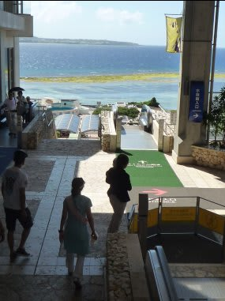

水族館では．

ヒトデを触ってみたり…

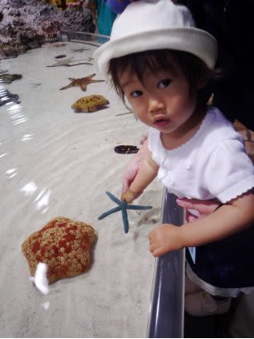

アケボノ君を撮って喜んだり…（それは娘じゃなくお前だろ！）

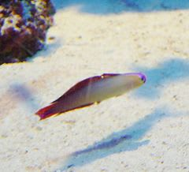

妻「水中だけじゃなく，こんなところでもハゼの前でカメラ

抱えて動かなくなるとは…」

…だって，好きだもん．

で，目玉の「黒潮の海」へ

いやー．

メインの水槽の巨大さにびっくり．

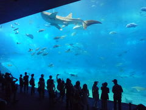

ぜひ．ぜひ，潜ってみたいですね．あの水槽に．

そんで，ログブックに

「ジンベエ，マンタ，レオパルドシャーク，マダラトビエイ，

クロマグロ，ロウニンアジ…」

と1ダイブのログに書くのが夢です．

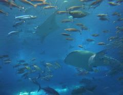

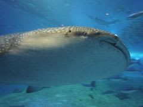

大物好きのわが親も，

「これだけ見たから，明日から潜らなくてもいいんじゃない？

これ以上のものは恩名近辺で見れると思わないし…」

など放言．

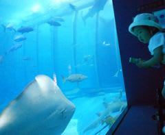

たっぷり水族館を楽しんで…

水族館の周りにもいろいろ施設があるので遊んで．

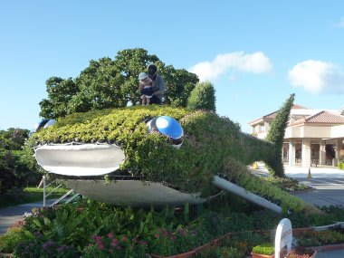

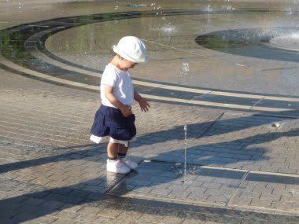

ホテルに戻るともう日が暮れて，夕食時間です．

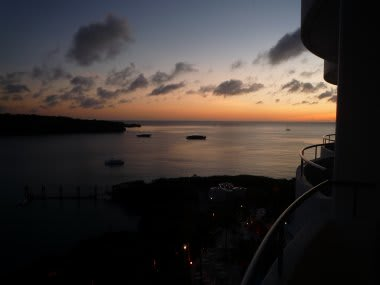

のんびりホテルで夕食を楽しみます．

ビュッフェスタイルのレストランだったので，

娘が好きなものをいっぱい取ることができ，

心配だった「娘が食べるものがあるのか？？」

って問題も無事クリヤー．

夕食を食べると，娘は即落ちでした…．

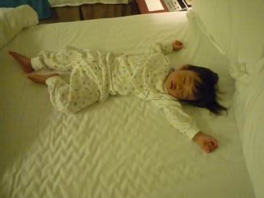

いよいよ明日からは，ダイビングです．

母親においていかれて，娘は泣かないのかっ！？？？

乞うご期待．

（何を？）
