# 2022/4/30(土)，GW2日目の志賀高原は…朝は真冬の景色＆雪で最高！…でも，晴天で昼前からは重い滑りの悪い雪に…

📅 投稿日時: 2022-04-30 22:18:18

ってなことで．

昨日のGW初日はスキーに行かず，

3回目のワクチン接種やら何やらを

やって過ごしていたわけですが．

本日から志賀高原に舞い戻りました～！！

…今日は焼額の早朝に間に合うように，

朝6:15焼額着を狙ってきましたが．

昨日書いたように草津越えは凍結通行止め．

信州中野インター経由で志賀へ向かいましたが…

志賀の登り坂も，4月になって初めての

雪道です…！！

4月は気温が高く，全然雪道を走らなかったので．

久しぶりの雪景色ですが…まさかGWに

雪景色を見ることになるとは…！！

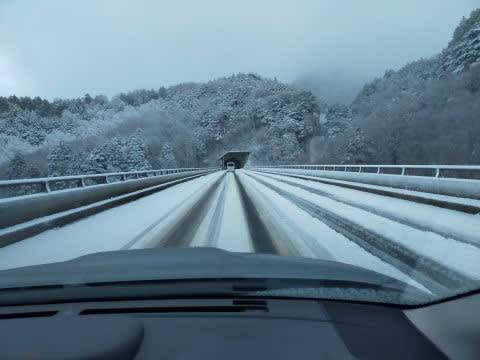

そして．

朝6:30スタートの早朝ゴンドラに乗ると…

え？これ，冬ですか？？

ホントに明日から5月なんですか？？

…という景色！

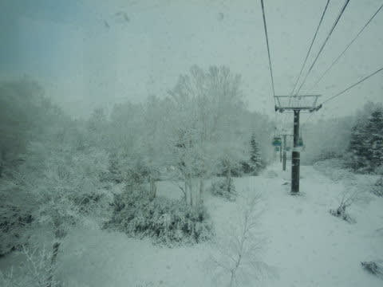

あさイチの山頂はうす曇りで．

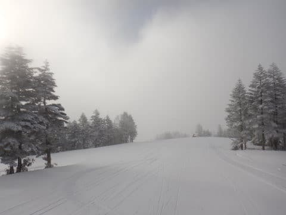

山頂の気温は-5℃で，久しぶりに

かっちり冷えてくれましたよ…！！！

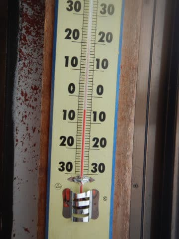

それなのにカチカチバーンじゃなく，

うっすら新雪が乗った，4月としては

最高級グレードの雪質じゃないですか！！！

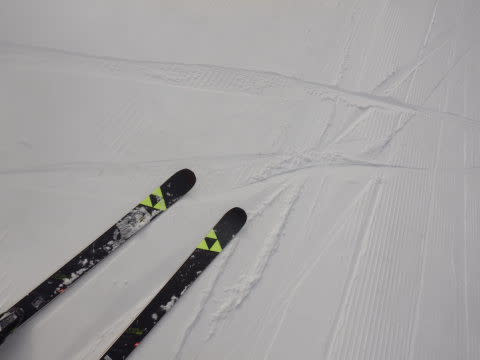

あさイチは下地が結構硬く，

そしてちょっと凸凹していたところもあり．

飛ばすと所々怖いところもあったけど…

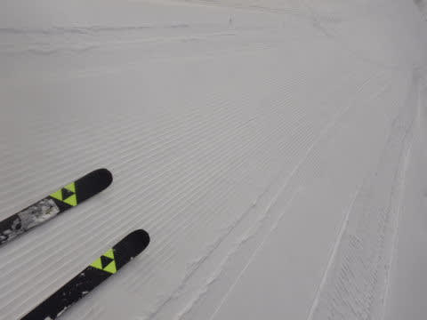

でも，この時期に．

こんな冷え冷えの圧雪で滑れるチャンスが

来るとは！！

4月の早朝では，かなりいいコンディションに

入る一日ですよ！！

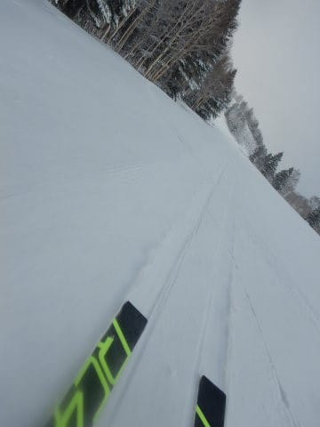

ただ，朝8時前にはすっきり晴天に

なってきて…

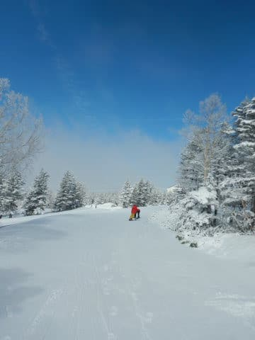

日差しでちょっと雪が緩み始めて

来ました(涙）

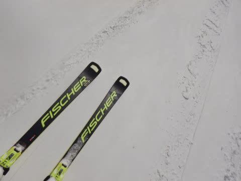

でも．

気温は低めだったので，9時半ごろまでは

GWとしては最高級のコンディションで

滑れました～！！

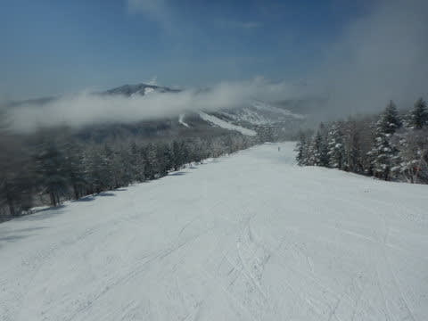

ただ，さすが3連休の中日．

先週と比べればゴンドラは混みましたが…

でも，朝9時ごろの待ち時間のピークでも，

ゲートの外にちょっとあふれる程度．

相乗りレーンはそれほど待たずに乗れましたよ！

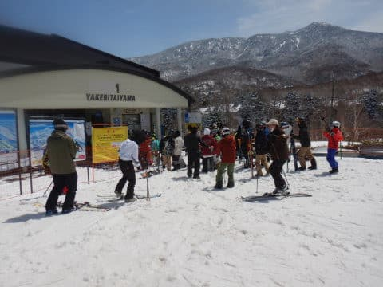

とはいえ．

8時半以降はすっきり晴天になってしまった本日．

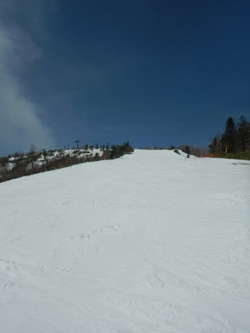

9時を過ぎると雪がかなりの勢いで

緩みはじめ…

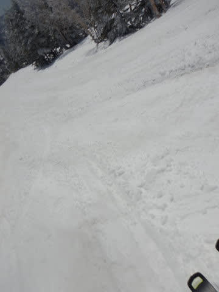

10時過ぎには，コースの下の方は

だんだん滑らない雪になっていきました…(涙)

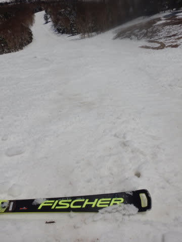

だもんで．

11時過ぎになってくると．

ゲレンデはもうガラガラになってきたし．

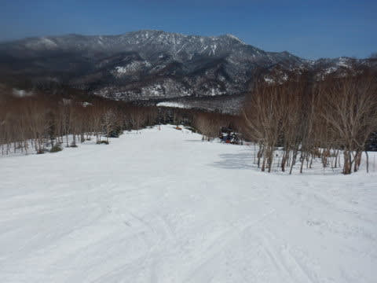

12時を過ぎると，ゴンドラも飛び乗りに

なってきました！！

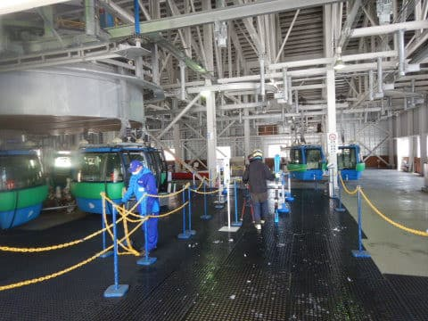

午後になると気温はぐんぐん上がり，

日差しもあり暑いくらいになってきましたが…

でも，最高気温は+5℃程度と，これまでに

比べればそんなに高くなく．

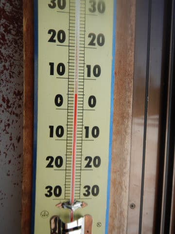

滑りが悪い雪といっても，妖怪板つかみに

強烈につかまれるというより，

「滑りが悪いなぁ…」という感じの雪で，

つんのめってひっくり返るほどの

雪ではなかったです…

でも，重いし荒れてるし，午後はかなり

疲れる雪でしたね…（ちょい涙）

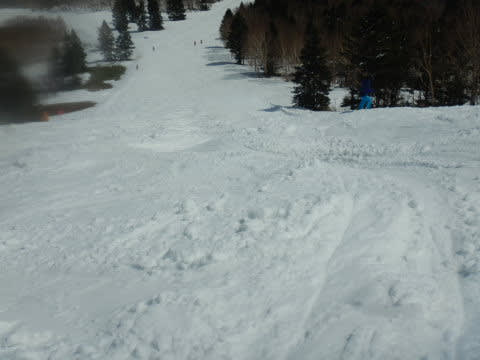

でも

まだ雪はたっぷりあるので，

あと1週間は持ってくれるかな？

…とはいえ．

迂回コースには，そろそろヤバそうなところも

ところどころ出てきましたが…

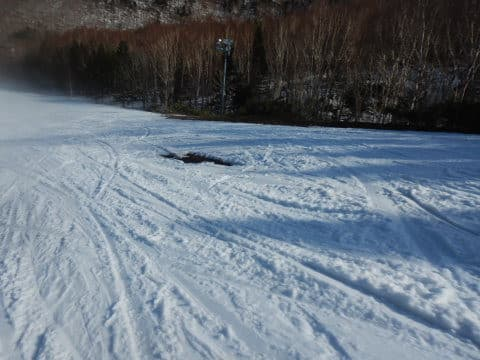

だけど，GSコースのメインバーンはまだまだ

全然大丈夫ですよ～！！！

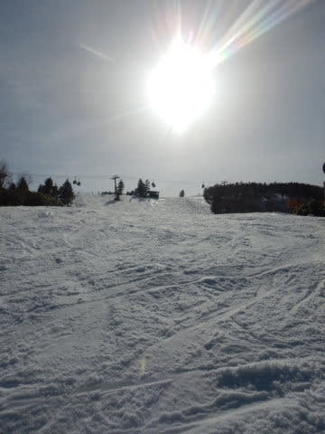

ってなことで．

今日も日が傾き始める，ゴンドラストップの

15:45まで滑って来たわけですが…

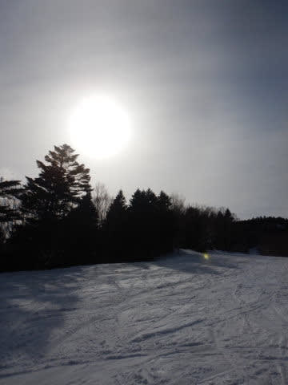

今日，一つ学んだことは．

ワクチン接種の翌日に，朝2時に家を出て

早朝からスキーをするとかなりツライ

ということを，身をもって痛感しました…

無茶苦茶しんどいし，ただでさえ午後の

雪が重かったのもあり，体中の筋肉が

痛いです（涙）

皆さん，ワクチン接種の翌日に，深夜2時発で

早朝から夕方まで滑り続けないよう，

お気をつけください←誰もそんなことしないから

## 💬 コメント一覧

### 💬 コメント by (ほっぽ)
**タイトル**: 4/30志賀高原
**投稿日**: 2022-05-01 06:33:04

Ｓさん

昨日は通常営業から参戦しましたが、朝一は良かったですね。

これがあるから志賀高原は止められないと思いました。

しかし、休憩なし、昼飯無しで滑っていたので14時上がり、

偶然お会いしたＳさんに「上がるの、早い、早すぎる！」と教育的指導を受けてしまいましたね(^^;

昨日は昼前からの奥志賀コブ道場で足が売り切れました。

いよいよ今日5/1が私のシーズンラスト、

ヤケビでお会いできたらご挨拶させて頂きます。

http://www2.tokai.or.jp/nana_hoppo/

### 💬 コメント by (Skier_S)
**タイトル**: ＞ほっぽさま
**投稿日**: 2022-05-01 22:08:28

シーズンラスト，お疲れさまでした～！

また来シーズンもよろしくお願いします！

