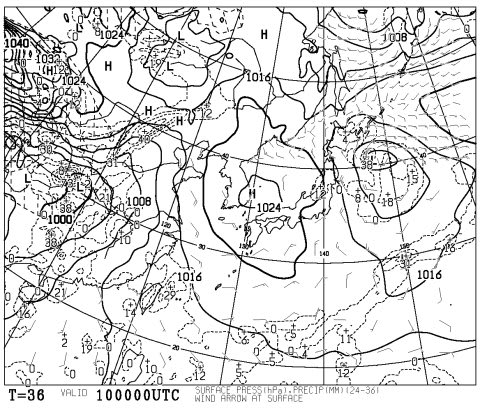
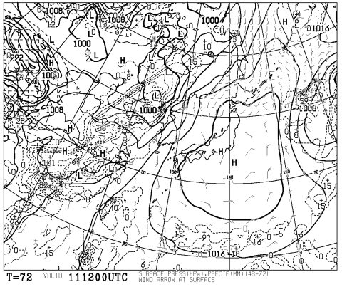
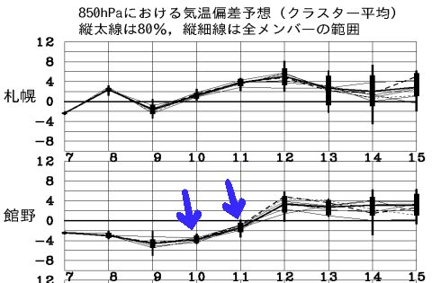
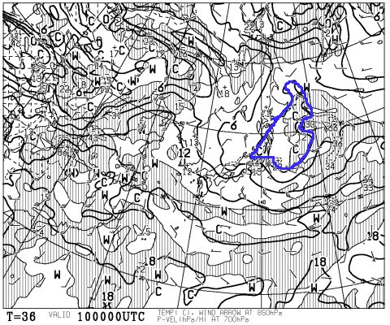
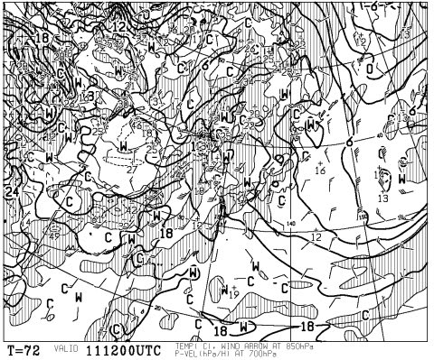

# まだ終わってないよ！今週末のスキー場の天気は…

📅 投稿日時: 2014-05-09 03:29:54

🏷️ カテゴリ: [スキー天気予想](c6554f5c3c106093b511a8daae23757e8.md)

…GWも終わったこの時期．

スキー場の天気を気にするのは．

人間として終わった人しかいない気がしますが．

とりあえず．

私のスキーシーズンはまだ終わっていないので．

天気予想，続くのだ．

ってことで．

天気図を見てみると…

…

ふむふむ．

土日はどちらも晴れますね～．

こんな感じで，土曜の天気図も…

日曜の天気図も．

高気圧に覆われているので．

雨が降る心配はないです！

で．

気温変化はこんな感じなので…

うむ．土曜は冷えそう！

前日の金曜は，平年比マイナス4度以下にまで

冷えそうな感じ…

いつもの850hpa気温図ですが．

土曜はこんな感じで，青く囲ったプラス3度という，

この時期にしては比較的冷たい空気が，新潟や

北信を覆っていますね～．

で．金曜の夜，ちょっと降水量がありそうなので．

…これは，標高の高い熊の湯，横手では．

金曜の深夜は雪になり，土曜の朝はうっすら雪が積もるかも？？

雪になったら，草津越えが通行止めになる可能性が

高いですが．

とりあえず，土曜の朝は冷えます．

かなり冷えます．

しっかりジャケットを着ていきましょう！

で．日曜は．

ちょっとわかりにくいですが．

信州～新潟は，9度線と12度線の間にあります．

…これは，例年並みですね．

朝から，あったかいですね．

昼間は，日差しで暑いくらいですね．

ってことで．

まとめると．

土曜：朝は冷える！バーンは固め．もしかすると，志賀では

　アイスバーンの上にうっすら雪が積もってるかも？

　午前中は寒いです．ウェアのジャケット忘れずに！

　朝早くは雲が残るかもしれないけど，基本的に晴れるので，

　昼から午後に向かっては気温が上がり，この時期の

　雪になっていくでしょう…

日曜：すっきり晴れ．気温は例年並み．

　朝から雪は柔らかめで，昼に向かって板の滑りがちょっと

　悪い，ドボドボの雪になるでしょう…

　

って感じかな．

うーむ．

冷えそうな土曜がねらい目かな？

## 💬 コメント一覧

### 💬 コメント by (komu)
**タイトル**: ダメ人間かも…
**投稿日**: 2014-05-09 22:46:54

明日は冷えますかU+2049U+FE0E

では横手で滑る事にします。

草津ルートの方が早いですかね？

### 💬 コメント by (Skier_S)
**タイトル**: 朝は冷えます
**投稿日**: 2014-05-10 00:20:24

今日の夕方はわずかに雪が降った

みたいです…

朝はそこそこ冷えるので、硬い

バーンになると思いますよ～

昼間はさすがに暖かくなりますが…

草津越えと中野経由、そんなに時間に差は

ないです。

わずかに草津越えが早いかな、

って程度です～

