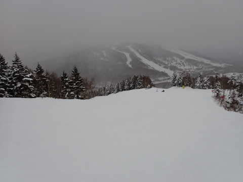

# 2023/1/9(月・祝)の志賀高原スキー場詳細レポート…3連休最終日なのに混まず．いいコンディションの一日だった…

📅 投稿日時: 2023-01-11 04:58:29

🏷️ カテゴリ: [2023スキー滑走日記](cd943df30cfcc3d0896469e2ff98720cd.md)

えー．

14，15日の週末の予想ですが．

低気圧の通過が早まり，15日は気温が

冷えて雪になるかも…

14日は雨っぽいですが．

15日は雪になる可能性も出てきました！

また明日詳細天気予想やりますが，

果たして今週末の天気やいかに…？

皆さんの日ごろの行いがよければ

雨は降らずに済むかも…？？

ってなことで．

今日，10日(火)の志賀高原ですが．

特派員写真が2枚だけ送られてきましたが…

朝は-13℃と冷え冷え！！

そして，朝の積雪は20cmを越え，

昼間も降り続けたみたいですが…

でも，風が強くて吹きさらし部分は

積雪せず．

さらに強風で焼額は2ゴンが運転

出来なかったようです…

ってな前フリのあとは．

本題の，3連休最終日の志賀高原レポートです！！

まず．

昨晩からの積雪は0cm(涙)

とはいえトップシーズンなので．

志賀への登り坂は，本格積雪路面

です…

ってなことで．

今日も焼額第1ゴンドラ営業開始8:30に

間に合うようにやってきますが…

あさイチの列はそれほど長くなく．

今日はそんなに混まなさそう…

で．

あさイチのゴンドラで山頂に登ると…

山頂の気温は-6℃と．

　朝イチの気温は-6~7℃

と書いた予想はピッタリ正解！！

ただ，水曜の予想で

　朝は曇り，雪がわずかにちらつくかも．

というのは外れて．

朝からすっきり晴天！！！

そして，すっきり晴天で，

見事な焼額クオリティーのシマシマを

滑れる快感…！

積雪がここしばらくなかったので，下地が

締まり気味でちょうどいい硬さ！！

いい感じにスピードがでる快感

シマシマです！！

この日の朝は…

今シーズンのベストのコンディション

だったかも…！？？

って感じで．

最高のあさイチの晴天シマシマを

楽しめましたが…

3連休最終日の本日．

意外なことにゴンドラはそれほど混ます．

ゲートの外にまで列がついたのは，

午前中のほんの数回程度．

11時近くになると…

ゴンドラの列は短くなり，ほぼ飛び乗り！！

そして．リフトは終日ほぼ待ちなし！

コース上も晴天で人が少なく．

さらに雪質も最高という…

間違いなく，今シーズン一番恵まれた

一日ですね！！

まだ積雪は少なめながらも…

今日はコース上の浮石はほぼなくなって

きたし．

いや～．

ようやっとトップシーズンがやってきた

感じ…

ってな感じで．

雪質がよく，人も少なく，天気もいいという

シーズンでもそうそうない最高の

一日だったわけですが…

昼間はちょいと気温が高く．

山頂でも0℃近くまで気温が上がりました…

それで，天気も良かったので．

南斜面のごく一部，ちょっと雪が

薄っすらとだけしっとりした感じの

ところもあったけど…

でも．

ほとんどのコースは一日中いい感じの

締まった圧雪バーンをキープして

くれて．

さらに人が少なかったこともあり．

午後になってもバーンが荒れず，

予想以上にフラットなまま！！

だもんで．

夕方のラストまで，大回り板で気持ちよく

大回りをし続けられるという．

いやーーー．

恵まれた一日だ…

ただ，午後3時近くからちょっと

曇り空になってきたな…と思ったら．

16:15の営業終了直前の，

15:30過ぎから雪が降ってきたり

したけども…

でも，15時を過ぎると人がさらに減り．

人がいない貸し切りバーンを

堪能できるこのシアワセ…

ってなことで．

今日もあまりのコンディションの良さに，

昼休みもとらずひたすら，

も営業終了の16:15まで滑り倒したの

でした…

いやーーー．

本格トップシーズンになってきましたね～．

毎日がこんな日だったらいいんだけどな～…

でも，残念ながら今週土曜はやっぱり雨っぽい(涙)

なぜ，このシアワセが続かないのか…(泣)

## 💬 コメント一覧

### 💬 コメント by (油漏＠あちこち)
**タイトル**: ラスト
**投稿日**: 2023-01-11 09:58:23

先日はご挨拶させていただきありがとうございました。「リフト動いているうちに帰るなんて」のお言葉を重く受け止め、奥志賀の最終まで滑り続けました。

午後は貸し切りゲレンデでゴンドラ飛び乗り状態で、粘ってよかったと感じました。

### 💬 コメント by (レインボー75)
**タイトル**: Unknown
**投稿日**: 2023-01-11 19:22:16

水曜日の志賀高原情報(お久しぶりです)

朝の湯田中は冷え込んで車のスライドドアが固着。上林-6℃　蓮池-11℃。

昨日の新雪を狙って当然太板。まずはGSサイド。気持ちいいけどなんか変。足に力がない。昨日まで痛風でゴロゴロしていたため、筋力が完全に落ちている。GSサイドは二本でリタイア。オリンピックでは珍しいサンピラー(太陽柱)も。だけど美味しそうなスーパーも諦めて板チェンジ。

白樺も三高も最高なんだけど、体力が落ちていて不完全燃焼。

ストレス解消のため西館で分不相応なステーキを食べてやったけど、今日はこれで終了。

明日から徐々に体力回復に努めます。

### 💬 コメント by (Skier_S)
**タイトル**: 回答遅れてごめんなさい
**投稿日**: 2023-01-13 00:51:15

＞油漏れ＠あちこちさま

コメント回答遅れてすみません…

先週末は無事お会いできて良かったです．

そして，ラストまでしっかり滑られたんですね．

それは20000mな方の基本動作ですから（笑）．

＞レインボー75さま

ブラボー75から戻りましたね…

久しぶりの志賀高原復活，お帰りなさい．

雪質は今が今シーズン一番じゃないでしょうか．

無理せず徐々に体力回復に努めてください！

