# 記録に挑戦っ！…20000mクラブにチャレンジしてみた…それと週末の天気予想を．

📅 投稿日時: 2016-02-18 00:54:19

🏷️ カテゴリ: [スキー雑談](c1f9d2cb7478308da16419928ea3945e9.md)

えー．

信心深い読者の皆様におかれましては．

昨晩から休むことなく，激しく，

冷え冷え踊りPart3を踊っていらっしゃることと存じ上げる

今日この頃．

…皆様，いかがお過ごしでしょうか．

…さて．

一晩踊り続けた，踊りの効果や如何に…！？？

…

…

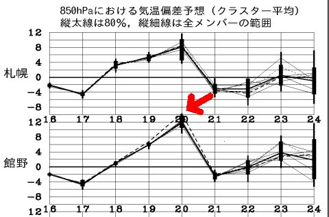

…

…ダメじゃん…（涙）．

先日は，こんな感じでまだ予想幅が広く．

運が良ければ平年比+2度で収まるかも…？

という，期待があったけど．

今日の予想では，運が良くても平年比+9℃

ということに…（涙）．

ダメじゃん．

ダメダメじゃん（悲）．

悪化してるじゃん（泣）．

踊りの効果は全く見られないようです…（残念）．

…踊り方が悪いのかな？？

20日土曜の朝9時の850hpa気温は，相変わらず0℃線は志賀より北だし．

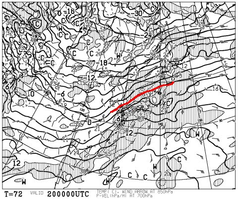

そして，この図を拡大すると，朝から南風になりそうだし．

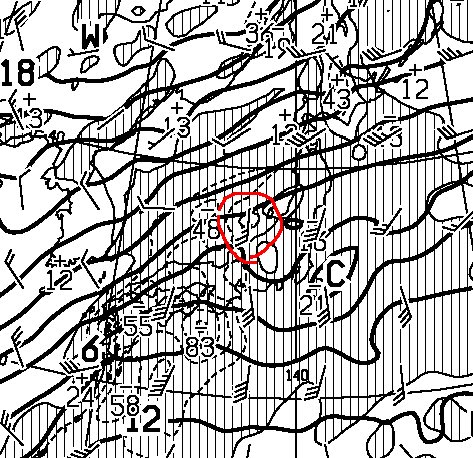

で．

土曜の夜9時になると，もっと悪化して，志賀は+6℃線がかかってるくらいだし．

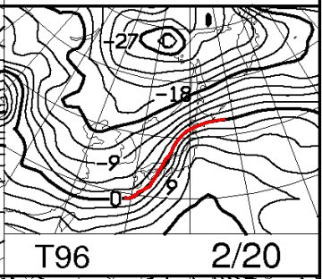

うーん．

土曜は志賀高原でも，終日プラス気温か…（涙）．

4月並みの気温だな…（泣）．

でも．

土曜朝9時の地上天気図では．

水色の網掛けの降水部分が，まだ志賀高原にかかっていないので…

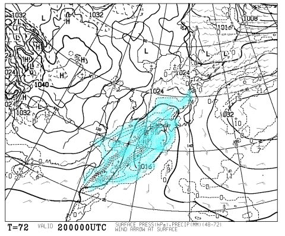

うむ．

気温は上がるものの．

土曜は昼頃まで降らなさそうな感じかな…

午後，降ったとしてもぽつぽつ程度で，

強く降るのは夕方から夜にかけてになりそう．

で．

次の日曜は，こんな感じで…

0℃線ははるか南，志賀高原には-9℃線がかかるので．

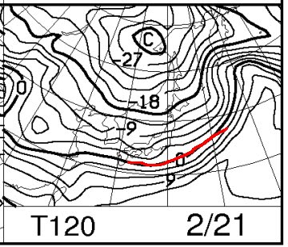

土曜と打って変わって，日曜は冷えます！

土曜夜には，雨から雪に変わり，

日曜は雪がちらつく天気かな～．

ってことで．

現時点の予想は．

土曜：朝から南風で気温は上がり気味．朝からプラス気温か？

　朝は曇り，時々薄日も．朝イチの圧雪はいい感じだろうけど，

　昼間は重めの春の雪っぽい感じになっていく．

　昼ごろから雲やガスが出始め，午後はぽつ，ぽつと…液体が落ちてくるかも．

　でも，おそらく降ってもそんなに強く降らない（と，信じる）．

　夕方から夜にかけて，本格的に降り始める．

　深夜から雪にかわる．

日曜：朝は前日の雨が凍ったアイスバーンの上に新雪．10cm～20cmかな？

　朝イチは，下地のアイスバーンが隠れた冷えた雪でいい感じ．

　雪が蹴散らされると，モサモサした新雪の下にアイスバーンという，

　ちょいと難しいコンディションに…

　終日雪がちらつく．土曜と違って，気温は冷えるよ！！朝は-10℃クラス．

　昼間もほとんど気温は上がらず．

という感じでしょうか…

…また明日，土日の詳細天気予想しますね．

…っていう，天気予想をしたところで．

本題へ．

えー．

先々週になりますか．

2月6日の週末ですね．

比較的コンディションもよく，人が少なかったこの日．

最近では，人が少なくなるとコスト削減のためか，

スピードを落とす焼額第1ゴンドラが，

大変珍しいことに，午後もトップスピード

運転をしていたので．

「これは，ちょっとやってみるか…？」

と．

…自分の限界にチャレンジしてみたんですね…

そう．

こんな感じで，

昼間も休まず，ひたすらひたすらゴンドラぐるぐるぐるぐる…！←いつもと何が違うの？というツッコミを受けそうだけど…いつもはちゃんと昼ごはん食べてます（^^;）．

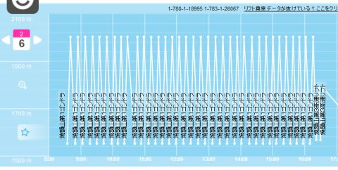

で…

SKILINEを見てみると．

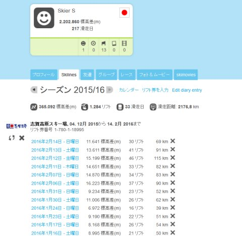

この日の結果は…

ふむ．

昼間で，16,223mか．

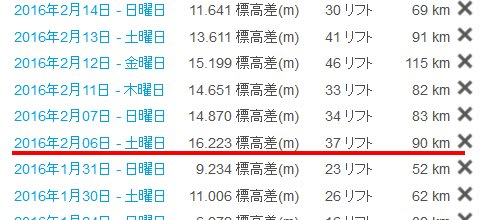

…これは．

もしかすると，ナイターで頑張れば，1日20000m超えるかも！？？

と，ナイターでも限界にチャレンジ！！

…

してみたところ．

ふむ？

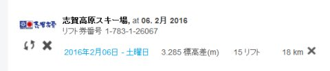

ナイターは，3,285mか…

ってことは，両方足すと…

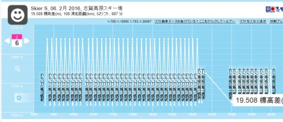

…

…

惜しいっ！！

19,508m！！

うーむ．

やはり，私の実力では．

ナイターを含めて限界まで攻めても，

一日滑走標高差20000m，行かなかったですね～（笑）．

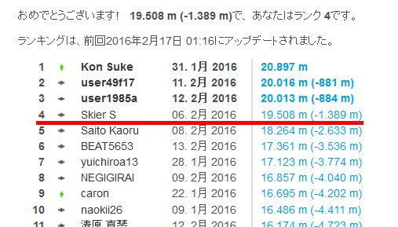

しかし，このトップクラスの方々は．

昼間だけで20000mを超えてしまうんだよなぁ…

恐るべし，20000mクラブっ！！

ということで．

私の実力では，

20000mクラブに入会するのは無理ということが分かったこの日．

スキー用に改造されたサイボーグな方々とは違って．

私はやっぱり，まだ人間だったんだなぁ…

と．

なんだか妙に安心していた，Skier_Sだったのでした…．

＃20000mを超えないよう，寸止めしたわけではありません（笑）．

## 💬 コメント一覧

### 💬 コメント by (のび太)
**タイトル**: Unknown
**投稿日**: 2016-02-18 12:48:58

相変わらずの滑走距離（落下距離）、恐れ入ります。

洋モノの板もマイルドな乗り味になることでしょう。

昨夜の冷え冷え踊り、足らなかったみたいです。

力不足でごめんなさい(笑）

やはり釣りに浮気しているためか冷え冷え踊りのパワーが弱くなっているんだろうな。

この天気なら午後、ポツポツ来たら家族を即行お風呂へ直行させますわ。

で、カッパをもっていけば、あとは一人で滑れる、、、ということですね。

これはこれで、ある意味おいしいぞ。

### 💬 コメント by (Goku)
**タイトル**: 惜しい！
**投稿日**: 2016-02-18 19:55:27

いや～あとゴンドラ1本チョイじゃないですか！

達成するにはやはりあのお方のように曲がらずに、ひたすらチョッカリしかないですね。

でも、Ｓさんが人間でよかった（笑）

### 💬 コメント by (Skier_S)
**タイトル**: 私はサイボーグではないので…
**投稿日**: 2016-02-19 00:09:29

＞のび太さま

釣りに浮気せず，ぜひもっとスキーを！！

昨日の積雪で，ゲレンデは結構回復したようなのですが…

さて．土曜の天気がどうなることか…

土曜は午前は降らない，午後は降っても本降りにならない！と強く念じていますので，大丈夫です（笑）．

午後は，カッパを着てソロタイムを楽しんでください（＾＾；

＞Gokuさま

自分でも大変惜しいと思っているのですが…

ヤケビだとやっぱりこれが限度です．

…これから先も，20000mクラブな方々に

「私は20000mクラブ会員じゃないですから」

と言い続けることができます（笑）．

