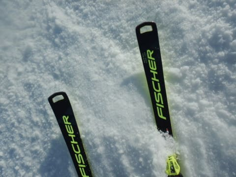

# 2022/3/21(月・祝)の志賀高原スキー場速報レポート…晴れて冷えた一日！午前は混んだけど午後ガラガラ，でも午後は雪が緩みぎみ…

📅 投稿日時: 2022-03-22 02:12:31

ってなことで．

今日もいつも通りラストまで滑ってきて，

帰宅は深夜モード…(涙)

渋滞もすごかった…

そして．

これから明日締め切りの仕事をしなくては

ならないご無体状態なので．

今日も帰宅日恒例，本日の志賀高原

速報モードにて！

えー．

まず．

今日は朝イチはすっきり晴天！

3月下旬の晴天なのに，朝イチは気温も

低くて，しっかり締まったシマシマ！

ちょいとコロコロが出てくるところも

あったけど…

午前中は，晴天なのに雪も冷えていい感じで…

3月下旬と考えれば恵まれたコンディション

でした～！

…でも．

さすが3連休．

午前中はゴンドラ・リフトは結構混みました(泣)

とはいえ，今日は3連休最終日．

午後になると帰っちゃう人が多いので，

…午後になると，ゴンドラも飛び乗りの

ガラガラに！

ゲレンデも人がいなくなって，

好きなラインで滑りたい放題！！

…と，喜んでいたら．

焼額スキー場では，コース下半分くらいが

完全に湿った重い雪になってしまっちゃいました(泣)

西側斜面の一の瀬方面は終日いい雪

だったようですが．

朝日を浴びる東側斜面の焼額．

昼ごろに結構重い雪になり，

さらに午後3時ごろには日差しが弱まり，

融けた雪がかたまってザラメ状になって…

最後はところどころ，ザラメの

コブ斜面になっていきました…（ちょい涙）

でも．

雪が緩んだ焼額も，コースの上半分は

冷えていい雪だったし．

この時期としては，晴天なのにこれだけ

コンディションが良かったのは，恵まれた

一日でしたね…！！

ってなことで．

また明日詳細レポートやります～！

…といったものの．

こんな時間に帰宅してBlog更新した後，

これからさらに仕事をせねばならない

ご無体状態なので．

明日，Blogを更新する余裕があるか心配…

更新できなかったらゴメンナサイ←3連休，スキーに行ってる場合じゃなかったのでは？（冷静なツッコミ）

## 💬 コメント一覧

### 💬 コメント by (レインボー74)
**タイトル**: Unknown
**投稿日**: 2022-03-22 12:37:15

月曜日の志賀高原情報

天気よし、雪質よし。まさに最高のスキー日和。だけど、友人の子供と滑る約束が！

しばらくは見つからないように楽しむつもりが、ニゴンから白樺へ着くや、手を振られて捕縛されてしまいました。あーあ！

寺子屋からブナは硬めのいい雪でしたが。

### 💬 コメント by (レインボー74)
**タイトル**: Unknown
**投稿日**: 2022-03-22 14:53:41

火曜日の志賀高原情報

朝の上林0℃　蓮池-3℃。朝から小粒な重い雪が振り続ける日。

アイスバーンに数センチの新雪が乗って、滑りやすいけど、それほど走らない日でした。

シーズン初のイチゴン一番かごget!

白樺はまさにファースト。平日はいいなあ！

さらに、カラマツもなぜか一番乗り。係員によるとニ高スタートは５人いたらしいけど、全員イチゴンに向かってくれた結果ですね。

気持ちよかったけど。10時頃からサウスやGSは荒れてきて、昼の銀嶺ざるそばで終了。その後も粘った仲間から、嫌な情報が！

「２時過ぎから足首パフでさらさら」

### 💬 コメント by (アツシ)
**タイトル**: Unknown
**投稿日**: 2022-03-22 20:30:55

最後、まだ1ゴンあと1回乗れそうなタイミングでしたが、今日で今季終了の3高に乗りに行きました(3高乗り場の時計で15:42！やっぱり1ゴン行けた！)。搬器を撫で回したりしてしばしのお別れをし、降り場の係員さんにも来年もよろしくです！と勝手に頼んでおきました。いや、妻が好きなんですよ、3高とイーストコース。万年ボーゲン(私の知る限り、20年はボーゲンしてます。イントラを除く一般スキーヤーで通算ボーゲン距離数ランキング出したら日本有数では？？)の人にSGSコースなんて行かせられませんからね。

### 💬 コメント by (Skier_S)
**タイトル**: 今日は良かったみたいですね…
**投稿日**: 2022-03-22 23:58:33

＞レインボー74さま

月曜は残念でしたが，今日は雪は良かったようですね！

早上りせず，午後まで滑っていれば…

＞アツシさま

昨日はお疲れ様でした～！

3高乗り場で15:42なら，まだもう1本3高乗れたんじゃないですか？

そうすれば，3高山頂でのヤケビメンバー終礼に参加できたのですけど（笑）．

### 💬 コメント by (アツシ)
**タイトル**: Unknown
**投稿日**: 2022-03-23 02:39:35

あれ？２本乗りましたよ。２本目の降り場で16:00だったので、係員さんに最後の挨拶をしました。リフトを降りてから夕陽の写真を撮り、Sさん来るかなとしばらく様子を見てましたが、来られないのでラストは2高だったのかなとか思ってました。

