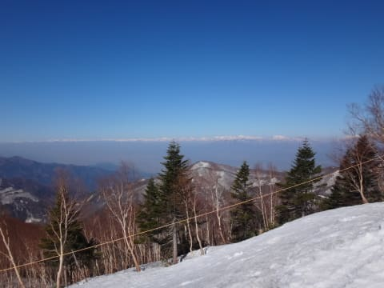
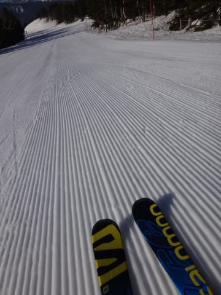
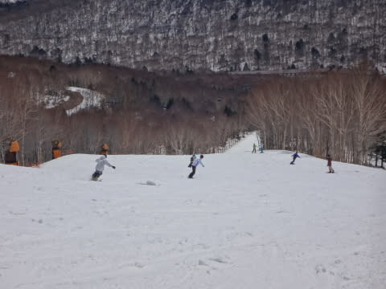
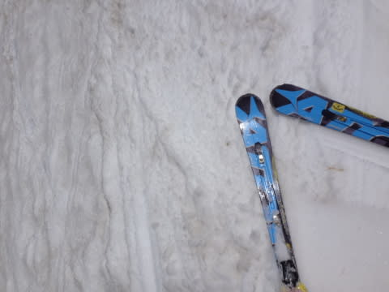
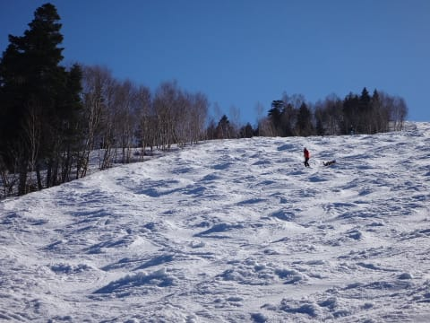
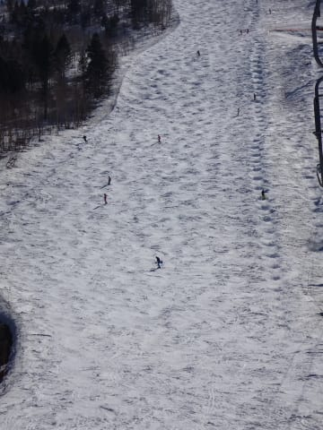

# 4月26日の志賀高原速報モード…朝から晴天！ポカポカ春スキーの一日

📅 投稿日時: 2015-04-27 01:00:28

🏷️ カテゴリ: [2015スキー滑走日記](c09ea645cfc085f86dfcd80f49599dd89.md)

ってことで．

今日も帰宅が遅かったので，速報モードで…

えー．

今日も行きました，早朝スキー．

朝から晴天ピカピカで．

北アルプスがすっきり見えるいい天気！

…んで．

早朝営業スタート直後は，かなりいい感じの締まり具合！

…でも．

開始1時間ほどで，すぐ緩んじゃったけど…（涙）．

そして．

昼前には，暑いくらいに気温が上がり，

かなり緩んだ感じの雪になり…

人が滑ってないところは，表面に汚れも浮いてきたかな～．

いやー．

春だねぇ．

で．

午後は，またまた奥志賀に移動したんですが．

…奥志賀の午後2時ごろ，第2高速ペア沿いは，

こんな感じでもうコブコブ荒れ荒れですね～

でも．

この時期で，まだコースいっぱい滑れるので，

まぁまぁ雪は多いかな！

とりあえず．

雪はまだたっぷりある志賀高原．

今日は，暑いくらいの強い日差しの中，

汗をかきながら滑るような．

「あー．春スキーだね～」

って一日でした…

詳細レポートは，また明日！！

## 💬 コメント一覧

### 💬 コメント by (いか)
**タイトル**: Unknown
**投稿日**: 2015-04-27 11:43:11

いやー今週末はよく晴れましたね。

汗だくになりながら、大回り、小回り、コブとめいっぱい楽しんでしまいました笑

### 💬 コメント by (はなげ親分)
**タイトル**: ２日間良い天気でしたね!!
**投稿日**: 2015-04-27 11:58:51

２日連続のピーカンの早朝スキーは、極楽気分満載でしたね！

だけど硬い雪面は、極楽と恐怖のセットでした。

日曜日の早朝スキー終了後に、調子に乗って白樺コースに滑り込んだら転倒したんです。

まあ滑る滑る。頭から脇にある藪に突入!!

死ぬかと思った。

### 💬 コメント by (Skier_S)
**タイトル**: 暑い土日でした…
**投稿日**: 2015-04-28 01:09:22

＞いかさま

いやーーー．

ホントに暑かったですね～．

こちらも奥志賀でコブ祭りしてきました．

この時期はやっぱりコブですね～！

でも，昔得意だったコブが最近苦手に

なりつつある気が…

＞はなげ親分さま

あれ？

早朝から滑ってらっしゃいました？？

ぜんぜんお見かけしませんでした…

X-raceを履いてから，固いの大好きになりつつある

私は，固い斜面を喜びながら自由落下しまくって

ましたが…

転んだら確かに怖いですよね（汗）．

怪我はなかったですか？？

