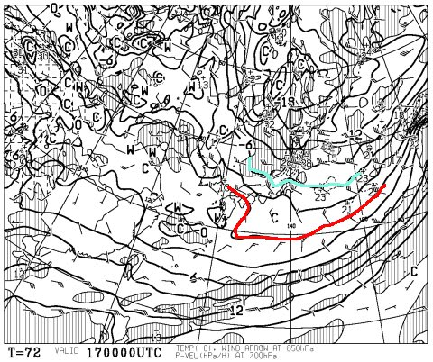
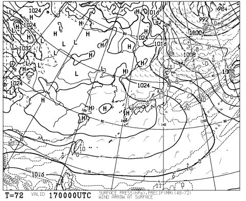
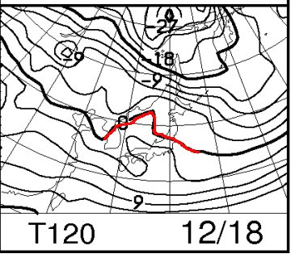
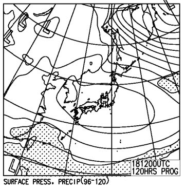
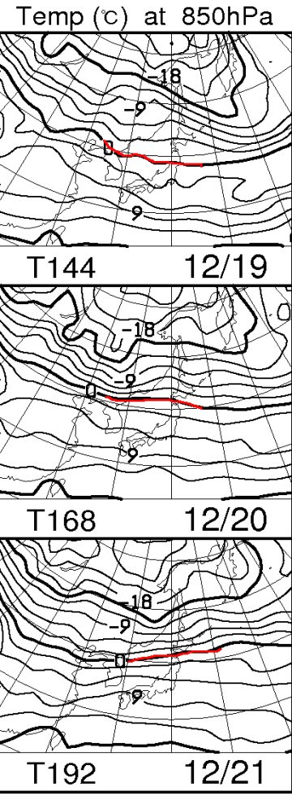
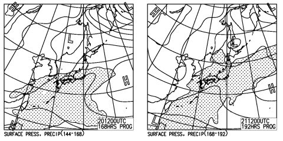
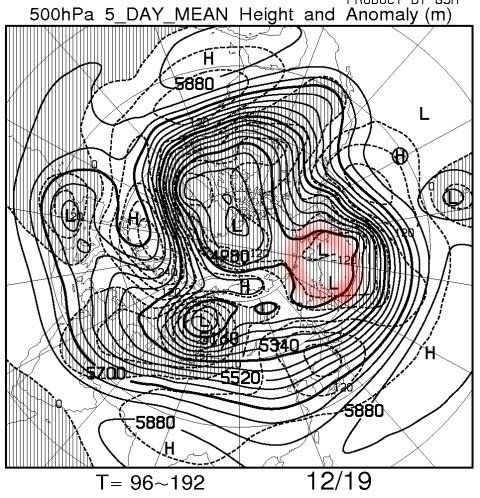

# この週末の志賀高原の天気は…土曜の朝は雪降りだけど，日曜は晴れのGoodコンディション！

📅 投稿日時: 2016-12-15 01:21:14

ということで．

今日はスキー場は終日雪が降ったようですが．

それほどの積雪じゃなかったようですね（涙）．

で．

なぜか．

15日もすごく冷えるものの．

雪は降るものの．

ドサドサ雪降りではなくなりそうな

天気図になってきました…（泣）．

どうしたこった…

まぁ．

でも．

気温が上がって雨になるよりはマシか…

と，自分を慰めてみる．

今のところ，15日夜から17日朝にかけては

そこそこ降りそうな感じですし．

そこに期待しましょう…

＃びっくりするような大雪にはならないけど

ってことで．

昨日は，「この週末までに雪は降るのか？」

の予想でしたが．

今日は，この土日の天気を予想してみましょうか…

さてさて．

17日，土曜の850hpa気温図ですが．

ふむ．

赤くマークした0℃線ははるか南．

志賀高原は水色の-6℃線がかかっている

くらいなので．

この日も冷え冷えの一日になりそうですね…

地上天気図を見ると，

西からひたひたと，高気圧が迫ってきていますな．

だもんで．

朝のうちは雪が残り．

昼に向かって雲が減り，

午後は晴れ間が顔を出す天気になりそうかな～．

そして，18日の日曜は．

うーむ．赤くマークした0℃線はちょっと北に上がるけど…

地上天気図を見ると．

すっかり高気圧に囲まれるので．

気温は上がるものの，雨になったりはせず．

比較的過ごしやすい，晴天で．

絶好のスキー日和かな？？？

ってことで．

まとめると．

17日土曜：

　朝は雪降り．前夜からの積雪は10cmほどかな…

　路面はしっかり積雪路面なので注意．

　柔らかい雪が圧雪されたトップシーズンの雪に，

　冷え冷えパウダーが乗っている朝．

　非圧雪コースでブーツパフくらいの新雪．

　朝のうちに雪は弱まり，午後に向かって雲が減っていき．

　午後には，青空がのぞき始める．

　午後は，柔らかい雪が蹴散らされて荒れた凸凹斜面に

　なっていきそう…

18日日曜：

　朝から晴れ！

　朝は放射冷却で寒く，最高雪質のしっかり圧雪バーン！

　おそらくかなりいいコンディション！

　終日晴れ．昼間の気温はちょっと上がるけど，

　雪質は比較的いいままキープ．

　日差しをもろに浴びる斜面はちょっと雪が緩むかも…

　この日も，人が多いコースは午後は荒れていきそう．

　でも，天気が良く，雪もそこそこ良く，ねらい目の

　一日かな．

という感じで．

冷え冷えウイークの総決算の今週末．

結構いいコンディションで滑れるのでは

無いかな～．

…

…だが．

ところが．

…あり？？

えええっ！！？？？

…こ，このままだと，20，21日は…

この時期に，雨？？？

…3連休直前なんですけど？？

いや．

そんなことは無いっ！

ありえ無いはずっ！！！

これからきっとこの天気図は変わるはずだ！←その可能性は低い（涙）

もし．

もし，万が一，変わらなさそうなら…

また，踊らねばなるまい…（涙）．

以下，マニア向け追記．良い子は読まない方が吉←なんのこっちゃ？

これまでの冷え冷えをもたらしたブロッキングHが，

16日あたりに完全消滅しそうです…

19日段階の図では，こんな感じで赤く囲った

カムチャツカ～アラスカ西部分．

高気圧ではなく，低気圧になってしまい．

ブロッキングHが完全になくなってしまっているので．

日本付近での寒気放出はしばらくは望めなさそう…（泣）

＃AOパターン的には中緯度での寒気放出モードに

＃なりつつあるっぽいけど，なぜか日本付近で

＃正偏差のパターン（涙）

## 💬 コメント一覧

### 💬 コメント by (かず)
**タイトル**: 土日行きます
**投稿日**: 2016-12-15 19:38:36

こんばんわこの前コメントさせてもらいました　ボードですが土日の朝は第二ゴンドラに行く予定です　よろしくお願いします

### 💬 コメント by (Skier_S)
**タイトル**: かずさま
**投稿日**: 2016-12-16 03:51:03

はいはい～！

朝イチは第2ゴンドラで滑ってると思いますので，

また見かけたらよろしくです～！

ただ，今回は．

子連れスキーなので，もしかすると昼間は

一の瀬を滑ってるかもです…

また，娘と一緒に滑っているときは，

ゆっくりお相手できないかもしれません…

その際は，ご容赦ください～！

