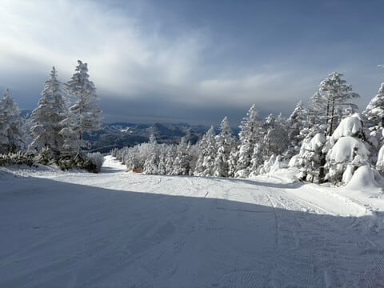
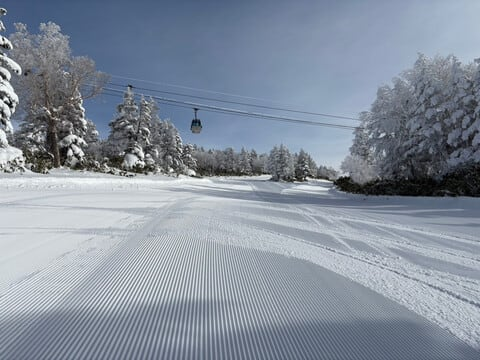
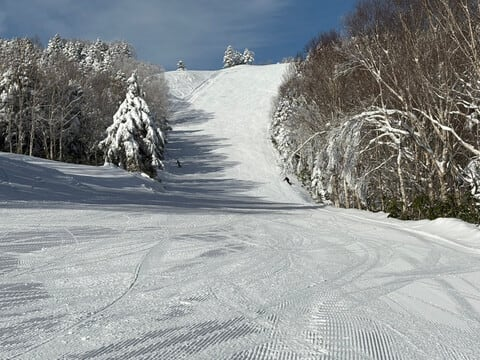
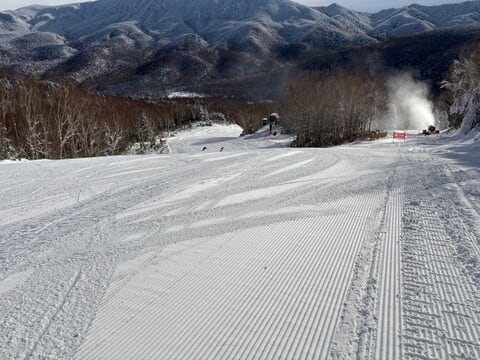

# 12月13日(金)の焼額山スキー場特派員情報！…そして焼額は土曜は終日雪降り，日曜は曇り~晴れ，西風で志賀は積もらなさそう

📅 投稿日時: 2024-12-14 00:55:47

🏷️ カテゴリ: [日記](cc4b5682fb7b8b144980957a978653fb0.md)

ってなわけで．

明日の土曜から，志賀高原は

奥志賀スキー場第1，第2，第3

熊の湯第3クワッド

が動き出しますよ～！

…ただ．高天ヶ原クワッドも動くかな，

と思ったけど…

今のところ，明日に高天ヶ原クワッドが

動くというアナウンスはないです…

ということで．

徐々に滑れるゲレンデが増えている志賀高原．

本日も志賀高原の特派員から，焼額山の

写真が送られてきました～！！

レポートによれば，本日の朝の気温は

朝9時の山頂で-6℃，昼間の最高は-2.2℃

だったらしく…

金曜は朝-7℃，昼間は-2℃という予想が

ほぼぴったり！

前の晩からの積雪も，残念ながら予想通り

ほぼなく，わずかにうっすら積もった程度

だったようですが…

でも，あさイチはいい感じのシマシマ…っ！！

うほーーー！！

こんなバーン，滑りたい…！！

天気は曇り終時折雪がぱらつく…といった

ところは外れて，

昼間は曇ったものの，朝と夕方は晴れて，

いい感じの天気だったようです！！

そして．

昨日の木曜は氷のコロコロが出て，

バーン全面硬かったようですが．

今日はパノラマの壁にちょっとコロコロが

あったくらいで，全体的に締まった圧雪で

楽しめたようですよ～！！

明日もこんないい状況だったらいいなぁ…

…でも．

明日の天気は，どうやら終日雪降りの

天気になりそう…

明日の朝までに，水曜の予想通り

10～15cmくらい積もるかな？

そのあとも水曜の予想通り，雪が

パラパラ降り続け，時折強く降る

天気になりそう…

冷凍人間製造機（4ロマ）しか動いて

なかったら厳しい天気だろうけど，

明日はゴンドラが動くから

冷凍人間にはならないはず…！！

雪が柔らかいので，午後は雪が荒れそう．

日曜は…うーん．見事な西風なので，

雪がパラパラ降ったり，いきなり止んで

日が射したり…

という目まぐるしい天気かな．

風が完全に西に回れば晴れます．

ちょっとでも北に回れば雪になります．

…日曜の志賀は西風で積もらないけど，

白馬や新潟方面はすごい積もりそう…

ってなことで．

明日の土曜は，早朝から結構雪が降るので，

志賀高原の上り坂は完全雪道ですよ！！

注意して運転してきてください！

そして今日も気づいたらもう深夜1時近く…

明日4時前出発なんですけど？

また睡眠3時間弱で300㎞運転して

スキーするのか…(泣)

とりあえず，明日志賀高原でお会いしましょう！！
