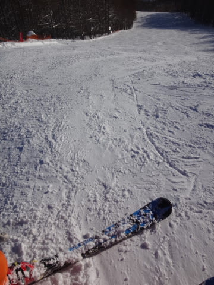

# うーむ．ATOMICの板とブーツに慣れすぎたのか？？

📅 投稿日時: 2015-01-21 04:12:53

🏷️ カテゴリ: [スキー雑談](c1f9d2cb7478308da16419928ea3945e9.md)

あー．

最新の22日の天気図を見ると．

気温は高くなりそうという予想は相変わらずなんですが．

こーんな感じで，低気圧の通過予想位置が，

昨日の予想より南側にずれてくれたので．

…うまくいけば，志賀高原．

ほとんど降水量がないかも…

雨が降っても，ぽつぽつレベルで済んでくれるかも…（期待）．

とりあえず，これから22日まで，

私は全身全霊でスキーの神に祈りますので．

もし，22日に雨が降らなかったら，

それは私のおかげということ…（パーン）←原田知世に撃たれる音

ってことで．

本題へ．

昨年3月に，[ブーツをATOMICに変えて](e1fbfec4d10be506cb1b13a31fa499d6d8.md)から．

ATOMICの板とブーツの組み合わせで滑っているわけですが．

この組み合わせで滑り始めた当初から，

「[これは無敵の組み合わせだわ](e49ba60ca83abf037c6421d52c585d288.md)…」

と，思っていたんだけど．

さらに最近，ATOMICの板とブーツの組み合わせのツボが

だんだんわかってきて．

当初より，さらに過激な性能を引き出せるようになってきた

今日この頃なのですが．

いや，荷重ポイントにだけ気を付けていれば，すごい

オートマチックに，これでもかってくらいの板の走りが

でるんですよ．

このブーツも板も，トップを抑えるということを想定していません．

…かなり後ろめ，しっかりかかと荷重をキープ．

そうすると，切換え時に板がすっと前に抜けて行って，すごく気持ちよく

ありえないくらいオートマチックに次のターン弧に入っていくので．

もう，この板の与えてくれる快楽におぼれちゃいます（笑）．

＃SALMONのX-RACEも，全く同じ操作で同じような動きです…

…で，このオートマチックさに慣れすぎてしまい，

板のトップに働きかけるという動きを全くしなくなってしまった

今日この頃．

久しぶりに，[とある方](http://blog.goo.ne.jp/suma_shikao)から板を借りて滑ったわけなんですね～．

（とある方が履いていた板と同じモデル）

で．

板を履いて…

よーし，1ターン目…

「は，はうあっ！！！」

サイドカーブのきついショートターン用の板なのに，

谷回りでまっすぐ外に進んでいくHart様．

「た，谷回りで板が回ってこないっ…！！」

谷回りでトップを押さえに行き，ようやく谷回り．

「の，乗り手が，こんなに動かないと，板が回ってこないのか…！！」

…どうやら，超オートマチックな板に慣れすぎ．

谷回りでトップを押さえないといけないという，

普通の板に乗れない体になってしまったようです…

…一般的には，Hart様が普通の板なんだと思いますが．

ATOMICブーツとATOMIC板のツボをついた，テール主体の

超オートマチックな滑りに慣れてしまった今．

どうやら，

マニュアル操作の板に乗れない，ダメ人間になってしまったようです…

とか思いながらも．

オートマチック板の過激な滑りの快楽から抜けられなくなってしまっている，

Skier_Sなのだった…

## 💬 コメント一覧

### 💬 コメント by (すぎぃ)
**タイトル**: 22日に雨が降らなかったら
**投稿日**: 2015-01-21 10:24:40

>それは私のおかげということ…（パーン）←原田知世に

>撃たれる音

Skier_S様

これは完全に私を狙ったものですね？

思わず笑ってしまいました。

満点大笑い

### 💬 コメント by (らぱん)
**タイトル**: Unknown
**投稿日**: 2015-01-21 20:08:50

こんにちわ、「とある方」です。

Hart様にお仕えして早○年の今日この頃、僕もいよいよ独立するお年頃のようです。

そんなわけで、ATOMIC最高！

### 💬 コメント by (いか)
**タイトル**: Unknown
**投稿日**: 2015-01-21 20:12:26

最近はSXに乗ってばかりなので、マニュアル車に乗れるかどうか不安になってきました(´△｀)

とはいえ、いまだにトップを掛けに行ってしまうのですが…笑

先日の動画ですが、あれは午後一番です。

午前中は風やら除雪やらで動いてなかったので、気合いで並び続けまして、先頭を確保しました(^ ^)

久しぶりの黒菱本気ロングターンでした…(*´ー｀*)

### 💬 コメント by (Skier_S)
**タイトル**: ATOMICはいいよね…
**投稿日**: 2015-01-22 01:36:17

＞すぎぃさま

はい．

ネタ，いただきました．

完全に狙ってました（笑）．

笑っていただけたようで何よりです…（＾＾

＞とある方

そうです．

ATOMIC最高です．

そして．

ATOMICという麻薬にやられて．

ラクチン板を履かないと滑れない体に

なっていくんです…

＞いかさま

ブーツはATOMICですか？

SALOMONブーツを履いていた時は，

私もトップを押さえに行っちゃいましたが，

ブーツと板をATOMICに揃えると，

テールの快楽に目覚め，

全くトップを抑えられない人間が

出来上がってしまいました…

しかし．

あれ，午後ですか！！

一体どれだけリフト前で待ったんでしょうか…

その根性に感服です．

