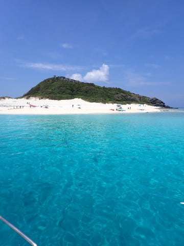

# 2023年8月，座間味で親子3世代ダイビング！その6…4年ぶりのダイビング1本目終了！2本目へ

📅 投稿日時: 2023-09-15 04:08:01

今週末は3連休だったのか…

3連休って言っても，おそらく1－2日は

また泣きながら仕事してる気がする…(涙)

でも，今年のシルバーウィークは，3連休

一発だけで終わるのか…

ちょっと寂しい感じ．

まぁ，この夏休みもコロナ明けでどこに

行っても混んでた感じだし．

この3連休も，どこに行っても混む

だろうから．

3連休は家でじっとしているのが正解なのだ！

…と．

自分を騙してみようとしたけど，

むなしくなっただけでした…

ということで．

今日も[前回に続いて](e8e1c56db0ad819ac11263269dead8611.md)ダイビング日記です．

ーーーー

ってな感じで．

4年ぶりのダイビングとなる，

今回の1本目も終了し…

そして，無事3世代ダイビングが

できました～！！

とりあえず，船は1本目のポイントから

移動し…

いったん港に戻り，今日の朝一の

高速船で到着したゲストを乗せたら，

すぐに港を出港，2本目のポイントへ

向かいます…

ってなことで．

2本目のポイントですが…

港からすぐの，阿真ビーチが見えるところに

船を止めました．

どうやら，このあたりで潜るようですね．

とりあえず，まだ1本目から水面休憩時間が

1時間たってないので，のんびりとタンクの

付け替えとか準備をして，ブリーフィングを

済ませますが…

やはり，娘は器材のセッティングを完全に

100％全く忘れていたので，

手取り足取りのご指導が必要でした…

ってなことで．

器材を背負ったら…

いざ，2本目へエントリー！

…2本目になると，もう慣れたもので．

娘も完全にブランクを感じさせない

潜り方になってますね…

ってなことで．

いかにも慶良間っぽい，癒しの海を

眺めつつのダイビングですが…

おっと．

娘が何か，ガイドさんから見せてもらって

ますね…

どうやら，カクレクマノミがついている

イソギンチャクを教えてもらっていた

ようです．

娘は今日は久しぶりのダイビングなので，

カメラを持たせなかったけど…

今日の水中での落ち着きっぷりを

見てると，明日からカメラを持たせても

よさそうだな…

とりあえず．

今日のこの1本も，移動距離も短いし

深度も浅めで，リハビリダイブには

いい感じ！

最後はボートの周りの浅瀬に戻って

来ますが…

下のサンゴが結構みごと．

まぁ，激しさもないけど．

すごい盛り上がりもない感じの

2本目ですが…

ブランクダイバーのリハビリダイブとして，

初日の午前中はこんな感じかな．

まぁ，久しぶりのダイビングだった，

初日午前のこの2本．

3世代全員，何とか平穏無事に潜れただけで

良かった感じです…

ってなことで．

2本目もエグジット！

追って，あとで潜った我が家族と

別チームの人たちもエグジットしてきて．

全員が船に上がったら．

ボートはお昼休みの場所に移動を

始めました…

そうです．

この船のお昼といえば．

いかにも南国っぽいきれいな白浜の

目の前，ガヒ島ビーチを眺めながらの

お昼休みです！

（[続く](e571810dfa54648a8bb3ed05928f31ea8.md)）

## 💬 コメント一覧

### 💬 コメント by (mae)
**タイトル**: Unknown
**投稿日**: 2023-09-15 16:03:16

ごぶさたしてます。

ハナゴイが美しいですね。

ダイビングは卒業してしまいましたが、写真をみてケラマにまた行きたくなりました。、🥰

そして、シパダン、ランギロア、モルディブ、ケイマン、パラオ、ポナペ、サイパンなど、海外の海を潜りまくり、妻と巡り会えたことが走馬灯のように思い浮かんできました。🥹

### 💬 コメント by (Skier_S)
**タイトル**: ＞maeさま
**投稿日**: 2023-09-15 23:55:21

久しぶりのダイビング，よかったですよ～！

慶良間はやっぱり癒されます…

ぜひ，また行ってみてください！

しかし，シパダン・ランギロア・ケイマンまで行ってますか…！！

そこまでやって，ダイビングをやめちゃったのがすごい．

私ならやめられないです…

でも，経済的に考えると，もう一生2度とランギロアとかには行けない気がします．

モルジブも昔は安いリゾートもあったけど，今はすごい高級リゾートだけになっちゃいましたし…

