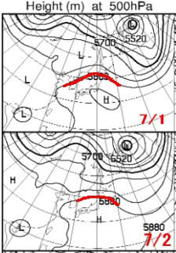
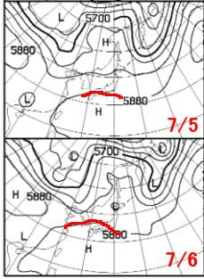
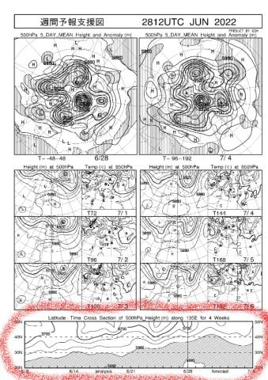
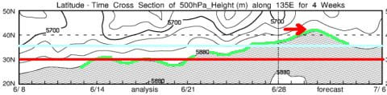
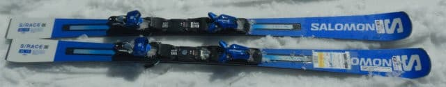
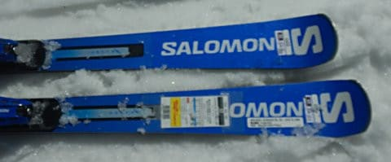
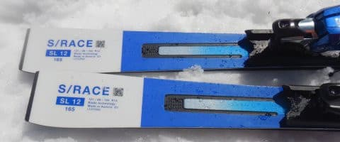
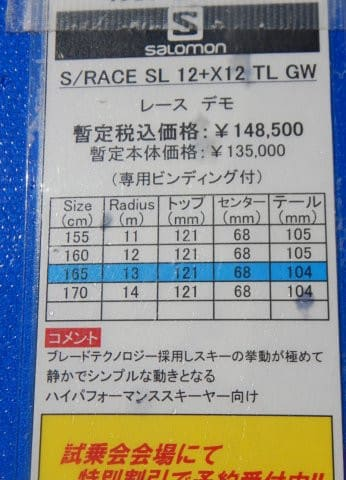
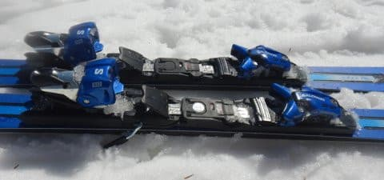

# 2023シーズンモデルのスキー板，試乗レポートその20…SALOMON S/RACE SL12

📅 投稿日時: 2022-06-30 01:23:51

まだ6月下旬というのに．

天気図を見ると，ありえない位置まで

サブハイが北上する予想になっている

今日この頃，皆様いかがお過ごしでしょうか…

という，謎の書き出しでスタートした本日．

このBlog読者の忠実な信者ならば，

サブハイってなにかを知っている

はず．←いや，普通は知らないから．数年間真面目に

読み込まないと解らないレベルだから…

あえて説明すると…

サブハイとは，500hpa図の5880m高度線に

囲まれた領域．

だいたいここに囲まれた部分が

「夏の空気」と思っていい感じのところ．

ってなことで．

7月1日，2日のサブハイの位置を見ると…

なんと．

津軽海峡から北海道の南くらいまで

北上しています！

…これは，完全に酷暑の真夏の

天気図ですね…

明日以降，2日までは死ぬほど

暑いと思います…（涙）

ただ，来週の7月5，6日あたりの500hpa

図を見ると．

赤く印した5880m線は本州の南岸くらいまで

下がっているので…

この日はちょっとだけ涼しくなって，

酷暑からは逃れられそう．

ちなみに．

[FXXN519](https://www.hbc.co.jp/tecweather/FXXN519.pdf)の一番下にある，500hpa高度線が

どれだけ南北に動いているかを時系列で

示した図を見ると…

私の経験上，網掛けになっている部分の

上側の5880m線(緑色)が，

赤線の北緯30度を超えると夏になり，

暑くなり始め．

水色線の北緯35度を超えると猛暑になり．

矢印で示した部分のように

北緯40度を超えると…外に出るのが

危険なレベルの酷暑になります．

そして，6月30日から7月2日は…

見事，5880m線は40度線より

北に突き抜けてます…(涙)

多分この3日間，死ぬほどの酷暑に

なりそう…

まぁ，来週は酷暑は一息つきそうかな？？

ってなことで，本題へ．←ってか，ここまでで普通の

Blog記事1本分はあると思うんだけど…

ここまで前フリだったのね！？？

本日も2023シーズンモデルのスキー板の試乗レポート．

今回はサロモン編です．

では，どうぞ～！！

○SALOMON S/RACE SL12 + X12 TL GW 165cm

基礎小回り，SLl競技用

前回，S/RACE PRIMEをレポートしましたが．

この板はSALOMONの基礎・SL競技用の

小回り板のラインナップ

S/RACE PRIME SL

S/RACE PRO SL

S/RACE 12 SL

S/RACE 10 SL

の4種類の中で，下から2番目になる板です．

なので，ビンディングも競技用ではなく，

X12 TL GWという，GripWalk対応ビンディングが

ついてますが…

滑ってみたところ…

これは，粘りが感じられて，踏むと

ウェットな感じでたわんでいく

私の好きな系統の板です！

乗り心地がしっとりしていて，

谷回りで自然にすっとたわんで，

そのたわみに乗ってスルスルっと

回っていく，なめらかな感じの板．

トップからテールまでがきれいにたわんで

グリップしてくれるので，板が長く

感じて，そのたわんだエッジに沿って

回っていくという，私の大好きな

フィーリング．

かといってどうしようもなくエッジが

食いついていく板ではなく，

たわみ量で半径は自由にコントロール

できるし．

さらにガッツリカービングをした中で

わずかにズレを入れていくという

高度な技も思い通りにできます！

ただ，スピードを出していくと結構

たわんで行きます．

高速の中では半径が小さくなり，

小回りスペシャルになっていきますね…

大回りは厳しい感じ．

でも，スピードがある中でも足場はしっかり

しているので，スピードに弱い板では

ないです．

ハイスピードでたわみに乗った

深めのカービングターンが気持ちよく

決まります．

履いた感じはすごい軽いってわけじゃいけど，

重くは無くそこそこの軽快感はあるし．

張りもそこまで強すぎないので，

コブにも突っ込んで行けそう．

スピードを出した大回りは厳しいけど，

完全板任せじゃない，いろんな小回りが

できて．

いろんな斜面を滑りたい人の，小回りベースの

ゲレンデ板としてすごい良くできた板です．

楽しめた！！

何だか来シーズンのSALOMON，

結構いいじゃないか…！←だから，なんでそんなに上から目線？？

## 💬 コメント一覧

### 💬 コメント by (koi)
**タイトル**: Unknown
**投稿日**: 2022-06-30 11:48:25

わたくし、まだ信者としての修行が足りないようです

今後とも天気読み素人をお導きくださいませ

### 💬 コメント by (harutomo)
**タイトル**: Unknown
**投稿日**: 2022-06-30 12:25:49

はじめまして。

いつも読ませていただいています。

来シーズンのSALOMONは、良いですよね。

試乗して、あまりに良かったのでPRO SLを買ってしまいました。

### 💬 コメント by (愛読者)
**タイトル**: Unknown
**投稿日**: 2022-06-30 20:19:52

Sさんと違ってberビンディングの板の取り回しに不安があってTLビンディングの板ばかり買い、何本もへたらせましたが、berビンディングのように移植して売ってもらえないのでTLビンディングは、意外とコスパが悪いんですよね。

### 💬 コメント by (なんちゃってレーサー)
**タイトル**: Unknown
**投稿日**: 2022-07-01 00:20:06

ご無沙汰してます．

PRIMEの上(?)にFISがありますね．

どれもなかなかの評判．

予約できた人はラッキーですね．

いずれにせよ，SL系の板はどれもSさんの技術とWCRブーツを持ってすれば簡単にターンしすぎて少し退屈だったのでは？

長い板のレビューもお待ちしています．

### 💬 コメント by (Skier_S)
**タイトル**: SALOMONの小回り板は全体的に良い板だったよ！
**投稿日**: 2022-07-01 02:30:11

＞koiさま

そうですね．修行が足りないようですね（噓）

いや…普通「サブハイ」が何か分かる人はそうそういないと思います（笑）．

今後も余力があれば，いろいろ天気図読み解き小ネタ仕込んでいきたいと思います…

＞harutomoさま

コメントありがとうございます～！

私もharutomoさんのBlog時々見てました．

来シーズンのSALOMONの小回り板，軒並み私の好きなしっとり乗り心地で

気に入りました…！！

でも，高い（涙）

＞愛読者さま

TLビンディング，使いまわし効かないんですか…？

というか，TLビンディングだと必ずセット売りになるからでしょうか．

私はVARビンディングがセットだったSXやX-Raceも，お願いしてビンディング無しに

してもらいましたが…

カンダハーさんとかだと対応してくれますが，通販とかだと絶対セットをばらしてくれませんよね…

＞なんちゃってレーサ―さま

あ，FISを忘れてました．

確かにありますね…

で，SALOMONのGS系の板も試乗しています！

またレポートしますので，しばしお待ちください…

