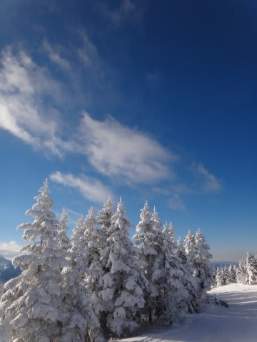
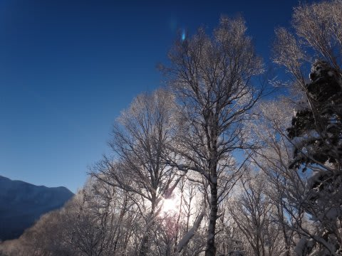
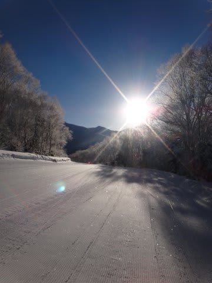
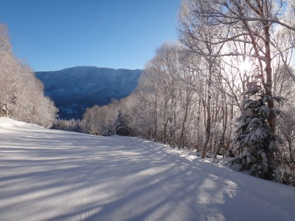
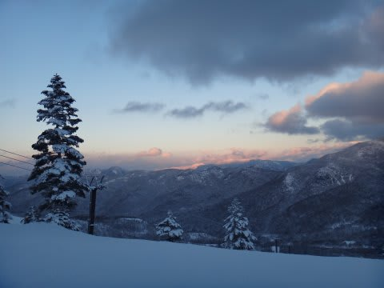

# 志賀高原を7泊8日で過ごしてきたわけだが

📅 投稿日時: 2013-01-08 01:50:22

🏷️ カテゴリ: [日記](cc4b5682fb7b8b144980957a978653fb0.md)

…って感じで．

この正月休み．8日間もの長きに渡って．

志賀高原で過ごしてきたわけなんですが．

あれですね．

どうも．

そんなに長く焼額に滞在する人は，まぁいないだろうなぁ…

と．思っていたけれども．

なんと．

…いたんですよ．

8日間，初日から最終日まで毎日．

焼額第1ゴンドラで見かける人が．

…8日間も続けて志賀高原で滑ってるだけでもおかしいのに，

それも毎日，ひたすら焼額第1ゴンドラで滑り続けるなんて…

し，信じられないっ！

アホじゃないかっ！！？←同類に対する親しみの尊称

…いや，

こう書くと，

「向こうも同じこと思ってるんじゃない？？？」

って突込みが入りそうですが．

こっちは滞在期間中，ウェアを3種類変えてるし．

板もいろいろ変えてるし．

向こうはこっちに気づいていないはず…

と，思っていたところ．

元日の朝．

リフトに乗ったとき．

古参の策道係員の方が

「あけましておめでとうございます～．おめでとうございます～」

と，お客さんに声をかけていて．

私の番になったとき．

「あ，毎年いつもありがとうございます～．また今年もよろしくお願いします～」

…

…バレテーラ．

ウェアも去年と違うし，板も去年と違うのを履いてるのに！

ウェアや板を変えても，いつも来てる人だって分かるものなのね…(汗)．

…

…

やっぱり，この正月休みに毎日会ったあの人．

私がウェアや板を変えてても，実は気づいていて．

「…あの人，今日も来てるよ…」

って思ってたのかも…

＃実はその人もほぼ毎週焼額に来ているらしく，

＃志賀に行った時はかなりの確率で第1ゴンドラで出くわしてるし…

＃やっぱりばれてる？

## 💬 コメント一覧

### 💬 コメント by (ひろりん)
**タイトル**: Unknown
**投稿日**: 2013-01-08 11:50:16

案外ウェアとか変わってても「ばれる」もんですよ～

以前、丸池Aコースを滑ってたら、横のリフトから大声で地元の知り合いに呼ばれたことあるもん（爆）

そのあと、うろたえて10mくらい転げ落ちたけどｗｗｗ

### 💬 コメント by (Skier_S)
**タイトル**: ひろりんさま
**投稿日**: 2013-01-08 23:08:09

いやー．

やっぱりばれるもんですか…

地元の知り合いならまだしも，見ず知らずの

人にもばれるものでしょうかね～？？

丸池Aコースで動揺したら，確かに

10mくらいは滑落しますね(^^;

### 💬 コメント by (mari)
**タイトル**: わははは
**投稿日**: 2013-01-10 23:07:57

私も、ホームの熊の湯リフトのしょちょーには家族で完全に覚えてもらってて、見かけたらいつも挨拶してくださいますよー。しょちょーが写真撮るので家族でスタッフブログにも時々載ってるし、昨年からは年賀状も出してますwたぶんどこのエリアもそんな感じかと♪

### 💬 コメント by (Skier_S)
**タイトル**: mariさま
**投稿日**: 2013-01-10 23:32:36

そーですよね～．

家族連れで行くと，目立ちますよね…

私なんか，おそらくスキー場のかなりの人に

覚えられちゃってる気が…

でも，熊の湯で家族連れは目立ちそうですね～．

しかし，年賀状までやり取りですか(笑）．

すごいですね！

