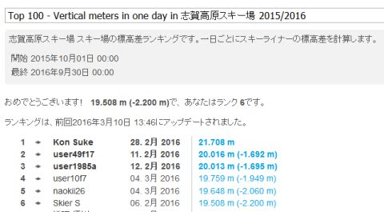
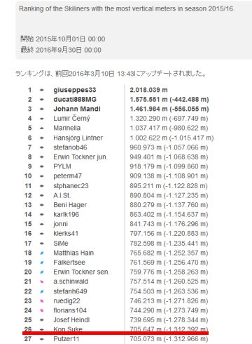

# え？20000mクラブが公式化？？…志賀Skiline現時点トップのKon Sukeさんから，ステキな提案

📅 投稿日時: 2016-03-11 01:06:08

えー．

志賀高原では，今日から冷えはじめて．

[ちょっとだけ雪が積もった](https://www.facebook.com/yakebitaiyama/posts/949453465150000)ようですね…

…はてさて．

この週末に向けて．

11日，ドサドサ積もってくれるのか？？

11日に奇跡の積雪があって

週末は最高のコンディションに復活する踊り

の効果はあるのか…っ！？？←今のところ，あまり効果がなさそうな予想なんだけど…（涙）

ということで．

話題は変わって．

[20000mクラブ…](ea8a953c4b60b5eec845669ca5ba7bf0f.md)

…それは．

志賀高原のSkilineで．

一日滑走標高差20000m以上の記録を残したことがある，

それはそれはおかしい素晴らしい人たちを指す，

私が勝手に作った呼び名．

昨シーズンは一日20000mを達成した人が9人いましたが．

今シーズンは今のところ，3人がこのおかしな人すばらしい人の

基準を超えているようです…

＃ここに出てないけど，今シーズンすでに20000m突破している人が他に数人いるはず…

で．

今シーズンは，この[20000mクラブな方々と一緒に滑る機会](e0826b3678fcf3f809298c177ce8d9008.md)も多く．

20000mクラブという呼び名が，半ば公式化（？）した感じがあったのですが…

このメンバーのうち．

志賀高原でSkilineが始まった2011年以降．

すべての年で20000mを突破し．

今シーズンの志賀高原のトータル標高差現時点でのトップという．

この恐ろしいすばらしいメンバーの親玉といって過言ではない，

Kon Sukeさん．

＃…この方，世界ランキングでも26位というすさまじさですが…

このKon Sukeさんから

「[20000mクラブのステッカーを作る予定](http://ameblo.jp/unbalance1/entry-12137622593.html)」

という，ステキな提案がっ！！

な，なんと，すごい…っ！

ついに，20000mクラブが公認になりましたね～っ！！

＃誰の公認なんだろう？？

…しかし．

シールには金と銀の2種類あって．

会長と20000m達成者が金色，

20000mを目指す仲間が銀色

ってことみたいですが…

そもそも会長って…誰？？

Skiline上まだ20000mを超えていない私は，

会員ですらないから，会長になるはずがないし…

と，疑問を呈したくなる，Skier_S＠焼額山重鎮(?)なのだった…

## 💬 コメント一覧

### 💬 コメント by (Kon Suke)
**タイトル**: 会長～
**投稿日**: 2016-03-11 09:17:53

何おおっしゃいますか！

会長はあなたですよ！

### 💬 コメント by (mae)
**タイトル**: Unknown
**投稿日**: 2016-03-11 19:09:26

達成者のみならず、目的とする方々の分も作るところが素晴らしいですね。

### 💬 コメント by (Skier_S)
**タイトル**: では，Kon Sukeさんは親分ということで（笑）．
**投稿日**: 2016-03-11 21:31:30

＞Kon Sukeさま

…やっぱり，会員資格を得るために頑張らないと

いけないということですね…（笑）．

そのためには，焼額の呪いを解かなくてはなりません（＾＾；

＞maeさま

いや，私もそう思いました！

しかし，何枚作るんでしょうね～．

志賀高原でみんな貼ってるようになったりして！

