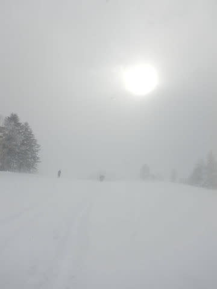
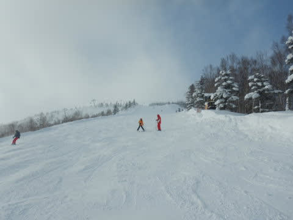

# 2020/12/31，大晦日の志賀高原焼額山スキー場は…朝は積雪60cmの大雪！でも，昼間は時折晴れの穏やかな天気

📅 投稿日時: 2020-12-31 23:09:37

ということで．

大晦日の本日も志賀高原で滑っていたわけですが．

今日の朝はめっちゃ積もりました…！！

昨晩からの積雪は60cm！

予想は20～30cmの積雪だったけど，

ここまで積もるとは…

おかげで駐車場も，昨晩から止まっている車は

雪ダルマになっていて．

あまりもの積雪で，コース整備作業のため

焼額のオープンは予定より30分遅れの

9時スタートになるほど（涙）

朝8時すぎまで，圧雪車での整備が続いてました…

営業開始が遅れた上に，奥志賀は全リフトの

営業を見合わせたため．

あさイチの焼額第1ゴンドラは，かなりの列に…！

ってなことで．

いつもより30分遅れの9時スタートの第1ゴンドラで

山頂に上がると．

山頂の気温は－15℃と，

　あさイチの気温は-15℃くらいまで冷え，

という予想がぴったり当たり，

今シーズン一番の冷え冷え！

…ただ．

　視界が悪くなるほどの感じで雪が降り続ける．

という予想と違って．

なんだか，薄日が差してますね！？？

でも，圧雪コースもブーツパフ！

そして，昨晩からの新雪が圧雪されていない

オリンピックコースへ突っ込むと…

うほぅ！

膝パフ！！！

…でも，－15℃の気温のわりに，かなり重め（涙）

かなり重めながら，悪天候でファーストトラックが

開催されなかった1本目は…完全フレッシュパウダー！

膝～太ももまで埋もれる，今シーズン一番深い

パウダー！！

でも，かなり重めで，緩斜面では止まってしまう，

ゴキブリホイホイ化する雪（涙）

…で，重めの，踏まれるとしっかり固まる雪で．

さらさらとシュプールが消えていくような

雪じゃなかったので．

2本目には，早くも踏まれた跡だらけの

荒れ荒れ＆ところどころ重い雪のカタマリ

という難しいコンディションになり…

コース端のおいしいところも

2－3本で終わってしまい，

あっという間に全面ボコボコ斜面に（涙）

ということで．

せっかくの60cmの積雪があった朝でしたが．

気持ちいいパウダーはわずか3本くらいでした…

で．

今日の天気は，終日雪降りかと予想していたところ．

雪が降るタイミングもあったけど…

なぜか，結構薄日が差す時間が長く．

‐15℃の雪降りで，根性の無いスキーヤーが

全力でふるい落とされる日かと思っていたら，

意外なスキー日和の天気！

ただ，朝のうちはゴンドラもガラガラだったものの．

奥志賀は午前中はクローズ．

昼頃にやっと第1ペアのみオープンした

だけなので．

奥志賀のお客さんが焼額に流れてきたからか…

昨日よりはゴンドラの列は長めで，午前10時

半過ぎから午後3時近くまで，3分～最大10分

ほどの待ち時間がありました…

リフトも，待ち時間があるというほどではないものの，

タイミングによっては乗り場に20人ほどの人が

溜まっていることもあり．

コース上も，昼間のタイミングによっては

今シーズンでこれまでにはなかった

高い人口密度の一瞬が…

これはたぶん，今日は予想外に天気が穏やかで．

根性の無いスキーヤーふるい落とし機能が働かず．

昼間は人が多かったのかな…

でも，今日はずっと天気が良かったわけじゃなく．

やっぱり予想通り時折雪が降ることもある天気で．

雪が降ったりうっすら晴れたり…と目まぐるしく

入れ替わる天気だったけど．

午後2時ごろからは雪も完全に止み．

そして，コース上の人も少なくなってきました！

今日は最高気温も‐10℃を超えず．

雪質も終日最高！！

まさか，激冷え雪降り予想だった本日．

こんなすっきり晴天で．

最高雪質のガラガラゲレンデを滑れるとは…！！！

いやー．

まさか，こんなに晴れるとは思わなかったよ！！←それは，予想を外したということですね

今日の昼前から，完全な西風に変わってしまい．

新潟近辺は今日は終日降り続けたものの，

西風だと晴れる志賀高原．

見事な西風パターンで，晴れたようです…

もう少しでも北に風が回ると雪だったのですが．←予想が外れた言い訳をしている

…とはいえ．

雪が柔らかかったので，さすがに夕方近くには

ゲレンデも荒れ始めてきたものの…

全く予想外に夕日がきれいに差し込むゲレンデを．

夕日が暮れる，最終16時まで滑り続けたのでした…

…で．

なぜか．

すっきり晴天にかかわらず，悪天候の予想だったため．

本日も焼額のナイター営業の中止が早々と決まり．

そして，毎年恒例の新春ファーストトラックも，早々と

中止がアナウンスされたのでした（涙）

残念…

ってなことで．

いろいろあった2020年ですが，私が知らぬうちに

早くも終わってしまうようです…

今年もご愛読ありがとうございました．

また2021年もよろしくお願いします～！！

## 💬 コメント一覧

### 💬 コメント by (Hide)
**タイトル**: よろしくお願いします。
**投稿日**: 2020-12-31 23:27:57

S 様

まさか今日晴れるとは。

私も予想外でした（笑）

次回1/3に突撃予定です。

来年もよろしくお願いします。

PS

早くK奈川県に戻りたい・・・（涙）

### 💬 コメント by (元旦はホームアサマ2000m&t)
**タイトル**: Unknown
**投稿日**: 2021-01-01 16:57:03

Sさん&皆様、明けましておめでとうございます。今年もよろしくお願い致します。

初滑りにホームのアサマ2000に行って来ました。天気予報では晴れの筈ですが、チェリーパークラインから降雪でツルツル、スケートリンク状態です。これならゲレンデは新雪パウダーが楽しめるかと登っていくと駐車場は10センチ程しか積もっていません。

しかし、ステージ２に登ってみるとサラサラのブーツパフではないですか!滑り始めると深い所は膝下パフ。

うひょー！アサマでこれ程のパウダーはなかなか味わえません！

元旦のせいか、ゲレンデにあまり人が出ていない為、m&t共々５本程新雪を楽しむ事が出来ました。明日は志賀高原に遠征予定です。

新年早々、皆様にお会い出来る事を楽しみにしています。

ちなみに、下山時にレッカー車３台とすれ違いました。スキーも車も安全運転でいきましょう。

### 💬 コメント by (西舘)
**タイトル**: 今年もよろしくお願い致します。
**投稿日**: 2021-01-01 20:15:01

鼻毛親分ご夫妻様、幻のGoku様、Northfox様、M様、S様、本日はありがとうございました。

楽しかった。ほんとーに楽しかったです。

Sさんんに声を掛けるのをためらっている全国1億3000万人読者の皆様、勇気を出して、声を掛けてみた方が良いですよ、絶対に楽しくなる筈！

### 💬 コメント by (Skier_S)
**タイトル**: あけましておめでとうございます．
**投稿日**: 2021-01-01 23:00:09

＞Hideさま

いや，まさか晴れるとは思わず…

1月3日，お待ちしてます！

早くK奈川県に戻れるといいですね…

＞m&tさま

あけましておめでとうございます～！！

アサマも良かったんですね．

志賀高原は最高でした…！

明日，焼額でお待ちしています！

＞西館さま

今日はお疲れさまでした～！

焼額遠征，楽しんでもらえたようで良かったです．

また焼額でお待ちしています！

