# まだ続く！5月1日の志賀高原レポートと…GW5連休直前の志賀高原の積雪情報！

📅 投稿日時: 2015-05-01 20:25:40

🏷️ カテゴリ: [2015スキー滑走日記](c09ea645cfc085f86dfcd80f49599dd89.md)

ということで．

志賀高原滞在3日目ですが．

…暑いっ！

暑すぎるっ！

昼間はもう，長袖Tシャツでも暑いっ！！

袖まくりして滑っちゃうほど，暑い！

おかげで，雪が解けて．

明日からの5連休，大丈夫か…？

と心配になる今日この頃．

で．

今日の志賀高原ですが．

朝は，車に霜がつくほどの冷え込みで…

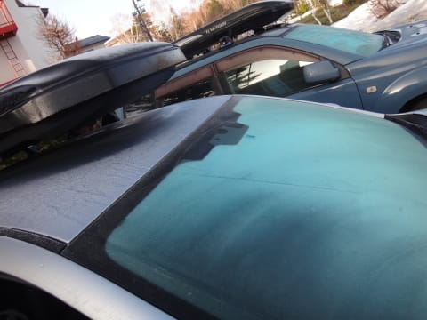

この冷え込みに期待したのか，

早朝スキー開始の6時半には，結構並んでましたね～．

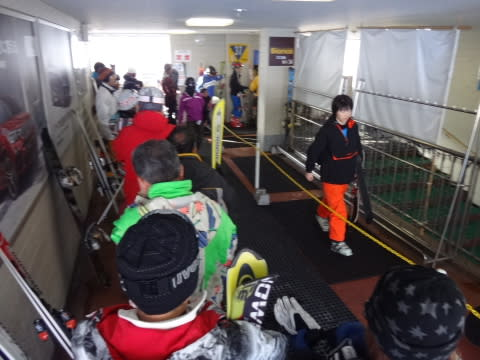

…でも．

朝6時台でも，山頂の気温はプラス8度（涙）

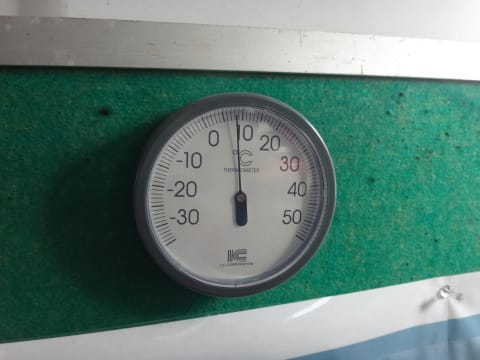

天気も，雲ひとつない快晴で．

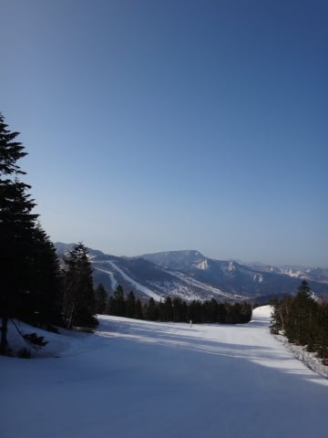

今日も暑くなりそうな予感…

とりあえず．

朝イチは気持ちいいシマシマバーンだったんですけど，

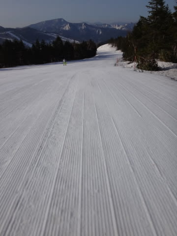

激烈な太陽の恵みを浴びて，8時ごろにはもう

ユルユルのバーンに…

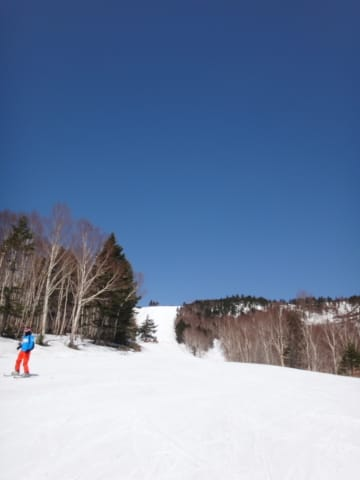

もう，その後は，ぐんぐん暑くなっていく気温につれて，

雪質は悪化の一途で．

10時にはほぼ全面，板に粘りつく，

滑らない雪と化してしまいました…（泣）．

だもんで．

11時ごろに，一の瀬へ移動！

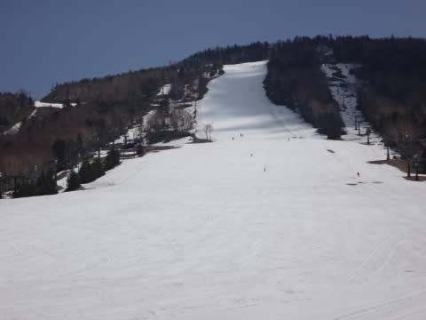

ふーーむ．

こちらは西斜面なので．

朝日が当たらず，10時近くまで固めの

バーン状況だったみたいで．

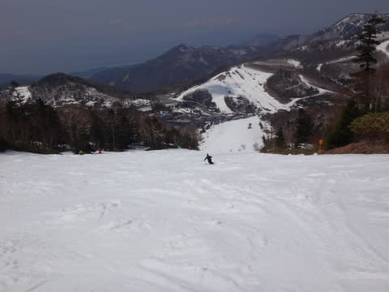

をを！

意外といい，フラットバーン！

板も滑るし，気持ちいい大回りが楽しめるよっ！！

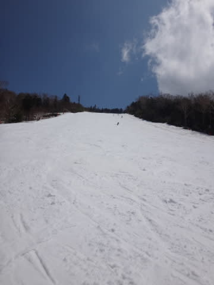

…しかし．

一の瀬メインバーンに，ここまで人がいないとは…

5連休の前日の今日は．

ホントにどこに行ってもガラガラ！

さすがに，午後2時ごろには一の瀬もざぶ雪になってきたけど…

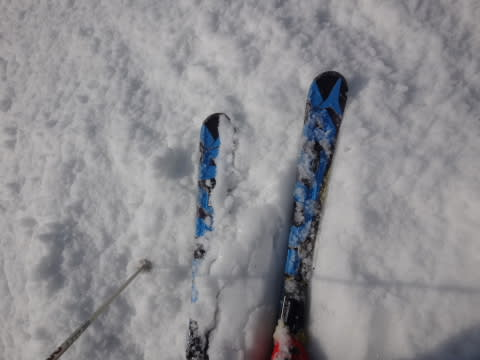

でも，まぁ．

人がこれだけ少ないので，コブ斜面にはならず．

夕方のリフトストップまで，結構楽しく滑れましたよ～！

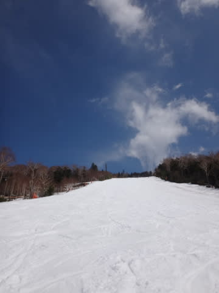

リフトストップ時もこの程度の荒れ具合だったので．

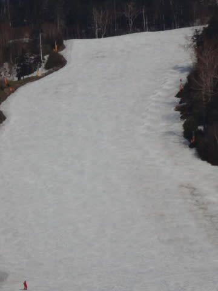

明日も今日くらいにがらがらだったらいいんだけど．

明日は混むんだろうなぁ…

で．

ここからは．

明日，ゴールデンウィークの5連休に来る人に，

志賀高原の現在の状況を…

雪ですが，ものすごい勢いで減ってます．

焼額のゴンドラコースは大体OKですが…

今朝，第2高速降り場付近，ちょっとブッシュが出始めたな，

と思ったら…

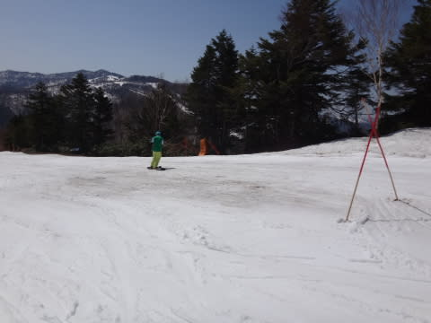

わずか3時間後，昼にはこんな風になっちゃってたり．

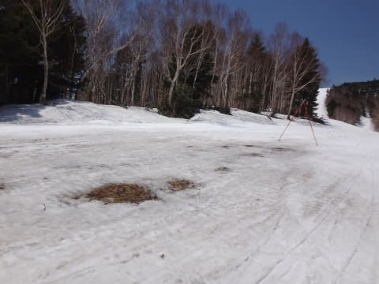

おとといまで何の問題もなかった第2高速沿い，

唐松コース．

上半分も，写真左からの土のエリアが広がり，

コース幅が狭くなりつつあるけど…

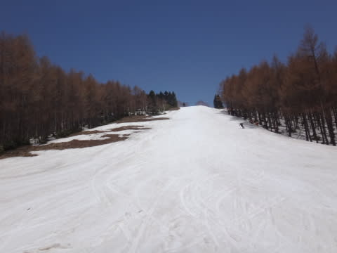

下半分も，真ん中に穴が開きました…

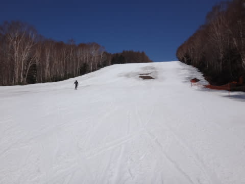

ちなみに，今日の夕方の一の瀬から見たら，

こんな感じで，かなり土のエリアが…（涙）

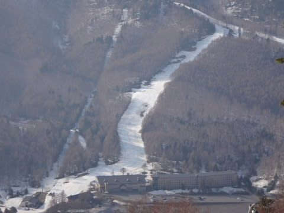

高天が原は，こんな感じで．

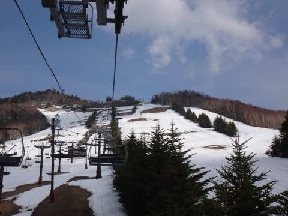

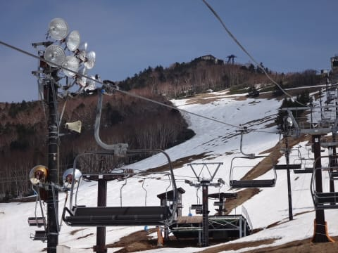

まともに滑れるのはNHKバーンだけです．

コブ斜面側は終わってます．

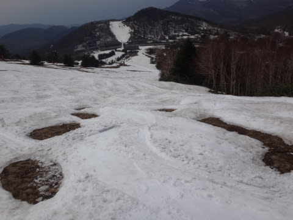

もう，明日くらいには，滑って一の瀬方面へ行けなくなるかも…

一の瀬ダイヤモンドはこんな感じ．

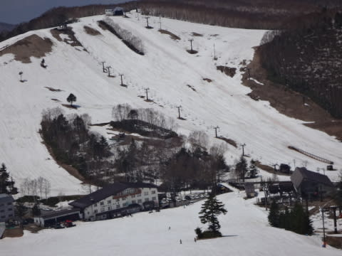

結構土は出てきたものの，まだ滑れるかな．

一の瀬ファミリーは，まだまだ滑れそうに見えますが…

昨日まではなんともなかった正面バーン．

今日の夕方に，ついにブッシュが出始めました…

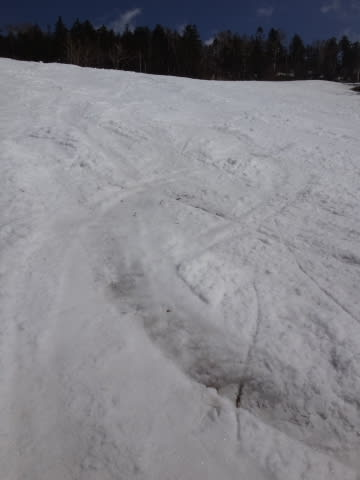

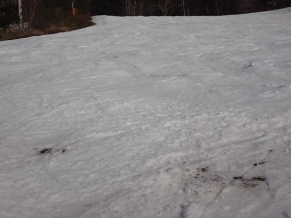

こうなると，雪が消えるのは早いです．

パトロールさんも

「もってあと2-3日かな…」

とつぶやいてましたので．

3連休2日目，5月3日ごろには，もう結構土が出てる

可能性大です（涙）．

うううーーーん．

1週間ほど前までは，土なんてまったく出てなかったのに，

ここ数日の高温は，ホントに効いてます…

もう，5連休最初はまだ雪がありますが．

途中でかなり滑れなくなる場所が出てくる感じ．

5連休は前半が狙い目でしょう！

その他の情報として…

・滑れるのは横手，熊の湯，一の瀬（ダイヤ，ファミリー，タンネ），

　高天が原，寺子屋，焼額（2ゴンと2高速のみ），奥志賀．

・一の瀬山の神は動いてないので，一の瀬と焼額・奥志賀エリアは

　滑って移動できません…

・少なくとも，ここ数日は暑いくらい．昼間は長袖Tシャツでも

　滑れる程度．…でも，いきなり寒くなる可能性もあるので，

　ウェアのジャケットは忘れずに！

・道路は夏タイヤでも行けます．

・志賀草津道路はオープンしてますが，通行できるのは

　朝8時～午後5時までです．

って感じですので．

GWに志賀高原にお越しの方は，

焼額ぐるぐるしている私を発見してみてください←なんのこっちゃ？？

## 💬 コメント一覧

### 💬 コメント by (いか)
**タイトル**: Unknown
**投稿日**: 2015-05-01 22:59:49

うーむ、やはりあたたかいのは痛いですね…

私も3-5で八方ですが、10日まで持つのか不安です…

### 💬 コメント by (komu)
**タイトル**: 雪が…
**投稿日**: 2015-05-02 04:17:04

志賀高原滞在4日目ですっかり早寝早起きになってしまいました。

気温も許せないですが、板に靴墨を塗ったようになるあの雪は悲しいですね。

奥志賀は馬がいるためか、靴墨に混じって馬の毛見たいのも付いてました。

ヘタにワックスしないで何もしない方が滑るかも？

今日はヤケビで滑ってます。

### 💬 コメント by (Skier_S)
**タイトル**: 暑すぎます…
**投稿日**: 2015-05-03 00:01:16

＞いかさま

八方もパノラマはそろそろマズそうな感じみたいですが…

暑すぎて，雪が減るだけじゃなく，雪が滑らなくなるのも

痛いです…

このままの暑さだと，10日まで持つかは危険な感じです．

冷えることを祈るばかり…

＞komuさま

毎朝早いですよね（笑）．

私が早朝のゴンドラ乗り場に到着するころには，

準備万端で待ってますし（＾＾

…私は，あまりのヤケビの雪の滑らなささに，

10時半ごろに一の瀬に移動しました…

こんな暑い日が続くと，まともに滑れるのは

早朝だけのような気が…

明日一日休んで，4日からまた焼額復活予定です！

