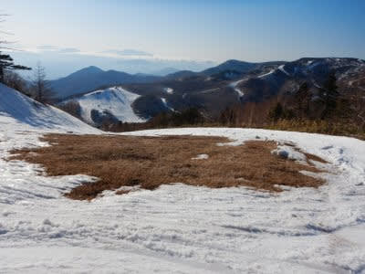
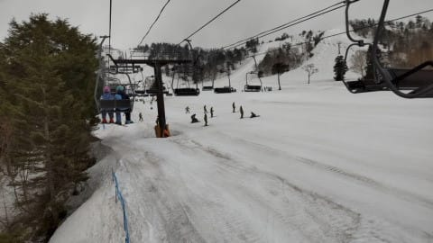
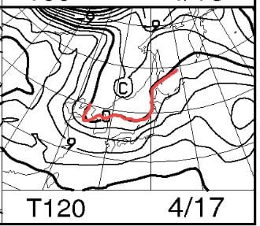

# 2021/4/12(月)，13日(火)の志賀高原スキー場特派員情報！…そして，知らぬ間にダイヤモンドスキー場今シーズン営業終了？

📅 投稿日時: 2021-04-14 01:10:30

🏷️ カテゴリ: [日記](cc4b5682fb7b8b144980957a978653fb0.md)

えー．

最近では夜中に死んでいるパターンが

多かったものの．

それでも翌日朝に何とか更新したり

していたものですが…

今回はまる一日，いろんな意味で死んでました

…そして．

今日，まだ今晩中にやっつけなくては

いけない仕事が残っているなんてことは

口が裂けても言ってはいけない

Skier_Sです←いろいろとっちらかって挨拶がおかしくなっている

で．

本日．

志賀高原中央エリアのFacebookを見て．

「なんだと…！？？

　ダイヤモンドスキー場も4月11日で

　終わりだったのか…っ！？」

ということに気づき，驚いたのですが．

([志賀高原リゾート開発Facebook](https://www.facebook.com/ShigaKogen.Ski/)より）

確か…

たしか，ついこの間までは．

ダイヤモンドリフトは5月5日のGWまで

営業すると出ていた気がするんだが…

（[志賀高原中央エリアホームページ](http://shigakogen.co.jp/wp-content/uploads/2021/03/20-21%E6%98%A5%E3%83%AA%E3%83%95%E3%83%88%E5%96%B6%E6%A5%AD%E4%BA%88%E5%AE%9A%E8%A1%A8.pdf)より）

4/12(月)のダイヤモンドスキー場

の写真を見ると．

普段の4月上旬より雪が少なく，

上の部分に土がでてるけど…

まだ1週間は営業できそうな感じ．

…例年より2週間ほど早い，予想以上の

雪解けも原因にあるのかもしれないけど．

むしろ，コロナ禍による来場者減により．

ダイヤモンドの営業終了を前倒しに

した感じですかね…（涙）

うーん．

でも，一の瀬正面バーン上部も，

雪はGWまでもつかどうかギリギリな

感じだし．

[前の記事の冒頭](e31c7f0c0c47c0afaf10c2348a5d2279c.md)に書いたように，

パーフェクターコースや高天ヶ原，

寺小屋も雪が少なくなってきたし…

だんだんまともに滑れるコースが

減っていってますね…(涙)

とりあえず．

そんな状況なので

貴重な特派員であるレインボーさんが

今シーズン終了を宣言したり，

次々特派員が減っていってるわけですが…

ただでさえ，

いろんな意味で濃い志賀高原常連の方々．

この中でも生き残っている方々は．

だんだん濃いエキスのさらに濃縮された

方々だけ残っていっているのかな？？？

という感じが…

でも．

まだまだ奥志賀もほぼ全面行けるし．

焼額第2ゴンドラのコースも幅いっぱい

滑れるし．

志賀高原，まだ大丈夫ですよ～！！

ってなことで．

昨日も今日も，まだ前線で生き残っている

特派員からのレポートです！

えー．

まずは

4月12日(月)

のレポートですが．

この日も朝から晴天！！

…でも，朝からプラス気温と，

暖かい上に，強い日差しで．

朝から雪は結構柔らかかった

ようです…

でも，見ての通りに

「人がいるのか？？」

というレベルでガラガラなので．

雪はかなり柔らかいものの，

バーンが荒れ始めるのは

遅かったみたいですね…

とはいえ．

やはり高温晴天のため，午前中

早いうちに雪はザブザブに

なってしまい…

昼ごろには，バーンは結構

荒れちゃったようです…

で．

続いて，

4月13日(火)

の状況ですが．

…この日は朝から強風で，

奥志賀全面運休…！

おこみんが奥志賀ゴンドラ前で

寂しくたたずんでます…

焼額もゴンドラ運休で

第4ロマンスのみ営業

だったようで…

([志賀高原索道協会ホームページ](https://www.shigakogen-ski.com/live-lift-status/list)より）

焼額の第4ロマンスも，強風で

2時過ぎに営業を終えてしまうような

悪天候だったようなので．

([焼額山スキー場ホームページ](https://www.princehotels.co.jp/ski/shiga/winter/)より）

特派員は奥志賀から熊の湯へ移動！

南風は強いけど，北斜面の熊の湯は

第2ペアが動いていたようです…

朝のうちは，青空がのぞくくらいで，

風が強かったものの天気は悪く

なかったようですね～…

さすが熊の湯，第2緩斜面はまだ全然

余裕で幅いっぱい滑れますね！

第3緩斜面もまだ真っ白で，土は

出てないようですが…

気温があさイチで+5℃と高かったようで．

雪は朝から柔らかく，すぐにザクザクに

なっていったようで…

さらに，午前10時ごろには一瞬液体も

空からぱらついたようです…（涙）

でも，雨が降ったのは午前中は一瞬だけ．

そのあとは，ほとんど雨にならず

済んだようです…

…ってなことで．

火曜の本日も，雪が解けるどしゃ降りにならず．

済んだようです…

で．

明日の水曜は朝のうち曇り，午後は晴れ．

木曜は終日晴れて，朝は冷え込んでくれて．

金曜は晴れ⇒曇り，気温は平年並み(昼間はプラス)…

って感じで．

金曜までも，致命的な雨や異常なほどの

高温はなさそうですね．

…でも．

なぜか．

17日の土曜は…

うむ…？降水域が日本をすっぽり

覆っていて…

そして，850hpaの赤い0℃線が

志賀より北ということは…

…また，この週末は．

空から液体が落ちてくる

ということか…っ！！！（激涙）

3月第1週から今週末まで，

7回の週末で6回雨が降る

というのは．

歴史に残るひどいシーズンではなかろうか…

…うがーーー！！

だれだ～っ！！！

日ごろの行いが悪いのはっ！！！

と言っておきながら．

誰かが志賀高原にいく夢を見るようになった

週末から，雨が降り始めた

という事実をここに書いてしまうと．

日ごろの行いが悪いのが自分だと

ばれてしまうから．

その事実は隠しておこう…

と思った，Skier_Sなのだった…←だから，ここに書いている時点でバレバレだから
