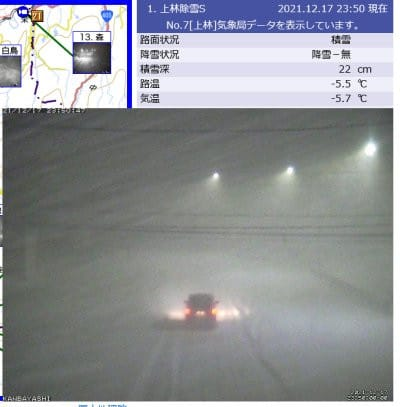
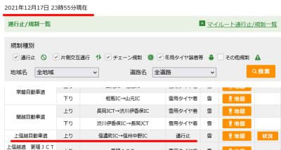

# 明日も志賀高原！今，志賀高原はめちゃくちゃ雪が降ってるようで，明日も吹雪．無事志賀にたどり着けるか？

📅 投稿日時: 2021-12-18 00:08:52

🏷️ カテゴリ: [日記](cc4b5682fb7b8b144980957a978653fb0.md)

えー．

なんだか．

今，志賀高原はものすごい勢いで雪が

降ってるようですが…

（[北信建設事務所道路状況カメラ](http://hokushin.pref-nagano-roadcamera.jp/)より）

そして．

深夜0時現在．

すでに上信越道の信州中野～信濃町間は通行止め

になっているようです…

（[ドライブトラフィック交通情報ページ](https://www.drivetraffic.jp/?t=r&area=05&lv=6)より）

果たして，今やっと仕事が終わった私は．

明日営業開始までに，無事に志賀高原に

着けるのか？

あるいは出遅れるのか？

…そして．

明日の志賀高原，ちゃんと営業開始時間に

スタートできるのか？

（なんとなく遅れそうな予感…）

でも．

明日は激寒の吹雪だろうけど．

パウダーが楽しめるはず…！

と信じて，出発します～！

風が強くてゴンドラが動かないとか

になったらつらいなぁ…

明日は，吹雪の中リフトにさらされて

滑ってたら冷凍人間になりそう…

ってなことで．

いつもよりちょっと早め，午前3時に

出発したいので…

あと3時間経たずに出発です～！

これからスキーに行く準備して，

お風呂入って．

って．

多分今日も2時間寝られない（涙）

## 💬 コメント一覧

### 💬 コメント by (レインボー74)
**タイトル**: Unknown
**投稿日**: 2021-12-18 15:51:04

土曜日の志賀高原情報

大雪の日。朝の上林-6℃　蓮池-11℃。

強風でイチゴン運休なので、期待していたGSの非圧雪は明日に持ち越しと相なりました。三高が動けばミドルが楽しめるのだけど、これもだめ。

40分遅れの四ロマから唐松へ。圧雪の上に30~35の新雪。だけど板が滑らない。チューンナップにだしたままの太板が、ワックスの酸化や急な低温のせいか、進まない。緩斜面では初転倒もあって最悪。

10時頃からニゴンが稼働。強風なので低速運転ながら、やっぱりゴンドラは楽ですね。奥志賀は二高が運休だけど、意外にもゴンドラを動かしてくれたようです。うらめしや。

吹雪が弱まり視界が回復。雪面もほぐれて普通に滑れるようになった昼前に業務終了。

朝の雪かきから、疲れた一日でした。

でも、今日来れなかった友人には、「明日もまた新雪かあ！」と、憎まれ口をたたいておきました。

### 💬 コメント by (モイストシルバー)
**タイトル**: Unknown
**投稿日**: 2021-12-18 17:11:04

Skier_S様　いつも焼額の情報大変楽しみにしています。本日の大雪に期待して焼額に来ましたが、第2ゴンドラが運休で時々動いたりでしたが、新雪が楽しめました。明日は第1ゴンドラが動きそうですね。お会いできれば、挨拶させていただきますm(_ _)m

### 💬 コメント by (５０代おっさん)
**タイトル**: Unknown
**投稿日**: 2021-12-18 17:55:12

学生時代に競技スキーをかじったもので、痛む腰をさすりながら、今もスキーを楽しんでます。２、３年前にこちらのブログにたどり着き、いつも楽しませてもらってます。特に気象に関する話題は、難しいのに分かりやすく、ホントにホントに参考になります！シーズン入り前後の雪の情報、気が気でなりませんもんねえ。志賀高原、たどり着けましたでしょうか？

こちらはブログを参考に頑張って６時に東京を出て、群馬・丸沼高原に到着。確かに降り方はすごかったけど風はさほどでもなかったので、新雪を楽しませてもらいました。

今度も読ませてもらいます。いつも寝不足のよう、余計なお世話でしょうが、運転にはお気をつけください。ブログ楽しみにしてますので！

### 💬 コメント by (かず)
**タイトル**: Unknown
**投稿日**: 2021-12-18 19:19:34

奥シーズンインしました！本日記念すべき初中部横断道から全高速！27年も待ちましたよ……しかし忘れ物あり高速降りて帰宅 笑 仮眠無しでギリ間に合いました 

 今日は体力もたなくて12時終了  明日イチゴンも行きます！日曜夜降りそうですかね？

### 💬 コメント by (Skier_S)
**タイトル**: 明日はそれ程積もらないかな…
**投稿日**: 2021-12-19 00:08:20

＞レインボー74さま

残念ながら，明日はそれ程新雪は積もらなさそうです…

でも，うっすら新雪に圧雪がかかり，明日の朝イチは最高コンディションだと思います！

>モイストシルバーさま

コメントありがとうございます～！

今日はゴンドラが動いたり止まったりの一日でしたね(涙）

明日は1ゴンも動き出し，終日運転してくれると思います．

イチゴングルグルしていると思いますので，お見掛けの際はぜひ！

＞50代おっさんさま

コメントありがとうございます！

このBlogが何かの役に立っているなら幸いです．

丸沼滑ってらしたんですね…

また，志賀にお越しの際は，焼額にお越しください．

1ゴングルグルしていると思うので，ぜひお会いしましょう！

＞かずさま

中部横断道使うようなルートでいらっしゃるんでしたっけ？

取りあえず，27年待っての開通，おめでとうございます！！

明日は1ゴン動きますので，また1ゴンでお会いしましょう…

って，朝イチじゃなく，10時からの運転見たいですが(涙）

