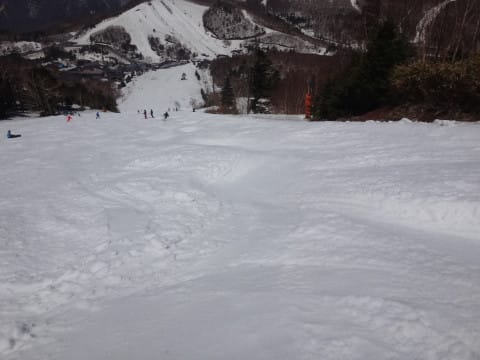

# 5月5日，5連休中日の志賀高原は…暑くて朝から雪が緩んだよ（涙）．かなりざぶざぶの，疲れる雪だったけど…

📅 投稿日時: 2017-05-05 23:18:38

🏷️ カテゴリ: [2017スキー滑走日記](c7d777cecfc91bdf0fa464ad62c6d49ab.md)

ということで．

本日朝4時起きで8時半に志賀高原に舞い戻ってきた，

Skier_Sです．

2時間しか寝てなく，眠いので．

本日の志賀高原レポートは手短に…←最近，スキー場レポートが

異様に長くなりつつある気がするんですが…

まず．

本日の朝．

志賀高原の丸池の温度表示は…

ええ？？

朝8時から，+15℃！？？

ってことで．

路面凍結も何も全くなく，

夏タイヤで全然問題なく突っ切れる，

暑いくらいの道路を登っていき…

やって来たのは一の瀬ファミリースキー場．

今日は朝からすっきり晴天！！

朝イチのゲレンデは，多少シマシマが残っているものの…

すでに，ゲレンデの雪はかなり緩く…

そして．

ちょっとピステンが甘い（涙）

でも．

一の瀬ファミリー正面バーン．

午前10時近くまで結構フラットな状態保ち…

パーフェクターも．

かなり入口の土は出てきたけど．

朝は荒れておらず，

朝からやわらかいながら結構滑れたよ！

ただ．

気温も日差しも強い本日．

10時を過ぎると，雪は一気に緩みだし…

多少板の滑りが悪く．

また，結構ゲレンデが荒れてきました…

もう，12時前にはこんな感じになってしまい．

あぁ…

完全に，春の雪ですね…

ただ．

今日は5連休というのに，リフトもコースも

それほど混んでないのが良かったかな．

ファミリークワッド，大体一日中こんな感じの

待ち時間でした．

もう，一の瀬ファミリーが完全にドボドボで

疲れる雪になって来たので．

向かいのダイヤモンドスキー場へ行ったところ…

意外とダイヤモンドのほうが，雪がそれほど

ざぶざぶになっておらず．

人も少なかったというのもあり…

いや．

遠目で見ると，こんな感じで雪が茶色く見えたダイヤモンド．

意外と気持ちよかったので．

午後はファミリースキー場をあきらめ，

ひたすらダイヤモンド滑ってました…

意外と，このスキー場．

人が少なくて，雪も荒れず．

夕方4時ごろまでこんな感じで．

穴場だったなぁ…

ということで．

午後はほぼ貸し切りのダイヤモンドを

グルグルしていましたが．

ダイヤは16:30までなので．

ラストは16:40までやってるファミリーで

最後としました…

いやー．

でも，ラストの一の瀬ファミリーの正面バーン．

かなり本格的なコブ溝ができてましたが．

コブ溝に，わずか2か所とはいえ．

土が出てくるようになってきましたね…

とはいえ．

営業はあと2日．

それまで雪はたっぷり持つでしょう…

そして．

ファミリー下半分は．

ものすごく重いし，滑りもそれほど良くない雪で．

…楽しくない…（涙）

ということで．

今日の午後は．

ダイヤモンドがかなり良かったなぁ…

これがなかったら，上半分は全面コブ化，

下半分は粘つく滑りの悪い荒れた斜面…

という，修行バーンの一の瀬ファミリーを

滑らなくちゃならないところだった…

PS.やっぱり明日，午後に雨になりそう（涙）

　ただ，正確な降り始め時間の予想は難しいです．

　…早くて昼過ぎ，遅ければリフト終了後に，

　1時間ほどバラバラと降るかな…

　って感じです．

## 💬 コメント一覧

### 💬 コメント by (いか)
**タイトル**: Unknown
**投稿日**: 2017-05-06 07:37:35

白馬は朝から豪雨です… おかけでゴーストタウンになりそうです(笑)

### 💬 コメント by (しんちゃん)
**タイトル**: ダイヤモンドで締めました
**投稿日**: 2017-05-06 09:39:35

一の瀬ダイヤモンドって、夕方でもコンディションいいですよね。先日もここでシーズン締めくくりました(^^)/

### 💬 コメント by (YUMI)
**タイトル**: えっ！　お留守番？
**投稿日**: 2017-05-06 22:13:25

今朝(多分、９時ごろ)、一の瀬休憩所前にポツンと赤いATOちゃんゴールドシール付きを見かけました。。。♪

・・・が、Sさんは見つけられませんでした。（悲）

１０日ぶりの一の瀬スタートだったのですが、雨が降ってきたので、帰っちゃいました。

### 💬 コメント by (Skier_S)
**タイトル**: 今日は悲惨だったけど…明日は晴れ！
**投稿日**: 2017-05-06 22:35:23

＞いかさま

あら…朝から豪雨ですか．

こちらも一瞬ひどい雨になりましたが，

10時過ぎですかね～．ひどかったのは．

ただ，志賀も午後はゴーストタウンでした（笑）

＞しんちゃんさま

この日のダイヤは，午前にポールバーン

で誰も滑ってないところが解放されていたようで，

昼なのに誰も滑った跡がないきれいなバーンでした…

良かったですよ～！！

＞YUMIさま

あら．

板は見つけられたのですね．

朝は’17SXを履いていて，

午後は’16SXを履いて滑りました…

おそらく見かけたのは，いつものお店の

黄色いシールが貼ってある’16SXで，

午後に履いて滑るためにあそこに

おいておいたやつです…

ちなみに，明日も滑るのですか？

明日は早朝奥志賀，通常営業からは

一の瀬の予定です…

