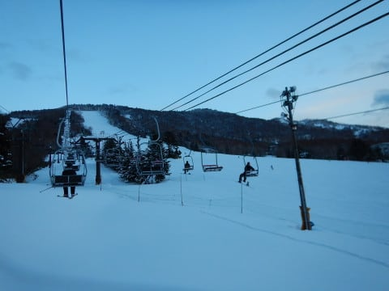

# 12月16日（土）の志賀高原は…朝は晴天！ピカピカ圧雪＆ガラガラ！3週続けて最高のコンディション！

📅 投稿日時: 2017-12-16 23:01:57

🏷️ カテゴリ: [2018スキー滑走日記](c11b88dc181f34079ab41db74a3587646.md)

えー．

本日も予告通り，志賀高原は焼額で滑ってきましたよ～！

まず，朝．

志賀高原の登り坂は積雪路．

…でも，雪は薄く．

焼額の80cm腰パフってホントか…？？？

と，大いなる懸念をもちつつも．

到着した先は，焼額第1ゴンドラ！

そう．

わがホームゲレンデの，

ホームゴンドラです！←そんな表現あるの？？

今日から営業開始の第1ゴンドラ．

いやーーー．

昨年4月上旬から，実に8か月ぶりに，

戻ってきましたよ～！

わが生息地，第1ゴンドラ！←住んでるところだからホームゴンドラなのね＜違うから

天気はすっきり晴天で．

ゴンドラからは，昨日の記事に書いたように．

「腰パフ」

という話のオリンピックコースが見えてます…

うはー！

非圧雪っ！

新雪！

早く滑らせて～！

って感じで，ゴンドラ山頂へ着くと…

本日の気温は-5度ですか．

ふははははは．

これは，水曜夜に予想した通りの気温ですな．

最近の私の天気予想の精度，かなり高まってる気が…

で．

本日は．

腰パフのオリンピックコースを攻めるわけなので．

こいつに初出動願いましょう！

いざ行かん，新雪のオリンピックコースへ…！

と，最高のシマシマ圧雪コースを通って．

やってきましたよ～，

オリンピックバーン！

ふははははは！

腰パフのコースへ，Go!

…って，あれ？

ちょっとクラスト気味？

で…

深さはせいぜいブーツ程度！？？（涙）

…これのどこが腰パフなんだろう…（泣）

雪は固まり気味で難しく．

残念ながら，ちょいと楽しくない感じ…（涙）

残念．

残念だ…

…ってことで．

新雪のオリンピックコースは2本であきらめて．

次は，圧雪ピカピカシマシマの

ジャイアントスラロームコースへ，Go!

シマシマだっ！

シマシマだよっ！

それも，いい感じで柔らかすぎず，硬すぎず．

ちょうどいい締まり具合の，脳内麻薬大量放出バーン！

シアワセっ！！

こんな最高グレードのシマシマ雪で．

ガラガラ飛ばし放題で．

晴天で．

…これ以上，何を望むものがあるだろうか…

新しいスキーブーツと

大回り用の板，

そして新品のウェア．

あと，新しい車と

毎日仕事しないでスキーに行けるくらいの

お金が欲しいけど

ゴンドラもガラガラだし．

全然待ちがない飛び込みだし．

いやーー．

ホントに最高！

と，GSコースを滑っていたわけですが．

午前10時ごろ．

研修会の団体さんが入ってくると…

ちょっとゲレンデが混み始めて

きたかな…（ちょっと残念）

でも，今日は第1，第2の2本のゴンドラが動いて

いるので．

人が分散して．

それほどひどい混雑にならなかったので，

例年の研修会混雑に比べれば，

かなりマシだったかな～．

研修会の団体さんと重ならなければ．

ゲレンデは恐ろしいほど人がおらず…

がらがら！

そして，景色はトップシーズン！

昼を過ぎても気温は0℃を超えず．

おかげで，午後になっても雪質は

悪くならないし．

ゲレンデが荒れないので，午後まで

大回り板でOK

あぁ…なんて最高のスキー日和でしょう…

ただ，昼を過ぎると．

予想通り，ちょっと空に雲が増え始めてきたかな～？？

とはいえ，曇って真っ暗になるほどではなく．

さすがに最後はちょっとゲレンデが荒れ始めて

来たものの．

致命的なほどゲレンデが荒れることなく，

最後まで大回り可能だったゲレンデを．

リフトの最終営業，16時まで

滑りつくしたのでした…

いやーー．

朝からコンディション良かったので，

いっぱい滑ったなぁ…

…

…

って，

あれ？

これ…一の瀬？？

ということで．

無意識のうちに瞬間移動していたらしく．

ヤケビの営業終了まで滑っていたというのに．

最後は，一の瀬ファミリーを，日が暮れるラストリフトの

16:30まで滑り続けたのでした…

で．

夜10時過ぎのいま，志賀ではちらちらと雪が

舞ってます…

明日までに10㎝くらい積もってくれることを

期待！！

PS.

本日，一番最初にGSコースを滑ったとき．

ん？

何か違う…

昨年までと，景色が違うぞ…？？

…そうか！

第3ロマンスリフトが撤去されているよ…（涙）

奥志賀ゴンドラからの帰り道用の復活を

期待していたのに．

ついに今シーズン，第3ロマンスも復活の道を

閉ざされたようです…

次々リフトが減っていくなぁ…（涙）

PS2.

最後あいさつできずすみませんでした＞しんちゃんさま

瞬間移動するのに必死でした…

## 💬 コメント一覧

### 💬 コメント by (はなげ親分)
**タイトル**: く～つっ！
**投稿日**: 2017-12-16 23:39:34

うらやましい！

悔しい～！

滑りたかった～！

最高のコンディションだったんですね～

来週は私も昇天させていただきます！！！

### 💬 コメント by (しんちゃん)
**タイトル**: 今日もよかったなぁ
**投稿日**: 2017-12-17 00:06:50

いやぁ～、先週に続き今日も良かったですねぇ。

ラストまでご一緒頂きましてありがとうございました。

よいしょとブーツを脱いでいたら、もう姿が無かったのでびっくりしました。一ノ瀬に瞬間移動していたとは。

恐るべしGOLD20000m倶楽部メンバー様

帰りは休憩を何回もとってなんとか無事にお家にたどり着きました。

→さすがに疲れました(^^;

またこの幸せを味わおうと、来週も行こうかと思っています。

よろしくお願いします。

### 💬 コメント by (olaf2125)
**タイトル**: 至極の一日でした！
**投稿日**: 2017-12-17 00:47:18

昨日はありがとうございました😊

やっとご挨拶できました。しかも！

今シーズン初滑りが最高のコンディションだったり、シルバーステッカーいただいたり、20000m倶楽部の重鎮の方々とご一緒させていただいたりと、至極の一日でした！

年末にまた予定してますのでよろしくお願します！

### 💬 コメント by (れお)
**タイトル**: 最高ですね！
**投稿日**: 2017-12-17 02:34:11

Ｓさん久しぶりです！

コメントできずでしたが、ブログ読んでました～

太板腰パフのレポート楽しみにしてたのですが、ちょっと残念。

でも圧雪コースは最高っぽいですね(うらやましい)～

私も、やっと本日シーズンインです！

白馬方面か志賀かでちょっと悩んでますが、たぶん志賀行くと思います！

今年もよろしくお願いします～！(´▽`)ノ

### 💬 コメント by (Goku)
**タイトル**: やっぱり
**投稿日**: 2017-12-17 08:45:20

昨日はお世話になりました。

朝イチからラストまで、最高でしたね♪

いや～楽しかった。

で、やっぱりあれから瞬間移動で一の瀬でしたか。

さすがです！

ではまた来週お逢いしましょう。

### 💬 コメント by (Skier_S)
**タイトル**: 今日は寒かった…
**投稿日**: 2017-12-18 00:22:14

＞はなげ親分さま

土曜は最高でしたよ～！！！

日曜は寒いしオリンピックコースは下地がガリガリだしGSコースは午後は凸凹に荒れたけど．

でも楽しかったですよ～！

来週はぜひ復活してください！

＞しんちゃんさま

土曜は最後挨拶できずすみませんでした…

あっという間に駐車場から消えているという，

瞬間移動を目の当たりにできたかと…

ぜひ，23，24日の週末も志賀にお越しください～！

お待ちしています～！

＞olaf2125さま

やっとお会いできましたね！

でも，朝イチにお会いして以降

一度もお見かけしなかったのが心残りですが…

焼額は20000mクラブの人たちがいっぱい

滑っているので，シール貼ってる人見たら

声かけてみてください！

また焼額でお会いしましょう！

今度はご一緒に滑りましょう…

＞れおさま

今日はお世話になりました～！

一緒に滑れて楽しかったです～！

でも，ちょっと寒かったですが…

息子さんにもよろしくお伝えください．

＞Gokuさま

土曜は良かったですね～．

日曜は違った意味で楽しめましたが…

オリンピックコース，下地を圧雪していて

くれれば最高だったのですが，そこだけ

ちょっと残念．

でも，寒いし終日降り続けるし．

もう，1月ハイシーズンの冷え冷え週末が

早くも来た感じです．

また来週，お会いしましょう～！

