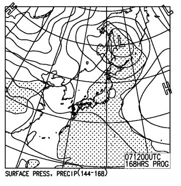

# 3月5日の週末の志賀高原の天気は…気温は上がるけど，土曜は雨にならなさそうっ！

📅 投稿日時: 2016-03-02 00:44:45

えー．

昨日．

…明日の朝は，かなりの積雪で，

最高でしょうね…

と，書きましたが．

…その通り，[火曜の今朝にかけてすごい積雪](https://www.facebook.com/yakebitaiyama/photos/a.133097176785637.26773.116999658395389/944393438989336/?type=3&theater)で．

50cmの腰パフパウダーデーだったようですね…

ああ…

こんなパウダーデー．

今シーズン，もう二度と来ないラストチャンスだった気が…（涙）．

（昨シーズンの腰パフデー）

ってことで．

今週末も，また危険な天気図になりつつあるので．

またまた臨時の，今週末の天気予想です…

とりあえず．

ドサドサ積雪は，本日までで終わり．

水・木は，気温が冷え冷えなれど，

積雪の積み増しは無い感じ．

…ってか．

水，木は冷え冷え晴天になりそうなので．

火曜のフワフワ雪が積もった後の，最高の2日間に

なりそうなんですが．

…なぜ．

なぜ，みごとに週末を外して，最高のコンディションに

なるのかなぁ…（涙）．

で．

金曜も晴れですが．

金曜から気温が上がり始めます…（泣）．

こんな感じで，金曜の0℃線はかなり志賀に近づいており…

地上天気図も高気圧に覆われるので，

おそらく，すっきり晴れ．

うーむ．

南斜面は，日差しで雪が解けそう…

で．

それで，だ．

問題の，土日だ．

850hpa気温傾向を見ると…

うむ？

6日の日曜．予想気温は高いままだけど…

昨日まで，かなり高温になると予想されていた，5日の土曜日．

平年比わずかにプラス，といった程度の気温にしか

上がらない予想に変わってきました！！

をを！

これは…

これは，いい傾向だっ！！

5日土曜の850hpa気温予想は，こんな感じで…

うーむ．

やはり，0℃線は志賀高原より北．

志賀高原には+3℃線がかかってます．

…日差しが強いと，雪が緩みそうですが…

でも，昨日の予想よりはましかな～．

で．

地上天気図はこんな感じなので．

をを！

低気圧の接近が，昨日までの予想に比べ遅くなっている！

このままの予想なら．

土曜は，高気圧の配下ですっきり晴れそうじゃないか！

…土曜日，気温は上がって，春の雪になりそうなものの．

雨に比べれば…

許す．

ぜんぜん許すっ！！！←異常気象の今シーズン，基準が甘くなっている

で，6日日曜の850hpa気温図は…

ああ．

やっぱり．

0℃線は志賀のはるか北．

志賀高原には+6℃線が…

日曜は，すごい気温が上がりそうです…（涙）．

この気温で降れば．

…間違いなく，雨（泣）．

そして，日曜の夜9時の地上天気図を見てみると．

うむ！？？

…ぎりぎり．

何とかぎりぎり，志賀高原には，

降水域の網掛けがかかってない感じ！

…これは．

日曜も，上手くいけば夜まで降らずに済みそう！

ってことで．

昨日までの予想に比べ，低気圧の接近が1日以上

遅くなったため．

土日とも気温がかなり上がるものの，

日曜の夜まで雨は降らない

…という予想に変わってきました！

おそらく，スキーヤーの皆さんの，

いろんな祈りやら踊りやら歌やら，

そして深い執念が．

神様に届いているに違いありませんっ！！！

…が．

だけど．

まだ，安心してはいけない．

6日土曜日の，特定高度線のばらつき＆スプレッドを見てみると．

スプレッドは0.41という，比較的大きめの値．

すなわち，予想の精度がまだそれほど高くない，ということ．

さらに細かく図を見てみると，赤矢印で示したように，

5400m高度線の位置予想に幅があります．

これは，現時点で．

低気圧の予想位置のばらつきが，これだけの幅で発生しうる…

ということ．

…

…

そうです．

この特定高度線の予想ばらつきのうち．

一番東の位置になった場合には．

日曜は，雨になる可能性も…（涙）．

そして．

週末が終わった，月，火となる7，8日は…

あう．

引き続き，0℃線は，志賀よりはるか北のまま…（涙）．

そして，月曜の地上天気図は…

…これは，間違いなく雨．

このままだと，月曜は雨ですね（泣）．

また，雪が解けちゃいそう…（涙）．

いや．

いやいやいや．

諦めるのは，まだ早いっ！！！

こんな感じで…

7日月曜の，気温予想のばらつきは，

まだ異常に大きいのだ！！

このうちの一番低い予想なら，平年並みに収まって．

雪になる可能性もあるのだっ！！！

だから．

また雨になって，3月にスキー場クローズの危機を招かないために．

まだまだ寒気の歌を歌い続けるのですっ！！！

そして．

まだまだ休むことなく，踊り続けるのですっ！！

冷え冷え踊りPart4～果てること無きネバーエンディングダンシング～をっ！！！←いいかげんそろそろ休ませてほしい
