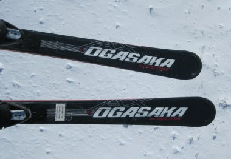
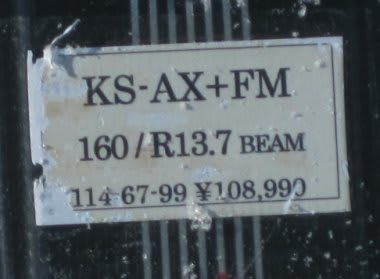
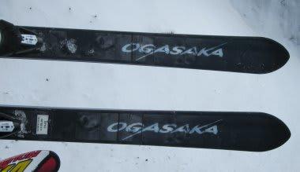
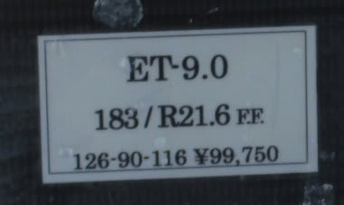

# 今度こそ最後！2012/2013シーズンモデルのスキー試乗レポート　OGASAKA編4

📅 投稿日時: 2012-05-24 01:13:43

🏷️ カテゴリ: [スキー板試乗](c0bd8048615710cee890e403a36cc9a2b.md)

あー．

今シーズンはスキーの試乗会に3回も参加したために，

かなりの回数にわたって2013年モデルのスキー板の試乗インプレッションが

続きましたが．

…さすがに今度が最後．

…もう飽きたよ，って声が聞こえそうですが．

これが最後ですので，我慢して読んでやってください…

＃素人評価なのであまり参考にならないでしょうけど

あ，そうそう．

試乗した日のゲレンデコンディションなんかは，

[これ](e3bae2b782961d95b4b24cde5cf7154e7.md)を読んでくれれば分かりますが，

かなりいいコンディションで試乗しています．

あ，ET-9.0は雪がどぼどぼになってから履きました…

では，いってみよう！

--

Keo's KS-AX＋FM600　160cm　

オールラウンド基礎板．

昨年からの継続モデルですね～．

試乗したのは160cmですが…

この長さだと，小回りベースオールラウンドですかね．

R=13.7ってことですけど，これよりRが大きいTKよりも，

もう少し大回りしていける感じ．

熊の湯くらいの短いコースだと，160cmくらいでもちょうどいいかも．

これも，TC-MVに近いですかね．かなりオールラウンド性が高そうな板です．

…まぁ，TC-MVよりはフレックスは柔らかめです．

しっとりときれいにたわんで，たわんだエッジに乗って回っていけます．

スピードが出てくるとたわみが強くなり，かなり深い内頃角のターンに

入っていけます．トップとテールのエッジグリップがしっかりしてる感じ．

板はかなり軽快で，履いた感じは軽いです．

軽いのにしっかりグリップして，結構いい感じ．

…でも，トップスピードを出すと，160cmって長さだと小回りになりすぎるかな．

中回り程度のオールラウンドを探していて，TC-TKは小回り過ぎて，

TC-MVだとフレックスがちょっと強いかな…って感じる人には，

これの170cm程度を選べばオールラウンドで使えそうでちょうどいいかも

E-turn 9.0　183cm

オールマウンテン．

フルロッカーのセンター幅90mmという，オフピステ・新雪狙いの板ですね．

この板…

日曜の雪がやわらかくなって荒れてから履いたんだけど．

いい！

これ，いい！

春雪のどぼどぼしてでこぼこになったゲレンデを，何の苦もなく

乗り越えていきます．

ロッカー形状と幅広さで，やわらかいでこぼこ雪の上をなめるように

滑らかに滑っていけます．

んで，傾けていけば，ロッカーが深いので，傾け始めてからトップのエッジが

接雪して曲がり始めるまで，ちょっとタイムラグがありますが．

トップのエッジがグリップしてからは，幅広い板がしっかり柔らかい雪に

壁をつくり，しっかりとした足場でターンしていけます．

普通の板よりフレックスがやわらかいので，しっかりとやわらかい雪でも

たわんでくれて，ターンしやすいです．

183cmって長さですが…

ロッカーが強いので，183cmとは思えない．

175cm，あるいはそれ以下の感じで，軽快に曲がっていきます．

183cm，ぜんぜんOK.

いや，むしろこのくらいの長さを選びたいなぁ…

R=21.6ってありますが，ロッカーだからかもっと小さい

Rの板に感じます．R=17から18くらいの感じかな．

…で．

これ．

新雪用じゃなく，春雪用として，すんごくいいかも…

春雪用としてほしいぞっ！

## 💬 コメント一覧

### 💬 コメント by (ひろりん)
**タイトル**: Unknown
**投稿日**: 2012-05-24 15:29:10

はじめまして♪

KS-GP01＋FM600に現在乗ってます。

KS-AXを友人に勧めようかと思ってます。

AX、なかなかいい板ですよね？

KS-TK履いたんですが、なんか「眠たい」感じでどうも好きになれず・・・

ホントはTC-SVがいいんですが、デザインがアレなので（笑）

ATOMIC　Bluester AXが自分の中では一押しなんですが、買われると悔しいのでナイショです（爆）

### 💬 コメント by (Skier_S)
**タイトル**: はじめまして
**投稿日**: 2012-05-25 02:08:13

役に立たない散文置き場へようこそ（笑)．

KS-AX，結構いい板だと思いますよ．

小回りメインならKS-TKですが，オールラウンド性はAXの方が高いと思います…

TKの方が，多少ルーズに感じるかも．

ATOMICのAX，私も今シーズントップ3に入る板だと思いますが，いかんせん高すぎます…定価14万以上って…（涙)．

