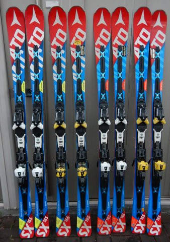
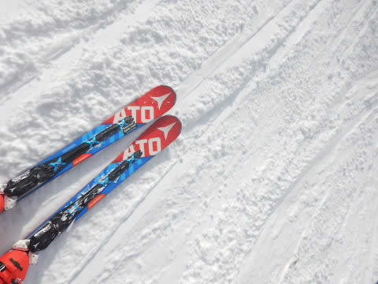
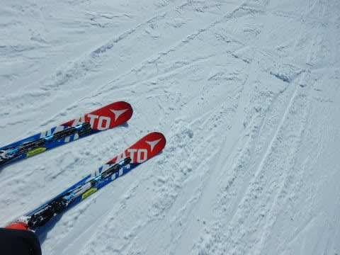
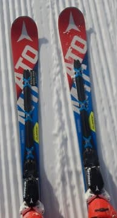
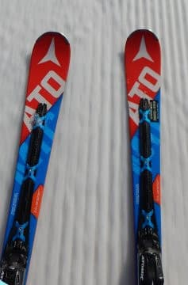
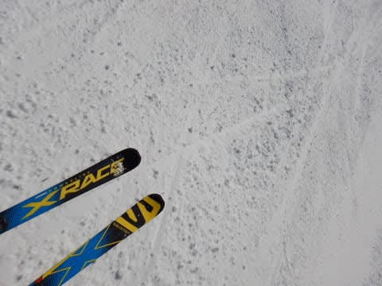
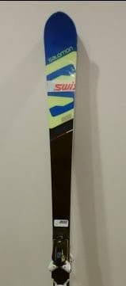

# ATOMIC Bluester SX，ついに二郎君から三郎君にチェンジ！

📅 投稿日時: 2019-02-01 00:10:37

えー．

ということで．

私がメインで使っている，ATOMICのSX．

この板をすごく気に入っている私．

何をとち狂ったか，[ついつい4セットも
購入した](e8a53c5e38b2ebcf1a084dc391aaad69d.md)わけですが…

一郎君はすでに引退しており．

昨シーズン，メインに使っていたのは

2シーズン前の3月中旬からデビューさせている，

[思わず通販でポチってしまった](e922ef4eede2bd4d2b900bd4bf1b03156.md)，2セット目の二郎君．

この二郎君．1シーズン半使って，

[エッジが剥離](ed5767135dfb18a758390c3e37aae05b5.md)したり滑走面が波打ったり，すごい

状況になって来たので．

この正月休みから，三郎君を本格デビュー

させたわけですが…

…実質4か月しか履いてない一郎君から，

二郎君に履き替えた時には．

古い一郎君が

「これ，元SXだった何かだよ…」

[というほどヘタっていた](e27e2a7149d362e76794896614d0f18f3.md)のに．

今回，二郎君から三郎君に履きかえてみて．

うむ．

二郎君，剥離して滑走面が波打っているけど．

それほどヘタってないぞ．

三郎君の方が，多少高速時の安定性が

あるように感じるけど．

前回のように，「全然違う板」と思えるまでには

ヘタッてないよ！

うーむ．

こんな経験（[その1](e7fa96c3f88bd94ba6390c710d6538679.md)，[その2](e2417d511869d49d0e1e493c47fbd692c.md)）や，[あんな経験](ef429e6264e79c420fc0cb4dc41634d6c.md)をしている私．

私にとって，メインの板が1シーズン半

もつとは，かなりの奇跡なんですけど！！

…実は．

一郎君と三郎君は'16SX．

二郎君は'17SXという違いがあり．

この両者，同じものに見えて．

デザインも微妙に違いますし…←普通の人には分からないから．間違い探しレベルだから

何より，大きな違いとして．

プレートの仕様が違います．

で．

板の違いって，結構プレートの違いが

効くので…

もしかすると．

二郎君の'17SXのレースプレートの方が，

一郎君，三郎君の'16SXのランプテックプレートより

しっかりしているので．

一郎君からプレートのしっかりした二郎君に履き替えると，

一郎君がすごいヘタって感じて．

さらに，プレートのしっかりした二郎君から

三郎君に履き替えた時には，二郎君がヘタってない

ように感じているのかも…（ありうる…）

でも．

とりあえず．

さすがに1シーズン半履いて．

雪不足の昨年のGWやら6月の月山，

Yetiやらで履きまくった二郎君は，

滑走面ももうボロボロだし．

エッジも剥離しかけてるし．

そろそろこいつは，シーズンイン・終了直前の，

石ころ踏み用にしましょうか…

ということで．

二郎君は1シーズン半という，

私のメイン板としては，記録的な長寿を

誇ったので←1シーズン半で長寿なんだ…

決して，SXがすべて，[わずか4か月でヘタってしまう根性無しな板](e27e2a7149d362e76794896614d0f18f3.md)

なのではないということが分かりました…

うーん．

このペースで，三郎君も1シーズン半もってくれれば．

来シーズン（2020シーズン）の終わり近くまで

もつなぁ…

…GW過ぎ＆来シーズンのYetiでは，二郎君に

再びお出まし願うので．

おそらく三郎君，2020シーズンラストまで

もってくれるんじゃないかな～．

そうすれば．

SXはそのあとにまだ四朗君がいるから．

四朗君が2021シーズンから1.5シーズン

もつと考えると．

2022シーズンの真ん中まで，SXを

履き続けられるなぁ…

ってな感じで．

'13SX，'14SX，'16SX2台，'17SX2台と．

計6台のATOMIC SXを乗り継ぎ．

2013シーズンからひたすらSXをメインマシンに

してきた私．

'17シーズンを最後に，生産中止になったSXですが．

これから後も2022年まで乗り続け．

10年間SXをメインマシンにし続ける

という，恐ろしい計画を練っているのであった…

もう，SXは私の体の一部と化してますから…(笑)

そして．

ロング板も，まだ昨年まで履いていた'16X-RACEがそれほど

ヘタッてなかったので．

今シーズンは'16X-RACEメインで乗り切って．

今シーズン購入した'18X-RACE Masterは，

来シーズンの2020シーズンから本格投入とすれば．

履く頻度＆時間が少ないロングの板は，

大体2シーズン半ほどもつので．

これも2022シーズン半ばまでもつはずだなぁ…

これで，2022シーズンまで，板を買わずに

済むはずだな！！←そんなわけないから…

これで物欲選手権も，しばらく開催されずに

すみそうだ…←それ無理だから…

と．

読者の全員が

「そんなわけあるかい！」

と突っ込みそうな，捕らぬ狸の皮算用をして

妙に安心をしている，Skier_Sなのだった…

…でも．

もうSX，買い足さないから．

まだ神田に残ってるのは知ってるけど．

もう買わないから…

## 💬 コメント一覧

### 💬 コメント by (若杉勲71)
**タイトル**: 志賀高原情報
**投稿日**: 2019-02-01 12:05:52

四本も変わり映えしないいたが、しかもショップでなく個人で並べられる人が、レーサー以外で、はたして日本中探しても存在するでしょうか。極めて稀有な人であることは間違い無い。うんうん。

今日も徒然・・の読者とご一緒しましたよ。毎日誰かに話しかけられます。20000mもかなり浸透しましたね。

本多ご夫妻との会話中に思いついたレインボークラブも、このブログのおかげでかなり知られてきました。

今日はオリンピックは膝パフ。40ー50くらい。最高だったのはスーパージャイアント。ずっと小雪がぱらついています。だんだんと乾燥した雪になってきました。明日も楽しみです。気をつけて、ご来志賀を。

### 💬 コメント by (ホンダ)
**タイトル**: 今日もモサモサです。
**投稿日**: 2019-02-01 19:38:44

今日のヤケビは天気はいまいちでしたがパフパフパウダーでしたね。朝から貸し切り状態でした。レインボーの方々を探しましたがあえませんでした。奥志賀のパウダーを繰り返し満喫しました。気持ち良すぎでした。明日は晴れますように。

### 💬 コメント by (さち)
**タイトル**: Unknown
**投稿日**: 2019-02-01 20:20:57

この記事、

買う前フリってことでよろしいでしょうか？(笑)

### 💬 コメント by (若杉勲71)
**タイトル**: 志賀高原情報
**投稿日**: 2019-02-01 23:01:19

奥志賀が最高だったなんて。そんな・・

強風で間引きか休止かと思っていたので、昼食をファミリーにしてしまいました。探したんですがね。杉山列車(スクールのトレイン)もヤケビに来ていたし・・・さすが本多ご夫妻。

明日は8時奥志賀です。

### 💬 コメント by (Skier_S)
**タイトル**: 今週末も焼額！
**投稿日**: 2019-02-01 23:58:04

＞若杉さま

そんなにパウダー積もりましたか！

うらやましいです…

この週末はパウダーは望めなさそうですが．

でも，コンディションは良さそうな感じ！

2月に入ったから，いつもならゲレンデが混むんですが…

では，明日お会いしましょう！

＞ホンダさま

また金曜から滑ってらしたんですか！

うらやましいです…

それも，パウダーパフパフって…（悶絶）

明日はあさイチはピカピカシマシマバーンの予想です．

ファーストトラック楽しんできてください．

＞さちさま

いや…

買いませんから！！！

お金なくて，もう買えませんから！！

### 💬 コメント by (ほっぽ)
**タイトル**: 五郎君、六郎君
**投稿日**: 2019-02-02 00:40:01

Ｓさん

そろそろ五郎君、六郎君、をＧＥＴする時期かと思います。(^^;

実は私、１月に新品の１５ＳＸを半日履いたのですが、

とても私には乗りこなせないと分かって早々に売却してしまいました。

ＳＸって独特の乗り味がありますよね。その乗り味を再現できるのは

やはりＳＸを置いて他に無い、と思います。

### 💬 コメント by (いか)
**タイトル**: Unknown
**投稿日**: 2019-02-02 22:35:49

いやー、SXがたくさん生えていますね。

私も17SXの二郎くんが1.5シーズン目です。ただ、先日他の人の19S9i Proと交換してみたところ、、、、という感じになっていました。おうち待機中の三郎くん登場のタイミングも近そうです(笑) そろそろ四郎くん購入も検討しないと、、、

### 💬 コメント by (Skier_S)
**タイトル**: いかさま
**投稿日**: 2019-02-03 07:41:53

そうですよね。

SX乗りがS9iproに乗っても、「？」って感じですよね…

SXは並べておいておくと増殖するようなので、

四郎君が並ぶ日も近いでしょう(笑)

### 💬 コメント by (カンタロス)
**タイトル**: ビクトリア本店に……
**投稿日**: 2019-02-04 20:18:25

SXの170センチなら並んでましたよ。(笑)たしか定価の半額。

### 💬 コメント by (Skier_S)
**タイトル**: カンタロスさま
**投稿日**: 2019-02-05 02:01:37

まだ結構残ってるんですね…SX．

いや．

でも．

買いませんから．

もうこれ以上，SXは増殖させませんから～！

