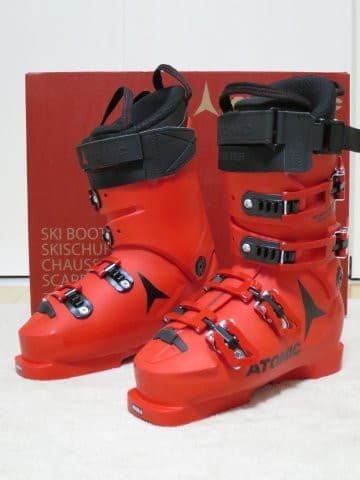
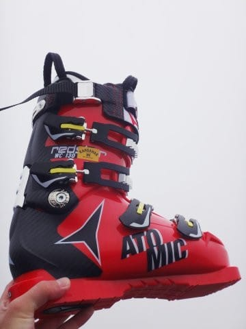
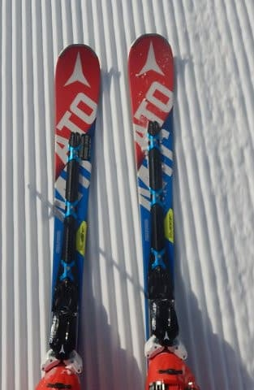
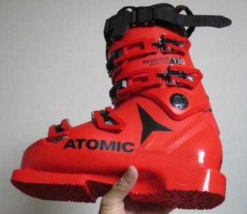

# 新ブーツ，2019モデル ATOMIC Redster WC 130のインプレッション

📅 投稿日時: 2019-01-21 00:47:03

ということで．

今週末は，土日とも志賀高原に

行かなかったので．

滅多にないことなので．

繰り返し言いますが．

5年ぶりに，トップシーズンにスキーを

しない週末を過ごしてしまったため．

…本日は，スキー場レポートではありません．

ってなわけなので．

本日は．

今シーズンの[物欲選手権に敗れた結果](e0191fb936cdf7d9e150b75a80adc5860.md)である，

ニューモデルのATOMICブーツ．

こいつのインプレッションを行って

みましょうか…！

まず．

今回購入したこのブーツ．

ATOMIC Redster WC 130．

私が前に履いていたのは，

'15モデルの，同じRedster WC 130です．

しかし，ATOMICブーツは2018シーズンに

フルモデルチェンジしているので．

以前履いていたのは，古い型のシェルに

なります…

とりあえず，足幅が広いくせに，足首が

細い私．

足首に合わせると，Pro130より足首部分が細身の，

WC130がちょうどいいので（それでもちょっと緩いくらい…）

WC130の足幅を強引に広げて履いていたわけで．

私の滑り方と，我が愛機のATOMIC Bluester DEMO SXとの

相性が異常によくて，かなり気に入っていたのですが…

そろそろまる3シーズン履いて，インナーブーツが

ヘタッてきたのと．

そのせいか，いろんなところが当たって痛く

なってきたので．

「200日以上履いたわけだから，そろそろ寿命だよな…」

と，止む無く買い替えたのでした．←決して物欲に敗れたわけでなく，止むなく購入したのであることを強調

とりあえず．

ATOMICブーツの性能は，むちゃくちゃ気に入って

いたんだけど．

このブーツには，最大の欠点があって．

私の足型と，致命的なほど合わない

ため．

足幅を広げる以外，かなりむちゃくちゃ

削ったり出したりして，強引に履いて

いたものの．

痛いのは嫌だから，そろそろATOMIC以外の

ブーツに浮気してみようかな…

と思っていたところ．

今シーズンモデルのシェルを履いてみて．

'15モデルまでのシェルと，形がかなり

変わってるっ！！

'15のシェルと全然違う！

これなら，自分の足型にも合いそう…

ということで．

ついつい，再びATOMICブーツを

購入してしまいました…

で．

こいつを履いて滑ってみたところ．

うむ．

かなり，先代モデルのシェルと，結構

性格が違いますね…！

先代モデルのシェルは，ロッカースキーの

性能を活かすべく．

ブーツのバックサイドにカーボンスパインを

入れていて，かなりブーツのバックサポートが強く．

板のテール側を抑えるような動きをすると．

硬いブーツのバックサイドが，板のかかとの

あたりをガッツリ食い込ませて行き．

強烈に板のテールをグリップさせて

山回りしていくという…

そして，谷回りでも．

ロッカースキーの性能を活かすため，

あまりトップを抑えすぎないようにするためなのか．

ブーツの前屈は比較的柔らかく．

前屈しても，板のトップ方向が抑えられていく

感じはそれほど強くなかったものの．

…今シーズンモデルのシェルは，

先代モデルに比べると，カーボンスパインも

無くなり．バックサポートが弱めになった感じ…

ブーツのテールに乗っても，板のテールが

ガッツリ食いつく感は弱くなりました．

そのため，ブーツを使うポジションが，

テールよりも，センターよりになってきた

感じがします…

センター～トップ気味に乗った時の，板の

コントローラビリティ―が，先代のシェルよりも

良くなった感じです．

先代シェルが，ガッツリグリップ一本槍マシンだとすると．

新しいシェルは，グリップさせることもできるけど．

谷回りでトップ側に動いた時の，板の動かしやすさ．

そこに特徴がある気がします…

うーむ．

このシェルは，昨シーズンにモデルチェンジしたわけですが．

昨シーズンから，ATOMICは板も変わっており．

新しい板を試乗してみると，

ロッカーを捨てたからか，谷回りからガッツリ

グリップするのではなく，谷回りでの板の

動かしやすさが特徴になっているんですが．

新しいシェルのブーツを履いて．

板もブーツも，ガッツリグリップから

谷回りの動かしやすさという，同じ方向性で

設計されているんだなぁ…

ということを感じました．

まぁ，ガッツリグリップのブーツも好きだったけど．

こういうブーツも悪くないなぁ…

とりあえず．

シェルの形が私の足型に合うようになり．

前回のブーツは，シェル出しを5-6回やって，

2シーズンくらいに渡って手を入れ続けて

いたけども．

新しいシェルは，買った時のシェル出し

だけで今のところ履けているので．

（さすがに正月の8日間履くと，ちょっと

　時々痛くなってたけど…）

今のところ．

この新しいブーツ．

結構気に入ってます…

## 💬 コメント一覧

### 💬 コメント by (musi)
**タイトル**: 笑
**投稿日**: 2019-01-21 09:56:57

土曜日は最高の天気だし、何故か人が少なくてという、Sさんの傷口に塩をすりこむコメントが多くて、面白かったです。そんな私も、インフルエンザ明けでやっと19年のスキー初めを「ガラガラ」「快晴」の奥志賀で初心者2名を引率してきました。でも3時間ぐらい、センターハウスで仕事のクレーム報告書作って電話するはめになりました。それに、昨日はなかなかの視界の悪いなかでのすべりになりました。偉そうに言える程、上手ではないんですが、初心者が滑れるようになって嬉しそうに笑ってるのを見るのは、なかなか得難い喜びですね。（杉山スキースクールのおかげですけど）。Sさんも来週は赤い素敵なブーツで鬱憤を晴らしてください。PTAとか野球団の用事でスケジュール埋められちゃうので、「屈辱感」共感致します。

### 💬 コメント by (新潟のスキーヤー)
**タイトル**: Unknown
**投稿日**: 2019-01-21 23:30:44

今日はSサンの予想通り、午前中はちょっと風がありましたが、昼過ぎには陽も差し、冷え冷えの最高のコンディションで楽しむことができました！(^^)

明日は杉ノ原、来月は蔵王へ遠征予定がありますので、３月上旬に休みがとれれば志賀高原にお邪魔したいと考えております！

追伸．

ゲレンデではなく、宿でゴールドのお札を貼られた板を見て、思わず声を掛けてしまいました。意外に定宿が皆さん一緒だったりして…笑

### 💬 コメント by (Skier_S)
**タイトル**: 今日も志賀は雪が積もってるよ！
**投稿日**: 2019-01-22 01:25:06

＞musiさま

インフル完治でスキーされたのですね…

土曜は初心者にとって最高の天気で良かったのでは

無いでしょうか．

…レストハウスで仕事はしたくないですが(笑)．

今週末は志賀高原へ復活します～！

＞新潟のスキーヤーさま

朝のパフパフは最高だったんじゃないでしょうか．

うらやましいです…

そして，宿で金のお札の人に会いましたか…

一の瀬の某宿ですね．おそらく．

金のお札の人は，確かに結構固まって泊まっているかも．

また3月に志賀高原でお会いしましょう～！

