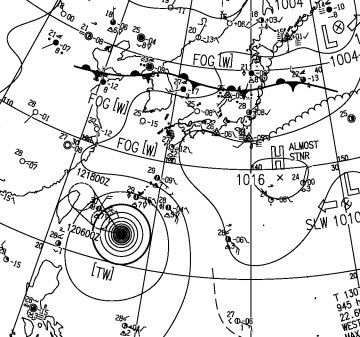
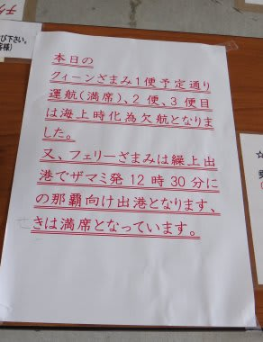
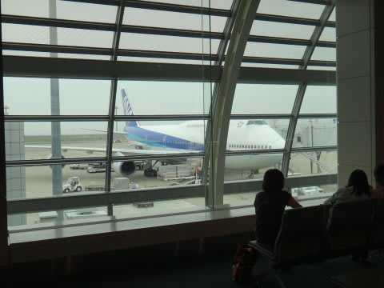
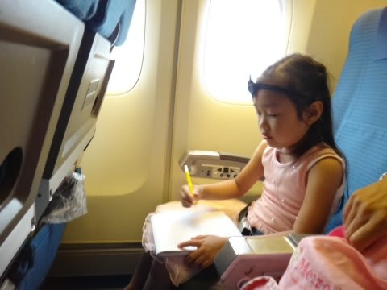
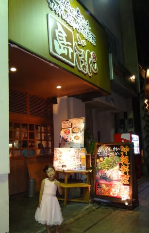

# 2013年7月　子連れ座間味ダイビング旅行記その1…奴がまたやってくる

📅 投稿日時: 2013-07-21 00:52:43

🏷️ カテゴリ: [ダイビング日記](ce3a7a8d424d112fce83ee85c81a0e344.md)

ということで．

家族みんなが待ち焦がれている3連休だったわけですが．

…

…

来た．

来ましたよ．

奴が．

予想通り…

出発数日前．

ダイビングショップからの電話にて．

「…台風が近づいてて，来訪予定の3連休初日，厳しそう…

　連絡船，出ないかも」

…

…

…うがーーーーっ！

ま，また，台風か～っ！！！！！！！

そう．

どうやら，

「台風を呼ぶ」体質を持っているらしい私．

昨年も[予定を変更して座間味脱出を余儀なくされる](edcda8f84cb51ffcca8cb97912c33cc74.md)という

悲しい思い出があるのですが．

(昨年の写真)

今回も．

出発前日の沖縄方面の飛行機は欠航．

がががーーーん！！！

こ，これはダメか～っ！

…と，思っていたところ．

出発当日．

台風は南にそれて，本島直撃は免れ．

那覇行き飛行機は無事飛ぶことに…

私の日ごろの行いの良さが効いたようです．←ダイビングシーズンもこれか

ただし．

風がかなーり強く，那覇から座間味への船は数日間欠航が続いており．

出発当日のこの日も，欠航が決定．

さらに．

風が弱まらなければ，明日以降も欠航が続きそう，という状態…(涙)．

…那覇に飛べても，慶良間に渡れなければ，潜れないではないかっ！！！

でも．まぁ．この日は．

午後便で那覇へ移動し，那覇泊．

座間味へ渡るのは，次の朝の予定なので．

うーん．

明日までに風が弱まって，明日は高速船が動いてくれることを，

祈るしかない…

とりあえず，飛行機は台風の影響も無く，予定通り飛ぶようなので．

空港へ行き，飛行機へ乗り込みます．

空港に着く前から

「早く飛行機に乗りたい～」

とのたまっていた，飛行機大好き娘は．

那覇までの2時間半，いつもどおり

ゴキゲンで飛行機に乗ってました…

飛行機は予定通り，那覇に到着して．

外に出てみると…

…なんだか．台風の吹き返しで，かなり風が強いですね～．

今日，座間味行きの船が全便欠航だったのもよく分かる…．

…明日，連絡船動くのかなぁ…

とりあえず，那覇到着は夜だったので．

急いで泊港のそばのホテルへ移動して．

夜は沖縄料理を食べつつ．

連絡船が明日は無事運行されることを祈って，

眠りについたのでした…
