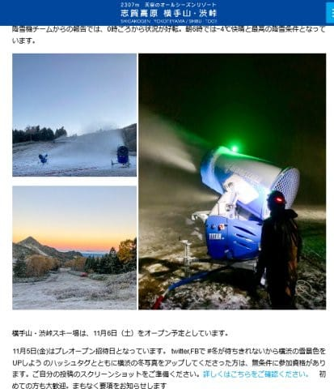
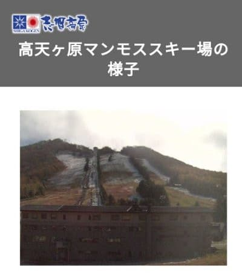
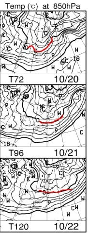

# 志賀高原は一の瀬方面までうっすらと雪が積もったようで…次は20日夜～21日にかけてまた積もりそう！

📅 投稿日時: 2021-10-19 01:54:07

えー．

やはり，17日夜から月曜18日朝にかけて．

日本の数多くの場所で積雪があったよう

ですね…

志賀高原も…

[ホテル銀嶺さんのBlog](http://shigakogen-ginrei.com/blog-entry-2849.html)を見ると，

高天ヶ原にも薄っすら積雪が

あったようですし．

[熊の湯Blog](https://ameblo.jp/kumakumanoyu/entry-12704377660.html)を見ても，うっすら

雪景色になってます！

そして，肝心な横手山は…．

意外と18日の朝は湿度・気温共に下がり．

人工降雪機が動かせたようです…！！

18日朝，晴れて-4℃まで下がるとは

思わなかった…

（[横手山スキー場ホームページ](https://yokoteyama2307.com/news/16297/)より）

しかし，日が昇ると気温が上がって，

雪も解けちゃったみたいで．

志賀草津道路の通行止めも，解除になった

ようですね…

（朝10時ごろの高天ヶ原）

（[志賀高原ライブカメラ](www.shigakogen.gr.jp/live/live_camera_manmosu.html)より）

…このあと．19日は一旦気温が

上がりますが．

また，20日から冷えますよ～！

850hpa気温を見ると．

20日は赤い0℃線が志賀高原にかかってるし．

21日も，0℃線は新潟近辺と，志賀から

それほど離れてないです！！

これは…冷えた18日よりさらに冷えそう！

20～21日も，志賀は雪が降りますよ～！

22日はちょっと0℃線は北に行ってしまう

ものの．

22日朝にかけては，横手山はまだ人工降雪

打てるかも…！！

…ただ．

昨日の予想の通り．

残念ながら，23日以降はそこまでは

冷えなさそうなので．

オープンが11月6日と考えると．

冷えるのは今じゃなくて，今から

2週間後くらいがいいんだけど…

去年もちょうど10月17日ごろに冷えて

雪が降って，「今年は雪が早い！」

と喜んでいたけど．

その後気温が上がって，

11月は全然冷えなかったんですよね…（涙）

11月オープン予定のスキー場，軒並み

オープン予定が遅れたのが思い出される…

今シーズンはそういうことが無いように

しっかり寒いギャグを連発しなくては…！←違うから

## 💬 コメント一覧

### 💬 コメント by (koi)
**タイトル**: Unknown
**投稿日**: 2021-10-19 07:13:44

いつもありがとうございます。私は志賀ではなく白馬ですが、一喜一憂しながら読ませて頂いてます

このような天気図の読み方はどうやって勉強されたのですか？あくまで趣味レベルですが、勉強したくて。

もしよろしければ教えて頂ければ嬉しいです本職でいらっしゃったらすみません

### 💬 コメント by (Skier_S)
**タイトル**: ＞koiさま
**投稿日**: 2021-10-20 01:46:08

コメントありがとうございます～！

…ちなみに，私の仕事は天気図とはと1ミリも関係ないです．

私も完全に趣味レベルで天気図見てるだけです（笑）．

どうやって勉強したかっていうと．

勉強はしてないですね…

ただ，パウダーになる日を予想したくて何気なく毎日天気図を見ていたら，

ある日，850hpa図というのを見つけて．

「これなら標高1500mの気温が分かるから，スキー場が雨になるか雪になるか

予想できるなぁ…」

と，ほぼ毎週のように天気図を見て．

それで，「今週はこんな天気になるかな？」予想して，

毎週スキー場に行って．

予想が外れたらなんで外れたか考える…

というのをやっているうちに，読む図面が増え，知らぬ間に

志賀高原の天気をかなりの精度で予想できるようになりました…

なので，完全独学です．

毎週行く志賀高原の天気を正確に予測したいがために，10年以上冬の間は

毎日天気図を見てたら，知らぬ間に身に着いてしまった技です…

### 💬 コメント by (koi)
**タイトル**: Unknown
**投稿日**: 2021-10-25 06:57:50

ご丁寧にありがとうございます！

なんと、まさかの独学でいらっしゃいましたか…

これまで多々、ヒントというか根拠を書いていただいてますので、私も独学で勉強してみようと思います

これからも楽しみにしています。

### 💬 コメント by (Skier_S)
**タイトル**: ＞koiさま
**投稿日**: 2021-10-26 00:22:05

はい…完全独学です(笑)．

ちなみに，私の天気予想記事は記事に載せてる天気図以外にも，

結構いろんな天気図やら気象衛星の写真やらを参考にして，

空気の流れや寒気の流れ込みを立体的に頭にイメージして予測してます…

高層天気図を見て，各高度の前線面やシアーの位置がイメージできるようになったら，

1-2日間の予想はかなり正確にできるようになります！

（この域に達するのに，私は10年かかりましたが…)

