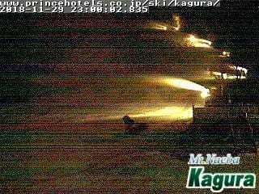
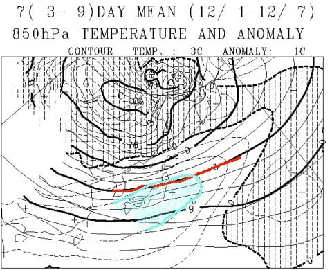

# 12月28日までの一か月予想図が出たのだが…ダメだ．今シーズンの12月のスキー場の雪の状態は，かなりダメっぽい…

📅 投稿日時: 2018-11-30 00:56:39

🏷️ カテゴリ: [スキー天気予想](c6554f5c3c106093b511a8daae23757e8.md)

ってな感じで．

ここしばらく，天気ネタばっかり続くのですが．

…同じネタばかりで飽きてきたかもしれませんが．

やっぱりスキーヤーとしては，これからの

天気が気になって夜も寝られないわけで．←毎日熟睡してるけど

本日発表の一か月予想図を見て．

これから12月下旬までのスキー場の積雪状態を

予想してみましょうか…

って前に．

この週末に向けてですが．

やはり，29日は冷えたようで．

志賀高原も，高天ヶ原は人工降雪機が

ガンガン動いていたようですね…

かぐらも，29日夜から人工降雪を

かなりの勢いで打ち始めています．

（[かぐらライブカメラ](https://live-media.monitorbox.jp/media/90/image/calendar/20181129/23.jpg)より）

…でも．

やっぱり予想通り，自然降雪は無かったようで（涙）

明日も冷えて人工降雪機はフル稼働できそうですが…

でも，積雪はほとんどなさそう（泣）．

いや，明日の金曜は，パラパラと雪はぱらつきそう

なんですが．

積もるほどではないです…（涙）

とりあえず．

明日一日，人工降雪機様に全力で

頑張っていただいて．

12月1日の志賀オープンには間に合わせてほしいところ…

ただ．

今のところ．

志賀高原で12月1日に滑れるとアナウンスされているのは，

　・熊の湯第2ペアリフト下半分

　・高天ヶ原トリプル

　・焼額第4ロマンス

の，緩斜面低速リフト3本のみ．

ええ．3本だけです．

志賀全山で，この緩斜面にかかる

3本だけしか動きません（涙）

もしかすると…

一の瀬ペアすら動かないシーズンインってのは，

近年まれに見るひどい状況じゃなかろうか…

ということで．

来週以降に期待したいわけですが．

やはり，週明けの3，4，5日は．

かなり気温が上がっちゃいます（涙）

特に4日の午後遅くから5日の朝にかけて．

かなり気温が高い雨が降りそうで．

ゲレンデは結構危険な状態っぽいです…（泣）

ただ，7日以降は，かなり気合の入った寒気が

降りてきそう！

7日以降に期待…！

ってところで．

一か月予想図を見て，ちょっと長期の予想を

してみるわけですが．

まずは，12月1日から7日までの一週間の，

850hpa気温を見てみましょうか…

うーーん．

やっぱり，3，4，5日の平年比+8℃の高温

期間が効いているのか．

水色で示した，平年比+3℃のエリアに志賀高原は

すっぽり入ってます．

…一週間の平均気温が平年比+3℃っていうのは．

異常高温です…（涙）

滅多にないレベルの高温です（激涙）

そのおかげで，山間部で雪になる目安の

赤く印した0℃線は東北まで北上して

しまっているので…

ダメですね．

この週は…（泣）

で．

次に，12月8日から14日までの850hpa予想ですが．

ようやく，赤く印した0℃線が志賀高原より南に

下がりました！！！

この週は，結構冷え込みそうですね～！

…とはいえ，水色の平年比0度の線が志賀に

かかっているので．

これが，普通なんです．

これが，平年並みなんです…

そして．

12月15日から28日まで．

12月後半の半月間の平均850hpa気温を

見てみると．

アカン…

ダメだ．

だめなやつだ，これ．

半月間の平均気温が平年比+2度となることを

示す，水色線．

これが志賀に近づいているので．

半月間の平均で，気温が平年比+2度近く

高くなりそう…

これはもう，ダメです（激烈な涙）

3年前の異常高温を思い出させる，ヤバい

パターンです（止まらずあふれ出る涙）．

これからの一か月の850hpaの気温傾向を見ると．

赤矢印で示す，3，4，5日あたりの高温のあと，

水色矢印の7，8，9日あたりの冷え込みが

予想されていますが．

この冷え込みで，やっと平年並み程度の冷え込み．

それ以降は，ずっと赤丸で囲ったような．

平年より1～2度高い気温が続きそう…（泣）

ダメだ．

これは，ダメだ．

この12月は，期待しちゃダメだ…

とりあえず．

今のところは．

「この数値予報，全然当たってませんでした～てへぺろ」

みたいな，気象庁の予想の大外しを祈るしか

ないのかもしれない…

## 💬 コメント一覧

### 💬 コメント by (若杉勲71)
**タイトル**: もう湯田中入りしてます
**投稿日**: 2018-11-30 11:00:34

昨日、湯田中の借家に来ました。広い一軒家を通年で、３人で借りたので、住みやすいように改装に明け暮れてます。

明日はヤケビで少しだけ滑りますが、そのあとは辛そうですね。もう10日以上滑っているyumilinさんが凄すぎる。今後のモチベーションも、s様の予報次第です。うそでもいいから降ると予報してください。

### 💬 コメント by (EXILE PIKACHU)
**タイトル**: やばい😱💧
**投稿日**: 2018-11-30 20:04:24

もし予想通りの気温になれば50年ぶりです！！

また、戦後1の位が9の年は必ず暖冬になっているので今年も諦めたほうが良さそうです！

### 💬 コメント by (Skier_S)
**タイトル**: もう少し冷えてほしい…（切望）
**投稿日**: 2018-11-30 23:44:30

＞若杉さま

ついに湯田中入りですか！

それも，通年で借りたのですか…

すごいですね．

とりあえず，天気ですが．

来週の金曜日は来ます．

降りそうです．

だもんで，来週末は意外といいかもしれません…

では，明日焼額でお会いしましょう！

＞EXILE PIKACHUさま

コメントありがとうございます…

戦後1の位が9の年は暖冬って，初めて知りました！

そうなんですか…

それはいろいろヤバそうな感じですね…

とりあえず，まだあきらめずに，今年はその法則が外れることを

必死に祈って，踊り続けることにします…

