# 2022/12/25(日)の志賀高原焼額山スキー場速報レポート…祝・第1，第2ゴンドラ運転！曇り～小雪，朝までの積雪はほとんど無しだけど雪質良かったよ！

📅 投稿日時: 2022-12-26 05:41:34

🏷️ カテゴリ: [2023スキー滑走日記](cd943df30cfcc3d0896469e2ff98720cd.md)

昨日はナイターまでガッツリ楽しんで．

そして今日もしっかりラストまで滑って

300km運転して，深夜帰宅したわけですが．

帰宅後いろいろ宿題をしていたら

もうとんでもない時間…(泣)

なので．

手短に今日の志賀高原のクイックレポート！！

えー．

まず．

今日は，朝から焼額第1と第2ゴンドラ，

無事運転開始されました～！

いやー．

ようやっと今シーズンのゴンドラ運転が

始まりました！

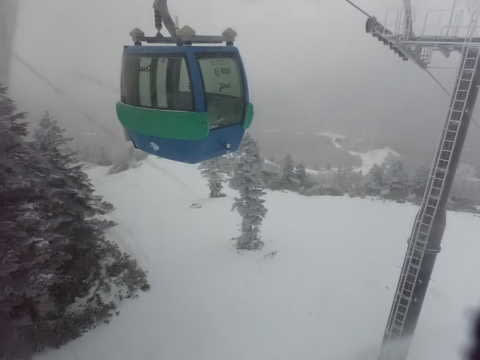

…でも．

昨日のナイターが終わってからの

積雪は，わずか2-3cmってところで，

全然積もりませんでした…(泣）

だもんで，コース上は新雪もなく，

きれいなシマシマ圧雪！！

天然雪の柔らかな最高シマシマです！！！

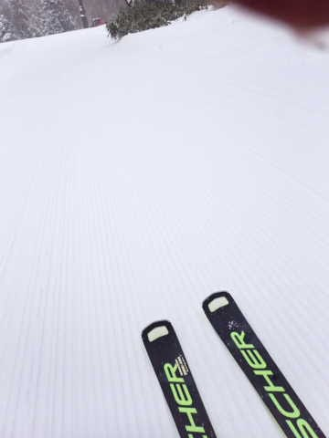

そして．

今朝は積雪が無かったので…

まだ焼額のGSコースはオープンできず．

今日滑れたのは，パノラマ～サウスコースと

唐松コース，そして白樺コースだけ

ですが…

でも．

本日オープンの白樺コースは，

コース幅もいっぱい滑れて，

ブッシュもなく最高！！

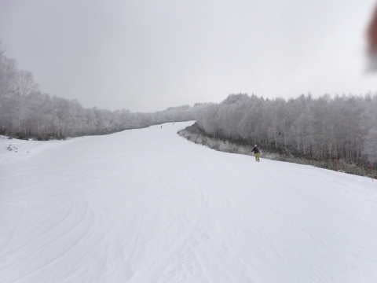

天気はパラパラ雪が降ったり，

曇ったりの天気でしたが…

そこまで寒くは無く．

過ごしやすい天気．

そして，久しぶりのゴンドラ運転

開始で…

実に久しぶり，2km越えのロングコースが

滑走できました～！

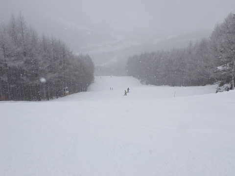

2本のゴンドラが運転開始したものの．

まだGSコースが滑れず，2本のゴンドラで

パノラマ-サウスコースに人を送り込むので，

コース上の人口密度はちょいと高め

だったものの…

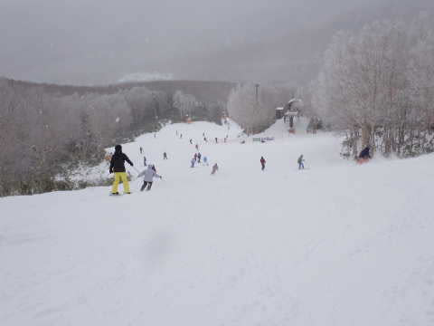

第2高速リフトも最大の待ち時間は

この程度だったし．

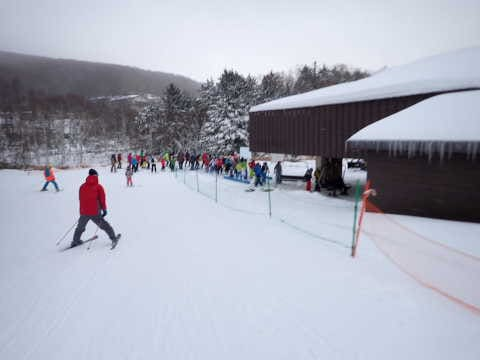

GSコースが滑れず，第2ゴンドラ側へ

連絡する，漕ぎが入るコースを移動

しなくてはならない第1ゴンドラは

終日ガラガラでした！

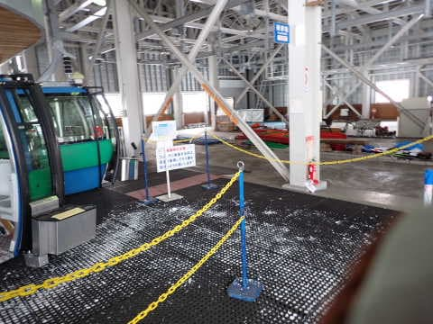

ただ．

雪が柔らかかったので，午後になると

急斜面が一部コブになってきた

ところもありましたが…

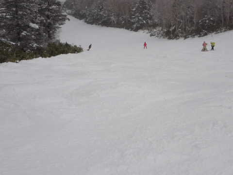

昼間は一瞬だけ日が射すタイミングも

あって．

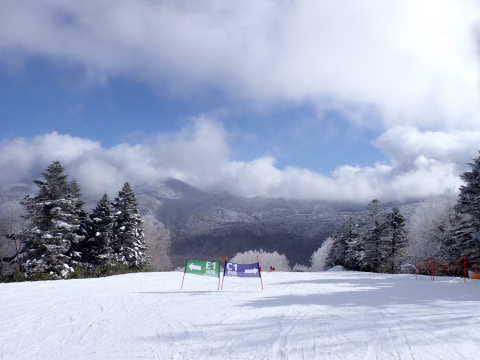

完全天然雪に覆われて，最高の

柔らか圧雪のロングコースを

ゴンドラで滑ることができて，

いやーーー．

やっと本格シーズンが始まった感じ！！

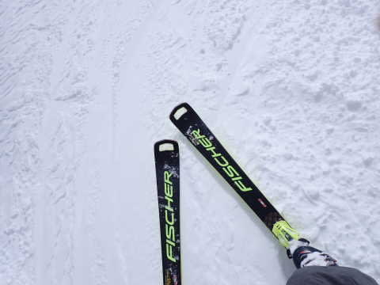

夕方のリフト終了前，ちょいと

雪が強くなってきましたが．

でも，今日はゴンドラがあるので

昨日までと違って，ゴンドラに乗れば

雪にまみれなくてもよくて．

ゴンドラのありがたさを痛感…

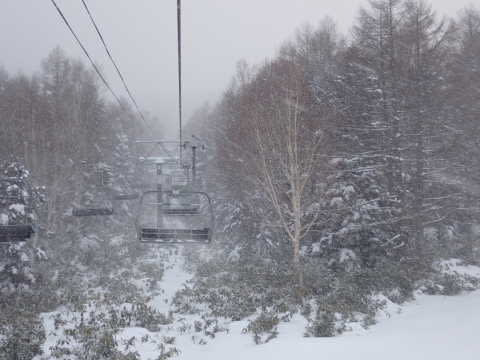

ってなことで．

ゴンドラが動き出して，今日から

やっと焼額らしいロングコースを

滑れるようになって．

雪質も良かったし．

2ゴンは最大10分くらいのゴンドラ待ちも

あったようですが，1ゴンは待たなくて

済んだし．

満足の一日でした～！！

明日…というか，もう今日ですね．

月曜からGSコースもオープンする

ようですし．

ようやっと本格シーズンインですよ～！！！

## 💬 コメント一覧

### 💬 コメント by (ダウンヒル)
**タイトル**: Unknown
**投稿日**: 2022-12-26 07:31:48

S様いつもお疲れ様です。

本日26日より志賀高原詣を致します。

(世のカレンダーと違う会社カレンダーなので...早くに年末年始休暇に入る社会人や冬休みに入った学生等が居る頃なのでしょうか？)

いつもながら、ブログもゲレンデも楽しみで一杯です!!

今シーズンも宜しくお願い致します！!

### 💬 コメント by (toya)
**タイトル**: 教えてください
**投稿日**: 2022-12-26 17:44:37

いつも楽しく拝読させていただいております。

教えてください。私も昨日（12/25）にyakebiに居たのですが、1ゴンはホテルとの連絡路として運行されていてコースは開いていなかったと思っていました。2ゴンの山頂スタッフにも問い合わせたのですが、

「降雪不足でまったく滑れません」と、言われてしまいました。

S様は滑ったのですよね？宿泊者専用なのでしょうか・・？

すみません、分かる範囲で教えてください。ずーっと、2ゴン下側を滑っていました。オリンピック、ジャイアント、滑りたかったです・・。

### 💬 コメント by (toya)
**タイトル**: Unknown
**投稿日**: 2022-12-26 17:47:31

ごめんなさい。

私の読み間違いですね。1ゴンコースは滑れなかったのですね、失礼いたしました。

### 💬 コメント by (新米パパさん)
**タイトル**: Unknown
**投稿日**: 2022-12-27 11:08:51

昨日26日、ようやく焼額山はGSオープンでした。

オリンピックはまだ笹が少し出て開けるには数日かかるそうです。ロマンスリフトは運休、奥志賀連絡路もまだ閉鎖でした。

大晦日、元旦あたりの焼額山スキー場は激込みでしようか？

大雪、期待したいですね。

### 💬 コメント by (Skier_S)
**タイトル**: 雪がまだ足りない…
**投稿日**: 2022-12-28 03:48:13

＞ダウンヒルさま

お久しぶりです～！！

26日から何日まで滞在でしょうか？

私は一応29，30は志賀で滑る予定です～！！

今シーズンもよろしくお願いします！

＞toyaさま

残念ながら，25日は私もGSコース滑れてません（涙）

26日からオープンしたみたいで，開くのが一日遅いよ，とツッコミを

入れたくなるところでした…

＞新米パパさんさま

GSオープンしたものの，まだ雪が薄いみたいですね…

パノラマ，白樺はそこまで薄くないんですけど，風で雪着きが悪い

GSコースはやっぱり厳しそう．

大みそか，元旦は混むと思いますよ…

次の大雪は年明けになりそうです（涙）

