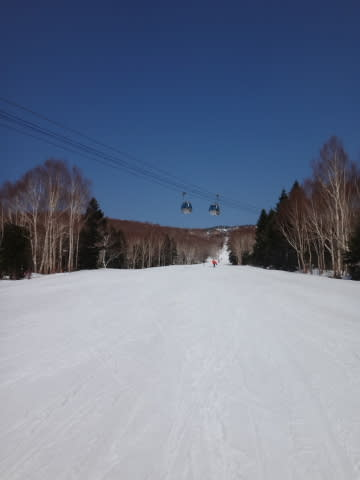
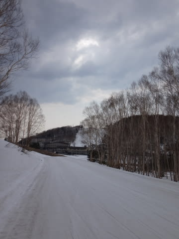

# 4月27日の志賀高原は…晴天！午後は緩んだものの，午前中はずーっとシアワセ大回りバーン！

📅 投稿日時: 2014-04-27 21:16:02

🏷️ カテゴリ: [2014スキー滑走日記](c992167609b6415052179ee69ea1ea7d8.md)

えー．

本日の志賀高原ですが．

今日も結構いい一日でしたよ～！

当然，朝6時からの早朝スキーに出かけるわけで．

早朝から，気温はプラスだったものの…

天気は晴天！

コースはピカピカ！

今日もシマシマのコースが私を出迎えてくれます！

朝6時のゲレンデは，かなりいい感じの硬いバーンで，

超ハイスピード大回り可能！

＃硬いのがだめな人には厳しいけど

ガラガラで気持ちよくて．

やっぱりこの時期，早朝は良いね～！

通常営業の8時には，ちょっと表面が緩んだ感じに

なってきたけど…

でも，まだ下地はしっかりしていて．

快適大回りバーンは続く！

天気も引き続きよくて．

今日も晴天なのに，昼ごろまで大回りが可能という．

かなり恵まれたコンディションでしたよ～っ！！

あー．そうそう．

今日は，昨日より人が多かったのか．

午前10時ごろのゲレンデは．

タイミングによっては，昨日より人がいましたね～．

まぁ，これでもゴンドラ待ちはほぼ0．

問題にならない混雑具合です．

そして．

この日は12時過ぎまで大回りデーだったけど．

昼からはちょっとざぶざぶ雪になってきて．

とはいうものの．

板に張り付くストップスノーにはならず．

…この時期に，板が滑る雪ってのはありがたい…

一の瀬にも出てみましたけど…

パーフェクターはちょっと土が出始め…

コース途中もこんな感じで…

そろそろやばいかな．

でも，それ以外のコースは，積雪量はパーフェクトです．

＃パーフェクターだけパーフェクトじゃない…

いつもはそろそろ雪がやばくなる，一の瀬～高天ヶ原の

連絡路もまだまだ雪はいっぱいあるし．

高天ヶ原のコブコースもまだぜんぜん大丈夫だし．

雪の量は，一の瀬エリアもGW後半まで，心配いらないなっ！

ってことで．

午後は雪は荒れたものの．

リフトストップまで，ちゃんと板が滑る雪で．

今日も早朝からリフトストップまで13時間近く

滑り続けて．

超シアワセな一日を過ごしたのでした！

＃普通は死ぬから！

＃昼休み1時間だけでこれだけ続けて滑ったら死ぬから！

＃普通の人はまねしないでください…←自分もちょっと死にそうだった

## 💬 コメント一覧

### 💬 コメント by (れお)
**タイトル**: やっぱり凄すぎ!!
**投稿日**: 2014-04-28 16:52:16

春雪でも、早朝からリフトストップまで滑られるとは！

やっぱり、Ｓさん凄すぎます!!

私なら、昼過ぎでギブアップですよ～。

やっぱり、Sさん、本当は人型ロボットなのでは‥‥

怪しい～（笑）

### 💬 コメント by (rousan)
**タイトル**: ヤケビにて
**投稿日**: 2014-04-28 17:57:37

今日、第2ゴンドラ乗り場で声をかけさせていただきました。

コースの途中で発見してから、必死で追いかけました。は、速い!!

いつも更新を楽しみにしています。

これからも頑張ってください。

### 💬 コメント by (Skier_S)
**タイトル**: 今日もいい一日でしたよ～
**投稿日**: 2014-04-28 20:09:32

＞れおさま

いやー．

この日は早朝から昼までにゴンドラ25本乗ってしまい，

それだけでも結構疲れてたのに，午後はなぜか

高天ヶ原のコブを攻めてしまったという…

もう，午後のコブはへろへろになりながら滑ってました(笑）．

雪質が良い整地なら，早朝～ナイターまで

いけるんですけど…(笑)

この日はさすがに疲れました．

＞rousanさま

をを！

初コメントありがとうございます．

本日はお声をかけていただき，ありがとうございました！！

…でも，滑っている姿見ただけで，よく私だと

わかりましたね～．

なんで分かったんでしょう…？？

いつも焼額を滑ってらっしゃるんですか？

シーズン中はあんな感じで焼額のゴンドラを

えんえんグルグルしてますので，また見かけたら

声をかけてください～！

