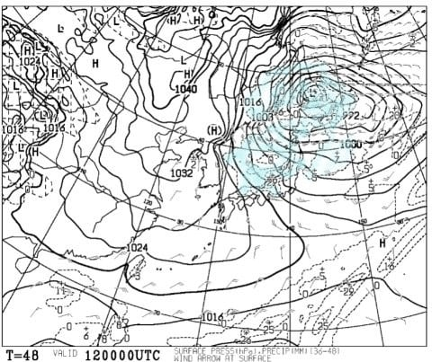

# 12月10日（日）の志賀高原・焼額スキー場速報モード…朝は晴天！12月2週としてはベストコンディション！

📅 投稿日時: 2017-12-11 00:19:35

🏷️ カテゴリ: [2018スキー滑走日記](c11b88dc181f34079ab41db74a3587646.md)

えー．

天気予報でいろいろ報じられていますが．

…なんだか．

これから14日まで．

むちゃくちゃ冷えますよ～！！

赤矢印で示した期間，11日から14日まで．

平年比6℃～8℃も低い日が4日間も続きそうで…

これは，異常低温レベルですな．

そして．

12日の地上天気図は…

うはー．

北海道は爆弾低気圧に襲われますね．

…これは，日本海側はどさどさ積もります！．

新潟，白馬は12日，13日パウダーねらい目！

…天気は荒れそうだけど．

あー．

でも．残念ながら．

志賀はそんなにドサドサ積もらなさそうです．

でも，ほぼ全面滑れる程度の積雪になるんじゃ

ないかな～．

…ただ．

16日の土曜日．

気温が上がりそうでちょっと心配ですが…

という，天気の速報をしたところで．

日曜定番，本日の志賀高原の速報です…

えー．

滑れるコースが広がった本日．

朝は，すっきり晴天！

そして，朝の雪は…

しっかりエッジが食い込む，

柔らかすぎない，超いい感じの

ぴかぴかシマシマ圧雪！

スピードが出せる，極上のごちそうシマシマっ！！

楽しい…楽しいよっ！！

ゴンドラ，リフトもほぼ待ちなしだし．

こんな晴天，雪よし，ガラガラって…

トップシーズンでもそうそう無いよ…っ！！

あぁ…シアワセ…

午後は気温が0度程度にまで上がったものの，

昼になると雲が増えて，うす曇りになってきたので…

強い日差しで雪が融けることなく，

夕方のラストまで，結構いい雪質をキープ！

先週と違って，ゲレンデも硬くならず．

午後まで超快感の傾きまくりターンを

ひたすら楽しむことができました…

いや～．

良かった．

今日は良かった…

また，詳細レポートは明日やります～！

今日は志賀日帰りで眠いので，おやすみなさい…

## 💬 コメント一覧

### 💬 コメント by (サトシ父)
**タイトル**: 初滑りに行ってきました
**投稿日**: 2017-12-11 08:10:54

週末息子と初滑り、ベースが奥志賀なので日曜日の午前中焼額で滑っておりました。最高でしたね！

### 💬 コメント by (たろ)
**タイトル**: Unknown
**投稿日**: 2017-12-11 12:34:33

3月のダイヤモンドでの試乗会以来、ご無沙汰しております。

私も、今週末から志賀高原に参戦予定なので、お会い出来ましたらご挨拶をさせて頂きます。

先ほど、志賀高原のHPでリフト運行状況を確認したところ、全リフト一覧に「奥志賀コンドラ」の文字が見えないのですが、それは私だけでしょうか。いくら、目をこすっても、メガネを掛けても、何回もページをリロードしても確認出来ません・・。（泣）GIFアニメのようなリフト運行状況マップを見ても、奥志賀ゴンドラのラインが表記されていないようです。全面滑走可になったら、追加されるのであれば良いのですが、運行出来ないトラブル等だと困りますね。

### 💬 コメント by (はっち)
**タイトル**: お会いできて光栄です
**投稿日**: 2017-12-11 15:03:22

日曜日はありがとうございました。

まだまだ初心者でみなさんに付いて行くことができませんが、いつか滑りもご一緒できればと思います。

当方もブログとYoutubeをしていますので、よろしければ、お立ち寄りください。

### 💬 コメント by (michi)
**タイトル**: 日帰りお疲れ様でした
**投稿日**: 2017-12-11 15:22:38

私も昨日ヤケビに行きました。Sさまを山頂で見かけましたがご挨拶出来ずでした^^;

雪質良かったですね。白樺コースもかなり良いコンディションでした。

明日から寒そうですね。降雪&全コース滑走可能に期待です。

また来週も日曜だけになりそうですがお会いしましたら宜しくお願いします。

### 💬 コメント by (Skier_S)
**タイトル**: この週末も恵まれてました…
**投稿日**: 2017-12-12 03:29:36

＞サトシ父さま

あら？

焼額にいらしてたんですね…

全然きづきませんでした．

この週末，良かったですよね～！

アホのようにグルグル滑ってました！

今週末も志賀ですか？

＞たろさま

あ，今週末から志賀ですか！

…先週末までは，3週連続週末晴れで

すごい良かったのですが．

この週末は，微妙な天気です…

奥志賀，確かにゴンドラが無いですね…

今シーズン，ゴンドラが無くなるという話は

全く聞いていないので，単なるバグだと

思いますが…

今週末は1ゴンが動く可能性が高いので，

1ゴンでお会いしましょう！

＞はっちさま

ブログ読ませてもらいました～．

動画も見せてもらいましたよ～！

しかし，私と同じく，スキー場の天気も予想されてますね…

それも，一週間くらい前のかなり早い段階で…

気象庁発表の高層天気図だのみの私の

予想では，3日前の予想が精いっぱいです（笑）．

また，志賀でお会いの際はよろしくお願いします～！

今度は一緒に滑りましょう！

＞michiさま

あれれ？？

きてらしたんですか…？？

全然気づきませんでした…

ってか，日曜は20000mな方々とかっ飛んでいたので…

明日から寒そうで，1ゴンが動くんじゃないかと

思ってますが，土曜日の天気がどうなるか心配です．

日曜は雪降りの一日になりそうですが…

では，また焼額でお会いしましょう～！

