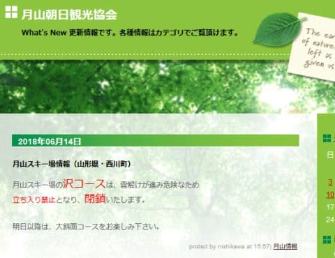
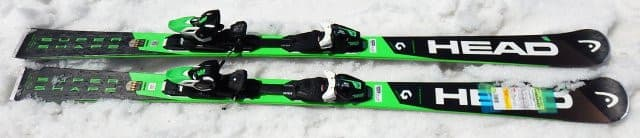
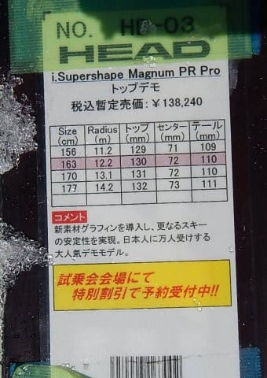
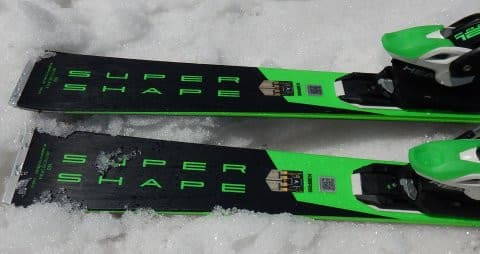
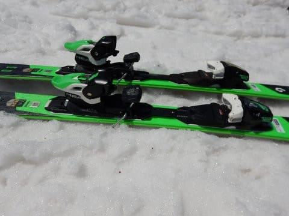

# 2019シーズンのスキー板，試乗レポート第16回…HEAD編その3

📅 投稿日時: 2018-06-16 00:29:23

🏷️ カテゴリ: [スキー板試乗](c0bd8048615710cee890e403a36cc9a2b.md)

えー．

なんだか．

月山ですが．

昨日を持って，沢コースが終わってしまった

ようですね…（涙）

雪解けで危険ですか…

せめて，私が滑りに行く今週末までは

もってほしかった…

沢コース，好きなのに…（泣）．

しかし．

沢コースが6月中旬に終わるとは．

やっぱり今シーズン，雪が少な目

だったんだなぁ…

月山もそろそろ終わりですね…

ってな感じで．

シーズンも終わりに近づいてますが．

まだ冬モードのこのBlog．

本日はスキー試乗レポートです！

今回はヘッド編です．

では，どうぞ～！

---

○HEAD i.Supershape MAGNUM PR PRO 163cm

基礎オールラウンド

一応基礎向けのモデルですが…

写真2枚目の説明書きには，「トップデモ」と

書かれてますけど．

でも，技術選に使えるほどのレベルではなく，

i.Supershapeシリーズとしては優し目のモデルとなる，

このMagnum．

センター幅72mmと幅広なので，整地をガンガン

攻めるというより，

いろんなシチュエーションを滑れる板を

目指してるのかと思いますが．

特にプレートとかもついておらず，足元も簡単に

たわみそうな感じです．

滑ってみると…

トップをたわませるように谷回りに入っていくと，

トップが食いついて小さい半径で良く回ります．

比較的フレックスは優し目で，力を入れなくても

良くたわむ感じ．

ただ，トーションはそれほど弱くないので，

グリップが足りないわけでは無く，

しっかりグリップを感じつつも，

柔らかくたわんでいく感じ．

とりあえず，力を入れなくてもトップから

捉えて回っていいます．

良くたわむので，楽に気持ちよく回りますし，

柔らかい春雪でも，センターの広さもあって，

比較的安定感高く滑っていけます．

…でも，スピードを出して横Gが強く

なっていくと，ちょいとたわみすぎるか…

リアルなトップスピードにすると，さすがに

ちょっとグリップが弱く感じるところもあるけど，

それでも割としっかりしたトーションがるので，

切っていこうと思えばグリップして切っていけます．

そんなにガンガンに飛ばさない普通の

ゲレンデのスピード域なら，

十分気持ちいいカービングで

楽にたわんで曲がっていけるので．

しっかりカービングしていく技術力はあるけど，

それほど体力を使う滑りはしたくない…

って人が，いい感じで小回りから

大回りまで，オールラウンドなクルージングに

使える感じの板でしょうか．

## 💬 コメント一覧

### 💬 コメント by (コブダイスキー)
**タイトル**: ヘッドのトップ形状
**投稿日**: 2018-06-16 11:11:27

Sさん、月山レポート楽しみにしています。

私は２週前に月山に入る予定がつぶされ

シーズンが終わりました。

マグナムのレポート参考になりました。

実はスピードの16-17年と17-18年を所有

しておりオガサカTC-SV(現所有板)等トップ

細めと比較して４月中旬～の午後の荒れ地では

トップにあたる雪のザクザクの壁が板を

跳ね上げて前方のエッジがはずれるような

感じがあります。

カタログでは整地・・・と記載されている

ように春の荒れ地と化す状態ではトップ細目

の方が前方のエッジが使えるように思えました。

私は国産(オガサカ)と外車(H社、K社)といろいろ

乗るのが好きなので・・・。

たまには失敗し、ブックオフとかフリマへの

出品となりますが。

家の大蔵省には内緒で物的証拠を抹消し別の板

にすり替えるのが大変です(笑)

ところで先日エクストレイルのところで

コメントをさせていただいた際のSさんの?が

気になり6/10のエクストレイルのコメントに

テスト結果を追記させていただきましたので

ご参考までにお読みくださいませ。

失礼いたしました。

### 💬 コメント by (Skier_S)
**タイトル**: コブダイスキーさま
**投稿日**: 2018-06-16 21:24:35

月山はもうリフトを降りてから

ゲレンデまで，かなり歩くようになり，

沢コースも閉鎖ですから…

そろそろリフトも終わりげな感じですね．

Supershape Speedの今シーズンモデルを

持ってらっしゃるのですね！

Speedはどちらかというと整地でスピードを

出すことを想定している板なので…

荒れた雪は，センター幅が広いMagnum，

さらにはRallyとかの方がよい感じを

受けるかと思います．

Rallyはかなり古いモデルにしか試乗したことは

ありませんが，整地はあまり楽しくないものの

荒れた雪は良かった思い出があります…

で．

エクストレイルのコメントのところに頂いた．

テスト結果ですが，

分かりにくかったかもしれませんが，ほっぽさんへの

コメントの下半分に回答させていただいてます…

すみません．

ちょっと発見しにくかったかもしれません．

おそらく，エンブレ時に．

フューエルカットが働くか，

燃料を吹き始めるかの境目で，

エンブレがガクッと効いたり，

エンジンがするする回り始めたり…

ということが起きてるのかな～，と思いました．

うちのレガシィでも，回転数が

低い領域とか，エンジンが冷えすぎた

時とか，燃料を吹き始めてエンブレが

スーッと弱まるときがあるので…

特にエンジンが温まってない領域では，

燃料を吹き始めてエンブレがあまり

効かなくなることが多いです…

そういう現象とは違いそうでしょうか…？？

ただ，文章を読ませていただくと

XVのエンブレ時の燃料カット・燃料on

タイミングの制御が，フォレスタよりも

うまくいってないように読み取れます．

この原因として，私の推測ですが…

フォレスタはポート噴射．

XVは直噴という違いが効いてるのかも．

直噴エンジンは，あまりエンジンを冷やし過ぎると，

ボア壁面への燃料付着によるミクスチャ混合不良，

### 💬 コメント by (まいる)
**タイトル**: 楽シーズンの板
**投稿日**: 2018-06-18 20:27:37

Sさん、ご無沙汰してます。

headの記事待ってました。

実は、私の三シーズン前のi.Supershape MAGNUMが終わってしまったので、来シーズン、板を新調しなくてはならないのです。

記事を読んで、次も同じMAGNAMでよいかなぁと思いました。

### 💬 コメント by (Skier_S)
**タイトル**: まいるさま
**投稿日**: 2018-06-20 04:53:41

来シーズンモデルも，Magnumは良さそうですよ！

今，Magnumに乗っているのであれば，

後継機は来シーズンのMagnumを

おススメしておきます！

