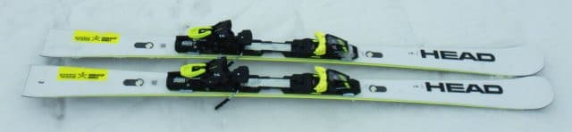
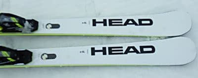
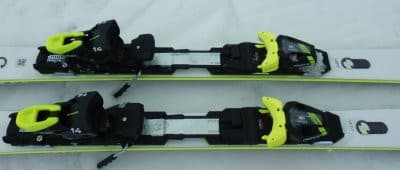
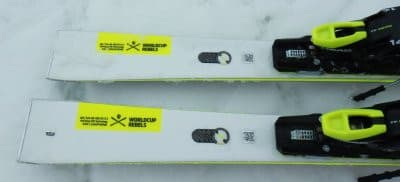
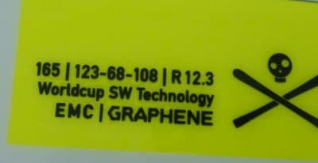

# 2022シーズンモデルのスキー板，試乗レポートその2…HEAD WORLDCUP REBELS e-SL

📅 投稿日時: 2021-06-01 01:06:20

🏷️ カテゴリ: [スキー板試乗](c0bd8048615710cee890e403a36cc9a2b.md)

渋峠の営業が終わってしまい．

毎日恒例だった特派員からの情報が送られて

こなくなったことに，

すごーーーーーーーーーく寂しさを感じている，

Skier_Sです…

あぁ…もうシーズンも終わりなんだなぁ…

…いや．まだ月山がある．

そう，月山に行けば滑れる…！

…しかし．いろいろバタバタしているので．

次に月山に行けるのはいつの日か…（涙）

ってなことで．

特派員情報もなくなったので．

本日から，2022年シーズンモデルのスキー板の

試乗レポートを真面目に書いていきます…！

今日も昨日に引き続き，ヘッド編です．

では，どうぞ～！

○HEAD WORLDCUP REBELS e-SL 165cm

SL競技用セカンドモデル＆基礎小回り用

この板も，基本的に2021シーズンからキャリーオーバーで．

2022シーズンも基本的に変わらないようです…

SL競技用のトップモデルとして，

e-SL RDがあり．

それのセカンドモデルとして，プレートも

薄くて軽いプレートになっていますが．

プレートだけじゃなく，板も違っていて．

フレックスも優し目，かつサイドカーブも

e-SL RDとは違うようです．

こっちの方が心持ちRが大きいのかな？

滑ってみると．

一応SL用と言っているだけあって，

板の張りはそこそこ強く感じます．

…さすがにe-RACEよりは優し目ですが．

で，この板も，e-RACE同様，角づけの瞬間から

サイドカーブに乗ってすっと回り始める板で．

エッジに乗ってサイドカーブなりに回っていく

カービング要素が強い板．

板の張りはそこそこあるけど，たわんで

板に圧が溜まっていく感じは弱く，

板の返りはそれほど強くも早くもありません．

サイドカーブでくるっと曲がるのに，

切り替えに向けてゆっくりと圧が

抜けていく感じなので．

返りの早い小回り板にありがちな，

板にふっとばされてしまうような

感じは弱いです．

そして，e-RACEに比べればエッジ

グリップは優しめ．

脚力が無くても，比較的容易に板が

動かせます．

…ただ．

板を動かして行っても，OGASAKAの板の

ような，微妙なコントロール性は無く．

板を動かしながら積極的に攻めたズラシを

していく…

というより．

サイドカーブで曲がり切れないときに，

簡単にラインをずらしてリカバーできる，

という感じ．

エッジを外して板の向きを変えたり

ラインを落としたりできますよ…

という，リカバー的ズレで．

基本的にはサイドカーブに乗っていくのが

楽しい板です．

すごいきついサイドカーブに乗って，

簡単にクルクル回っていく板です．

ビンビンしたばね感は無いけど，

テールの張りもそこそこあるので，

ターン後半の走りも結構出せますし．

そこそこのスピードを出しても

板が逃げていくような感じもないし．

私にとってはちょっと柔らかすぎた

以前のi-SLに比べると，良く回る性格は

キープしたまま，ワンランクアップした

感じ…！！！

でも，e-SL RDやe-RACEの

グリップがガチガチに強い板と比べると，

簡単に板を動かすこともできるし．

ばね感の強い小回り板にありがちな，

板が元気すぎて体力を使うってことも

無いですし．

1級レベルの人がゲレンデの気楽な

小回り用として使うには，十分ありな

板じゃないか…と思いました．

…私はもう少しばね感が強い板が好きですが

## 💬 コメント一覧

### 💬 コメント by (ikkun)
**タイトル**: Unknown
**投稿日**: 2021-06-01 11:02:56

おはようございます❗ 確かに人により 同じスキーでも印象は変わりますから難しいですね どんな滑りをしたいかはで、当然……私し先輩に相談「フォルクルGSデモをレッスンとずらしに……長いのでスラローム板がいいんじゃない？」と確かにデモばかりでは 「成長は無い」と云われた気を付けてしました( *´艸｀) ありがとうございます❗

### 💬 コメント by (Skier_S)
**タイトル**: ＞ikkunさま
**投稿日**: 2021-06-02 00:59:34

試乗の難しさは，試乗して気に入る板は，自分の癖で操作しやすい板であり，

正しいポジションに乗れる，自分を上手くしてくれる板とまた違うというところです…

なので，自分は試乗板はなるべくいろんな乗り方をして，適切な荷重位置や

板の使い方を試してみています…

