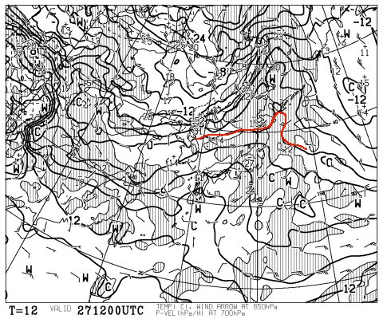
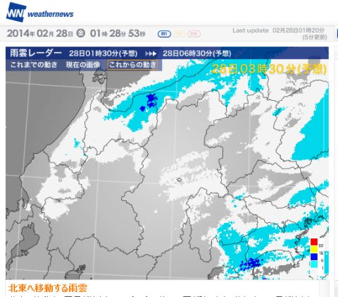
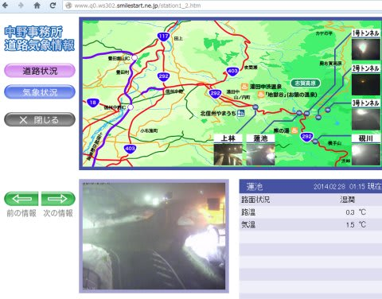
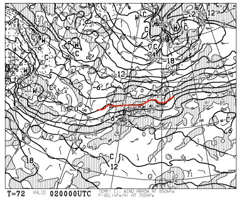
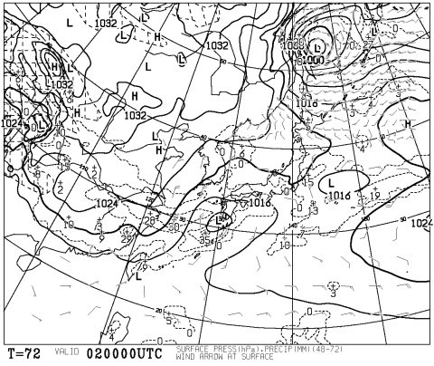

# うーむ．どうやら今，志賀高原は小雨のようで…（涙）．

📅 投稿日時: 2014-02-28 01:45:59

🏷️ カテゴリ: [日記](cc4b5682fb7b8b144980957a978653fb0.md)

うぎゃーっ！

やっぱり，雨か～っ！

いや，今日（木曜）の，午後9時の850hpa気温が

こんな感じだったので…

…もし，降れば．

降ってしまったら．

…雨だな…

…

と，思っていたところ．

やっぱり，こんな感じで降り始めてしまったようで…（大泣）．

うーむ．

ライブカメラ見ていても．

…なんだか，雨っぽい（涙）

…

…ダメだ．

…ダメじゃん（泣）．

なんとか，明日の朝からちょっとだけ冷え込み，

ぎりぎり雪にかわってくれそうだけど…

うーーーーむ．

とりあえず．

今日の段階でも，日曜の850hpa気温はこんな感じで．

ぎりぎり，志賀高原は0度って予想は変わらず．

地上予想図はこんな感じで．

やっぱり，日曜は，終日ちらちらと降りつづけそうだし．

うーん．

でも．

なんとか．

何とか，ぎりぎり雪っぽいんだけどな～．

ヘタすると，昼間はみぞれっぽい感じになるかも…

あー．

標高が低いスキー場はダメですね．

特に土曜は，気温もかなり上がり．

雨です．

＃どしゃ降りではなく，ぽつぽつ程度…ってのが救い．

って感じで．

志賀高原は，雨になるか雪になるか，ぎりぎりって感じなので．

いつものセリフで締めておきます．

スキーヤーのみんな，祈るのだっ！！！

PS.今のままなら，来週の水，木くらいに，冷え冷えパウダーが来そうなんだけど

## 💬 コメント一覧

### 💬 コメント by (初心者ママ)
**タイトル**: 質問させてください！
**投稿日**: 2014-02-28 19:35:18

はじめまして。今シーズンからスキーデビューした初心者ママです＾＾

3月の第4週に志賀高原に行くか思案中です。

例年、3月下旬の雪はどのような感じなのでしょうか？

関西在住なので、そもそも3月に雪なんて本当にあるの？？って感じです。

年末に行った時は快晴＆パウダースノーで最高でした！

もしよろしかったら教えて下さるとうれしいです♪

### 💬 コメント by (Skier_S)
**タイトル**: 初心者ママさま
**投稿日**: 2014-02-28 23:07:31

初めまして～！

今シーズンからスキーデビューですか．

スキーの楽しさに目覚めてくれる人が

いて，うれしい限りです…

さて．3月下旬ですが．

志賀高原はまだまだまったく問題なく，

全面滑走可能です．

土が出てくるようなこともなく，雪の量自体は

年末とほとんど変わらないです…

ただ，雪質は年末よりちょっと重くなっているかも．

気温も年末よりは暖かくなってます．

昼間の気温はプラスにまで上がるようになってきます．

でも，

運が良ければ，4月下旬でも軽い雪が降る志賀ですから…

http://blog.goo.ne.jp/tsakamot2001/e/d87ecc584671a2c396ada52e71fdf5a5

もしかしたら，3月下旬でも，真冬並みの激冷え

になることもあります．

これまでに，3月下旬にふぶいたことも何度も

経験がありますので，お気を付けください…

あと，3月末までは，道路も雪道です．

3月いっぱい，志賀高原の登りのチェーンチェックも

やっています．

車で来るのであれば，雪道である覚悟も

しておいてください…

3月4週といえば，3連休ですね．

私も志賀高原をばりばり滑ってると思います～！

