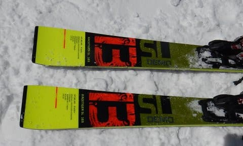

# 2020シーズンモデルのスキー板，試乗レポート…VOLKL編その1

📅 投稿日時: 2019-04-19 00:48:22

🏷️ カテゴリ: [スキー板試乗](c0bd8048615710cee890e403a36cc9a2b.md)

ってことで．

志賀高原では，明日の朝の雨は

それほどひどくなさそうで．

朝8時には止んでそうだから．

雪はほとんど解けずに済みそう…

という感じがする今日この頃．

皆様いかがお過ごしでしょうか．

とりあえず．

今週末．

天気は土日とも良さそうで．

ポカポカ陽気の春スキーになりそうですが…

そう．春というと．

明日19日（金）の10:00から，ついに

志賀草津道がオープンです！

明日から，草津越えで志賀にアプローチ

できるようになります．

…が．

今シーズンも，

夕方 17：00～翌朝 8：00は通行止め

ということらしく．

朝8:30の焼額スタートに，草津越えでは

間に合いませんね…

うーむ．

残念…

ってなことで．

本題の，2020シーズンのスキー板の試乗レポート．

本日はフォルクル編です．

小回り用の板2機種のレポートになります．

では，どうぞ～！

○VOLKL RACETIGER SL WC 165cm

SL競技用．

純粋なSL競技用モデルとなるこの板．

プレートもかなりしっかりしたものが

乗っています…

滑ってみると…

さすがはSL競技用モデル．

結構固く，しっかりした足ごたえ．

かなり張りが強い感じを受けます．

谷回りからガッツリ板が捉えて行く．

エッジグリップの強い板なので．

かなりのカービングスペシャルに

感じます．

だんだんスピードを上げていくと，

板がいい感じでたわんで行くので．

強いエッジグリップで，このたわみに

沿ってきれいにエッジの線に乗って

回っていく感じ．

ちょいと固めながら，私の普段履きの

ATOMICのSXに近い性格に感じます．

谷回りから足場を作って，しっかり

傾きを作っていくと，

カービングでかなり小さい半径で

しっかり回ってきます．

谷回りの傾き具合で旋回半径が

コントロールできるので，

旋回半径のコントロール性もいい感じで．

ガッツリエッジグリップしたまま

グイグイ回っていき，高速耐性も十分．

ただ，グリップが強いので，

板を動かしていくのは難しく．

ズラシの小回りとかやっても楽しくない

感じ…

だもんで．コブも厳しいかな．

まぁ，やはりSL板ですので．

そこそこのスピードで，整地をかっ飛ばす

ための板ですね．

○VOLKL RACETIGER SL DEMO 165cm 

基礎小回り用

SL競技用のRACETIGER SL WCとかなり

似ているので，

見た目でほとんど区別できないこの

モデルですが．

こちらは基礎の小回り用です．

サイドカーブが違えば，ビンディングも

RACETIGER SL WCとは違います．

こちらの板は，RECETIGER SL WCと比べて，

かなり軽快で，ATOMICで言えば，S9iに

近い感じ…

スイングウエイトがSL WCより軽く，

谷回りで板を動かしやすく，

どのようにでも好きなところに

板を差し込める自由度があります．

谷回りからどうしようもなくグリップする

SL WCとは違って，板を自由にずらせる

自由度があり，こちらの方がいろんな

斜面状況での適応性が高い感じ…

ただ，グリップがWC SLよりは弱いので．

私のリアルトップスピードまで攻めると，

板が軽い分，山回り板が叩かれてばたつく

感じはありますが，

普通のゲレンデの速度域なら，ほとんど

気にならないレベルかな…

何にしろ谷回りが自由に作れる．

WC SLは硬い斜面のカービングスペシャルだけど，

この板は硬い斜面だけじゃなく，

荒れた斜面や柔らかい雪でも十分コントロール

しやすくて．

低速でも板が動かせる分，いろんな表現が

できます．

SL競技用ほどではないけど，

結構しっかりしたグリップがあり，

スピード耐性もそこそこ十分あるので．

普段のゲレンデ履き程度のスピード域ならば，

カービング小回りも，板を動かす

小回りもできて，

そこそこ大回りまでも引っ張れるし．

ズラしも使えて，コブでも攻めて

いけそうな感じがするし．

雪質も斜面も選ばず，どんな状況でも

滑れそうなので．

ゲレンデでオールラウンドに履く小回り

ベースの板としては，

結構いい板なのでは？

## 💬 コメント一覧

### 💬 コメント by (ももも)
**タイトル**: Unknown
**投稿日**: 2019-04-19 22:14:34

先日はブーツの相談にご回答いただきありがとうございました。

やはり、難しそうですね…。お値段的には魅力的でしたが諦めようと思います。

実は２月にサロモンのブーツを購入したばかりなんです。たぶんS様にお会いしたときに初めて履いてたような…。中級モデルのブーツでしたが、なんだかスキーが楽しくないんです。

お金貯めて来シーズンに新しいのを探してみます。RX130、神田で探したのですがないんです。シーズンの終わりなのもいけないのですが、女性サイズの上級モデルはいつでも品薄です（涙）

S様のスキーシーズンはまだまだ続きますね。お怪我のないよう楽しんでください!来シーズン、お正月辺りかな?志賀に行く予定です。お会いで来たら嬉しいです。

### 💬 コメント by (Skier_S)
**タイトル**: もももさま
**投稿日**: 2019-04-19 23:39:28

うーむ．

固めのブーツが好きならいいかと思うんですが．

快適性を求められると…違うかと．

でも，SALOMONのブーツは合わなかったんですね．

フレックスがどのくらいのモデルでしょうか？

しっかりしたブーツを履いていた人が，いきなり

柔らかいブーツを履くと物足りない感があるかと

思うので，一気に柔らかくしない方が良いのですが…

とりあえず，また来シーズン，志賀高原でお待ちしてます～！

