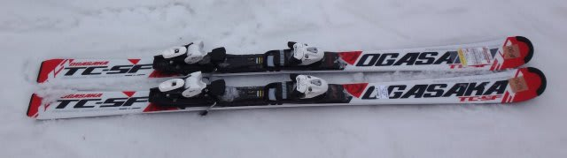
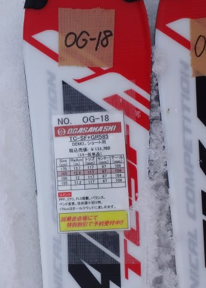
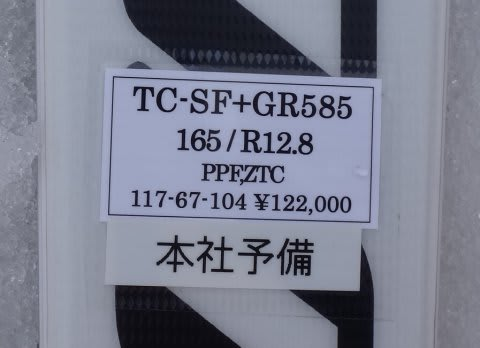
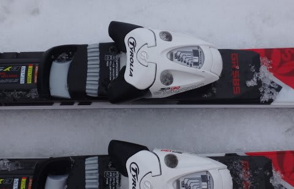

# まだ続く！2016シーズンモデル，スキー試乗レポート第4回…OGASAKA編その2

📅 投稿日時: 2015-03-20 23:15:57

なぜか，週末はアイスバーン＆春雪になりそうなのに．

意味もなく，月曜と火曜に気温が下がり，

週明けになってから冷え冷えのいい雪が降りそうな感じで．

「降るのがおせーよ」とグレたくなる

今日この頃．いかがお過ごしでしょうか．

…とりあえず，この週末の天気は，

大体おとといの予想通りで…

土曜は晴れ，時々雲がかかるかも…って感じですね．

…一昨日は曇りベースの予想でしたが，最新の天気図では

晴れベースになりそう．

朝はアイスバーン，午前早いうちから雪が緩み，重い春雪に．

夕方にまた冷えるとバーンは固くなっていく…という感じで．

まぁ，気温も上がり，雪質は重く，典型的な春スキーの一日かな．

日曜も基本的には晴れ．午後に向かって雲が増えていくかも．

で．気温上昇が遅いので，

アイスバーンは午前遅くまで続くかな～．

…うーむ．

春が来たなぁ…（涙）．

ってことで．

あと4時間で出発なのですが．

一応，今日も2016シーズンモデルのスキー板試乗レポート，

行っておきますか．

今日は，昨日に続いてオガサカ編．

時間がないので，1機種だけです…

では，どうぞ～！

○OGASAKA TC-SF GR585 165cm

基礎小回り用．

これは，一番強いGRプレート付きの板でしたが…

…これは．

これは．

これは，いいっ！

思い通りに動く！

きれいにたわんだエッジに乗って，気持ちよく切れる小回りもできる！

谷回りで，自由自在に好きなところに板を差し込んでいける！

気持ちいい切れと，そこそこ強い返りで，かなり快感な小回りができます．

…私の超お気に入りの'14 ATOMIC Bluester SXに匹敵する快楽を与えてくれる板かも…

荒れた斜面でも軽快に動かせて，そしてしっかりグリップします．

どんな局面でも，板がしっかり圧を受け止めて，回ってきてくれます．

板のトップ寄り，テール寄りのどこに乗っても挙動が大きく

崩れることがなく，板のアロワンスが広い感じ．

小さく回そうとずらしても，しっかりグリップして，

まるでサイドカーブで回っているかのごとく

きれいに回っていきます．

大きく回しても，小さく回しても．

ずれを伴って回っていくんだけど，

しっかり圧を受け止めてたわんでいくので，

ズラして行っても，まるでサイドカーブに乗っているが

ごとく回っていきます．

板もたわみ止まりがある感じで，高速でも窒息することなく，

安定性も結構あります．

履き慣れてる板ではないのに，荒れた斜面でも安心して

板を外に出していけるし．

返りの速さ，バランスも良し．

トップからエッジを食わしていくことも，テールで

たわませて回すこともOK.

切る・ずらすの出し入れもかなり自由．

…いや．これ．

気に入った．

…物欲を強烈に刺激する板でした．

## 💬 コメント一覧

### 💬 コメント by (いか)
**タイトル**: Unknown
**投稿日**: 2015-03-20 23:56:58

ふむーまったく予想外のところからよさ気なやつが出てきましたね。。。プレートのおかげなのでしょうか。

ズレがしっかり使えてコブも楽そうですね。

まだ私の14'SXは20日も乗ってないので、まだXがなくなってはいないし、買わないぞ…！

### 💬 コメント by (Skier_S)
**タイトル**: いかさま
**投稿日**: 2015-03-21 23:29:20

いやー．

結構良かったですよ，SF…

’１４SX，来シーズン中にXがなくなるかも…

買っておいたほうがいいかも…（笑）

