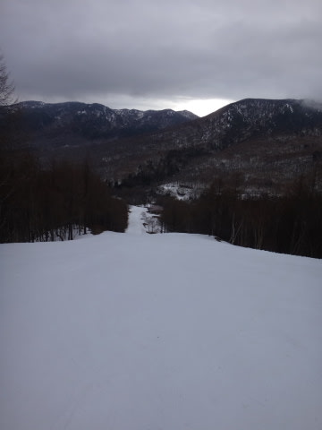
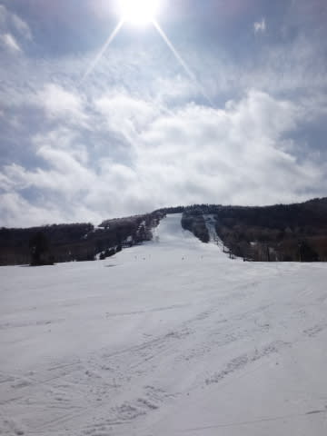
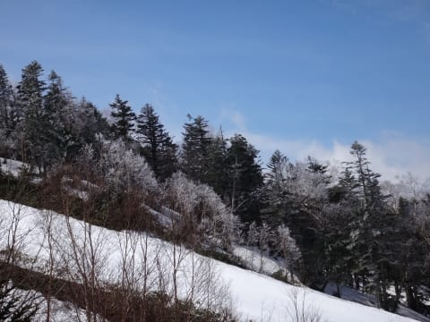
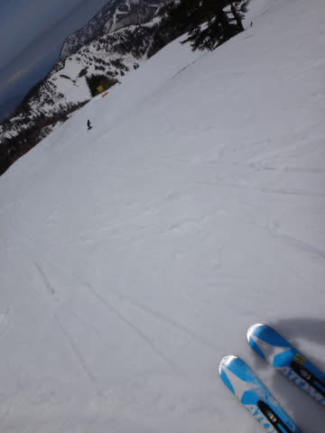
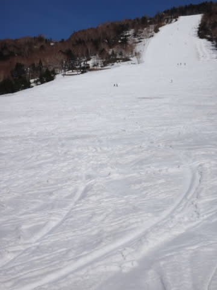
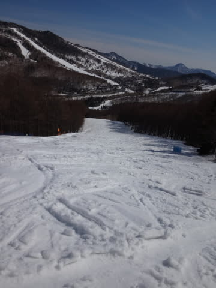
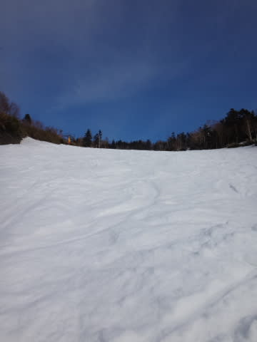

# 5月6日，GW最終日の志賀高原，速報モード

📅 投稿日時: 2014-05-07 01:37:01

えー．

GW最終日が終わってしまい．

帰宅したわけですが．

…いつものパターンで，帰宅が深夜だったので．

本日も，速報モードで…

今朝は，奥志賀の早朝から滑りはじめて…

今朝は氷点下まで冷え込んだので．

昨日の雨が凍った早朝は，

「ザ・氷」といった感じで．

かなりガッツリ硬いバーンコンディションでしたね～．

で．朝9時ごろからは日が射し，

すっきり晴れてきました！

朝，氷点下まで下がったので，木々が白く

凍り付いてます…

朝方にしっかり冷えてくれたおかげで，午前10時ごろまで

比較的しっかりした気持ちよいバーンを

滑ることができましたね～．

さすが，午後はかなり雪が荒れてきたけど…

見ての通り，今日も午後はゴーストタウン化してしまい．

晴天のガラガラのゲレンデを，

今シーズンの営業終了時間まで，

悔いのないように滑り倒したのでした…

詳細レポートは，また明日のお楽しみにっ！←だから，誰も楽しみにしていないって…
