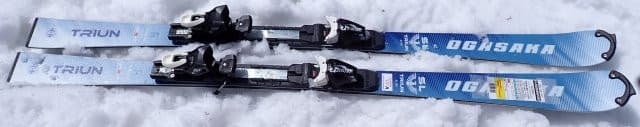
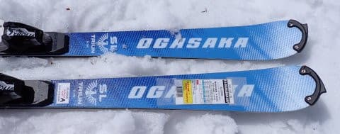
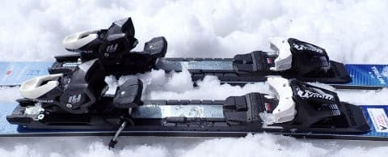
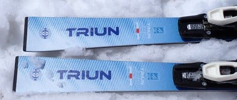
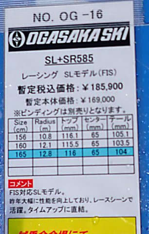

# 2025シーズンモデルのスキー板，試乗レポートその26…OGASAKA TRIUN SL + SR585

📅 投稿日時: 2024-07-10 02:05:58

🏷️ カテゴリ: [スキー板試乗](c0bd8048615710cee890e403a36cc9a2b.md)

本日，新幹線で某所に出張だったのですが．

新幹線で行きも帰りも2時間ちょいずつ

寝てられるから，睡眠時間短くても

カバーできるよね…

と，睡眠3時間で出かけたら．

緊急の仕事が降ってきて，新幹線の中で

やっつけざるを得ず．

ムチャクチャ睡眠不足の回らない頭で

出張先での打合せをこなさなくては

ならなかった，悲しいSkier_Sです．

そして，予想通り帰りの新幹線でも

寝られず（涙）

…コロナ禍以降，在宅勤務が普及した

のもあり，職場じゃないどこでも仕事が

できるようになった結果．

誰がどこにいるかとか気にすることなく，

どこまでも仕事が追いかけてくるように

なったのは，便利なのか不便なのか…

…まぁ．

新幹線に乗っている2時間ほど，

ずっとデッキに立って緊急リモート

会議に参加することになった過去に

比べれば，椅子に座ってられただけ

マシだ，と自分を慰めてみる．

（全然慰めにならないけど（涙））

ってなことで本題へ．

本日も書き溜めておいた2025シーズンモデルの

スキー板試乗レポート．

今日はオガサカ編です！

〇OGASAKA TRIUN SL + SR585　165cm

SL競技用

FISマーク付きの本格競技用SLモデル．

今シーズン，TC-Sの方がTriun SLより

強くなったんじゃないか？と思うほど

TC-Sの張りが強く感じたけど．

やっぱり履き比べると，Triun SLの方が

張りが強い感じ．

でも，コアが硬い突っ張る硬さというより，

メタルが強いバネ感がある硬さという感じで，

しっかり踏んでいくといい感じのたわみが

出て，トップからテールまでの長いエッジが

しっかり効いて，たわみに沿って強い

グリップでぐっと回っていく感じの板．

どっしりしていてグリップも強いので，

ずらして板を動かしていくというより

しっかりとグリップさせた中で滑って

行く板ですが…

フレックスがかなり強めの板のわりに，

サイドカーブのせいなのか，かなり

小さい半径でカービングできます．

うーん．

TC-SのSRプレートより張りが強く

感じるのに，Triun SLの方が小さい

半径で回っていく感じ…

なんでだろう？？

ガッツリ強くてどっしりした板なのに，

比較的小さめの半径でグイングイン

回っていくという，脚力があればかなり

気持ちよく滑れる板．

小回り板としては板の重さもしっかり

感じ，重い春の雪でも板の重さで

ガンガン蹴散らして安定度高く滑り

降りていけて，春の荒れた雪での

安定感，高速での安心感は結構高い

です．

重さがあるのに，板のグリップと安定感が

しっかりしていて山回りがしっかり

仕上げられるのと，板を信頼できるので，

荒れた急斜面でも，安心して谷回りの早い

段階から板に「えいやーーー！！！」って

乗って切っていけます

ただ，この日の一ノ瀬ファミリーの正面バーン

は，朝で割と固めの急斜面だったのですが…

急だったので，スピードコントロールのために

ときどきずらしを入れようとすると，

グリップが強いからか，私の腕前ではあまり

うまくずらしが入れられず…

硬めの斜面の上に，緩んだモサモサが乗った

ところが混ざっているというような状態

だと，TC-Sの方がずらしてコントロール

しやすい分，乗りやすかったかな～…

とりあえず．

そこそこの中斜面を気持ちよくカービング

していく分にはいいけど．

急斜面でずらしを入れた小回りをしよう…

と思うと，結構手ごわくて，しっかりした

脚力と正確なポジションが必要となる

板なので，普通の人がゲレンデで

小回り用として履くには手ごわいかな…

体力，脚力を必要とする，かなりレベルが高い

小回り板でした．
