# 2020年10月，八ヶ岳の編笠山に登ってみた，その3

📅 投稿日時: 2021-08-06 01:58:52

今週末は3連休ですね…

で，私はそのまま一週間休みで，

なんと．

正月以来の9連休に

なりそうなんだけど…

正月以外で9連休以上の休みって…

2019年のGWくらいまでさかのぼりますね．

でも，この3連休は台風10号にやられ．

その後も10日~11日にかけて台風11号が襲い．

そして，12日以降も太平洋高気圧が弱くて

ひたすら雨になりそうで．

天気図を見ても，

お盆時期の1週間，晴れそうな日が1日もないじゃないか

という，ひどい夏休みになりそうなん

ですが(涙)

緊急事態宣言のために，帰省も何もしない

ことにしたこのお盆．

せめて体がなまらないよう．

そして，普段の激務からのリフレッシュの

ために，人が少なそうな山にでも登ろうか

と思っていたのですが…

この計画はどうやら実行できなさそう

です（泣）

ってなわけなので．

ひたすらStay Homeな夏休みになりそうな

今日この頃．

皆様いかがお過ごしでしょうか（以上，時候の挨拶）

あぁ…

せっかくの夏休み．

ずっと家でストレス解消できないと

死んでしまうかも…

もし，来週更新が無かったら．

Skier_Sは運動不足のストレスで死んだ

と思ってください…（泣）

ということで，本題へ．

去年の八ヶ岳登山レポートの続きです…！

ーーー

ってなことで．

緩やかな上り坂を登り始めると．

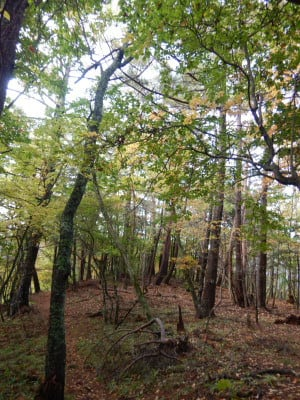

編笠山まであと3時間の看板が

出てきました．

駐車場からここまで，50分．

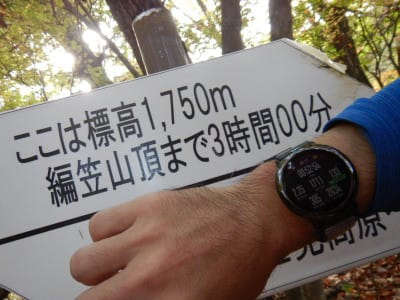

そして，標高1750mですか．

山頂は2524mなので．

まだ標高で800m弱登らないと…

ちょうど標高1750mのここは，

石小屋というポイントで．

横に石が屋根のようになっている，

それっぽいモノがありますね…

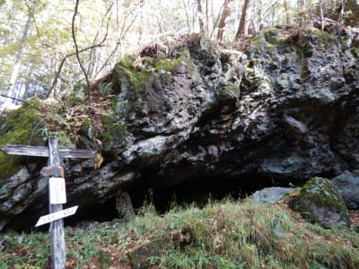

この石小屋のポイントを過ぎると，

あとは特に目安となるポイントは無く．

木立の中の単調な登り坂をひたすら

登り続けます…

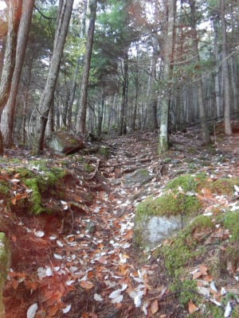

標高1800mからは，標高100m毎に

看板が出てますね．．．

残り2時間50分の1800m看板が登山開始1:01…

ということで．

残り3時間の看板から10分でここまで

来てるので．

大体看板の所要時間通りの時間で

移動していますね…

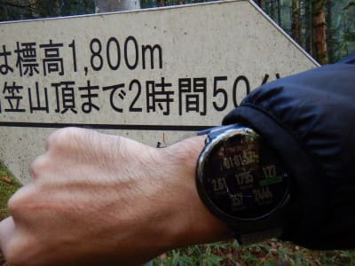

そして，

残り2時間50分地点から，2時間半地点の

1900mまでの所要時間は20分と

ここもぴったり看板の所要時間通り．

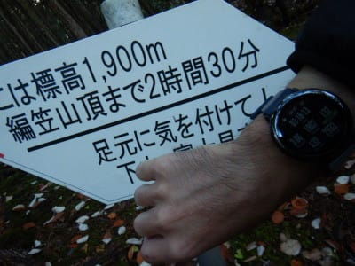

そこから残り2時間10分地点の2000mまでは，

看板通りなら20分のところ12分と，

ちょっと巻きましたが…

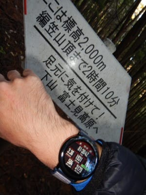

そこから残り1時間45分地点の2100mまで，

看板通りなら25分のところを22分…

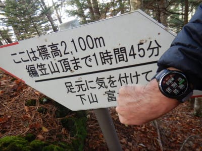

そこから看板通りなら30分の，残り1時間15分地点．

2200mまでは27分と．

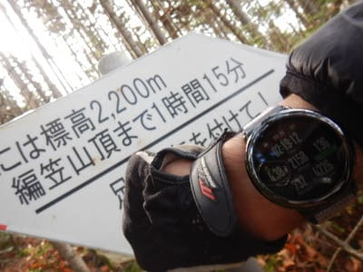

だいたい看板の所要時間と同じペースで，

変化の無い木立の中登り坂を

淡々と登って行っています…

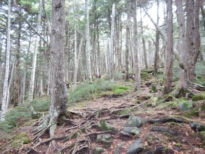

が．

何だか．

標高2200mを超えたあたりで．

地面に何か，白いものが残ってますよ…？

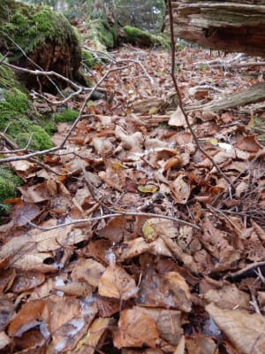

さらにしばらく歩くと．

なんだか，地面がところどころ白くなって

きましたね…

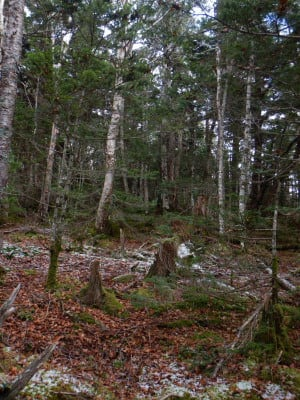

そして．

山頂まで1時間地点，標高2300mまでの

予定15分の区間は所要時間18分．

かなり斜度がきつくなってきたのも

あり，ちょっとペースが落ちましたが…

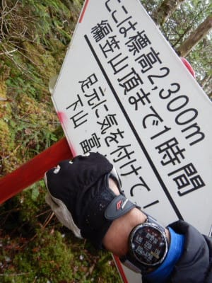

…なんだかこのあたりから．

かなり足元が白くなってきてるん

ですが…！！？？

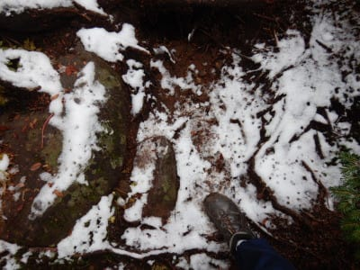

うむ．

そして，ものすごい急登になってきて．

まだこれから山頂まで，標高200mも

あるんだけど…

今すでにこれって，この先は

どうなってるんだろう…？？

（登山道っぽく見えませんが，この狭い急坂を登る！）

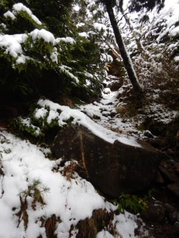

まさか10月中旬の八ヶ岳で，

ここまで本格的な積雪にみまわれ

ようとは…！！

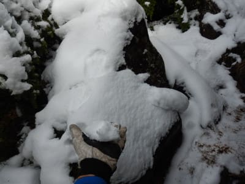

…とりあえず．

積雪を見ると．

スキーがしたくなるよな…←それどころじゃないでしょ

と．

6月の月山以来，4か月ぶりの積雪を見て

テンションが上がるSkier_Sだったの

でした…←いや，これから先の危険を恐れようよ…！！
