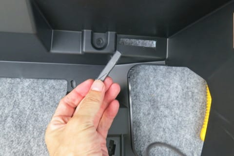

# プロジェクトX2第2章…LEVORG E型にKENWOODナビ連動ETCを取り付ける！グローブボックス内に車載器取りつけ

📅 投稿日時: 2018-08-07 02:57:27

朝2時から活動開始だった，ご無体スケジュールの

帰国日の昨日，

なんとか夜3時ごろに寝て．

今朝，かなり辛いところを会社に行ってきましたが…

辛かった．

朝イチからフルパワーで働かされ．

さらに帰宅もいつも通りの深夜パターン…

辛かった．

ひじょーーーーに辛かった（涙）

だのに．

今日も夜中に記事を書いている自分．

一体何が，自分をここまで駆り立てているのか…

ってなわけなので．

今日はちょっと記事は短めで…（許して）

とりあえず今回は，しばらく休んでいた

ETC取り付け記事の続きです．

では，どうぞ～！

---

ってなわけで．

グローブボックス内にETC車載器取付作戦を実行中な

わけですが．

[前回の記事](ea8c1169d3877ef009d742278f4ef40bc.md)で取り外した助手席側インパネ下部の

パーツに，ETC車載器からのケーブルを通す穴を

あけます…

素材は比較的柔らかいので，カッターで

ゴリゴリと筋彫りをくりかえしていけば…

こんな感じで切り取れます．

グローブボックスの奥．

それもETC車載器で隠れる位置なので．

穴の形の仕上げはあまり気にせず．

こんな感じであいていれば十分でしょう…

裏から見るとこんな感じで．

分かりにくいですが，指さしているところが

穴を空けたところです．

ETC車載器を取り付け位置に

当ててみると…

うむ．

コネクターがぴったり見える位置に

穴があいたようです…！

では．

ETC車載器に．

ETCの付属品の両面テープを貼り付けて．

さっそく固定しましょうか…！

という段階で．

…ちょっと待て．

ちょっと待てよ．

この両面テープ，異常にぶ厚くないか！？？？

ってことで．

両面テープをETC本体に貼りつけたあと．

反対側の剥離紙は剥がさず，取り付け位置に

押し当ててみたところ…

やっぱり，両面テープの厚さ分，穴が

ずれてるよ…（涙）

ってなことで．

両面テープの厚み分，穴を広げました…（泣）．

これを見て同じ位置にETC車載器をつけようと

している方は．

車載器に両面テープを貼り付けてから，

穴あけ位置の決定をすることをおススメ

しておきます…（尊い犠牲）

…という感じで．

ちょっとしたトラブルはありましたが．

こんな感じで，目立たない位置にETC車載器を

つけることができました…

どこに車載器があるか，わかるかな？？

…これで車載器取り付けは完成です！

次は，ETCアンテナ取り付けですね…

（続く）
