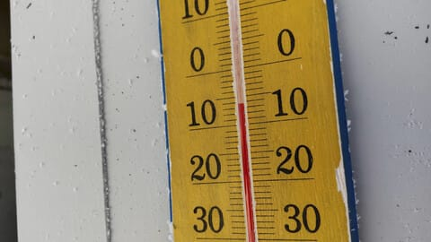
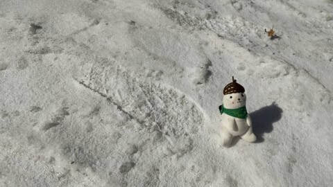
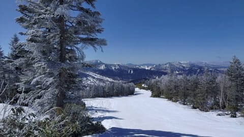
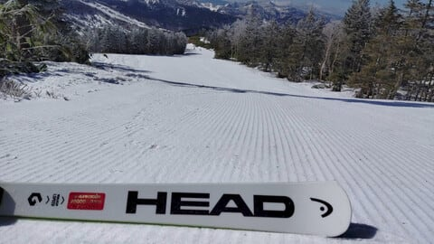

# 2021/4/26(月)の志賀高原スキー場，冷えて良かったみたい！…そしてGW前ご無体進行中(涙）

📅 投稿日時: 2021-04-27 10:56:38

ということで．

GW直前の駆け込み仕事が大量に

突っ込まれ．

昨晩は更新時間がとれませんでした…

なので，変な時間に無理やり更新！

とりあえず，昨日の特派員からの情報によると…

朝は-5℃と，かなりの冷え冷え！

そして，朝はうっすらと雪が積もっていた

ようで…

あさイチは真っ白な，冬みたいな景色！

昼間も0℃前後くらいまでしか上がらず，

晴天なのに板も滑る，いい感じの一日

だったようです…！！

いいなぁ…

今朝まで冷える予想なので，

今朝も良かったんじゃないかな？？

ということで，

ショート更新でした！

## 💬 コメント一覧

### 💬 コメント by (しんちゃん)
**タイトル**: シーズン終了
**投稿日**: 2021-04-27 23:12:47

本日で今シーズン終了いたしました。

今朝は朝一カリっとしまているかと思いきや、しっとりした雪でスタートしました。何とか無事に滑り終えて、無事に自宅に帰宅できました。

Ｓさんはじめ、YASの皆様方、大変お世話になりました。

また来シーズンヤケビでお会いしましょう。

### 💬 コメント by (Skier_S)
**タイトル**: ＞しんちゃんさま
**投稿日**: 2021-04-28 02:46:36

シーズン終了，お疲れ様でした～！

今シーズンもいろいろお世話になりました．

また来シーズン…いや，夏に何かイベントやって，その時にでもお会いしましょう！

