# 2013年9月　子連れタイ・タオ島ダイビング旅行記　その31…タイでの最後の晩餐

📅 投稿日時: 2013-11-29 01:02:59

🏷️ カテゴリ: [ダイビング日記](ce3a7a8d424d112fce83ee85c81a0e344.md)

うむ．

昨日の予想通り，志賀高原はほとんど雪が降ってませんね…(涙)

それどころか，風向きが多少西南西に回っているので．

新潟も雪が降ってないようで…

うーーーむ．

結構な寒気が入ってきているのに．

おしいっ！

ってわけで．

今日も本題はここまでにして．

ここからは，おまけのタイ旅行記へいくのだ．←完全にこっちがおまけとなっている

----

結局，ジンベエさんを見るという壮大な計画の下，タオまで

やってきたというのに．

ミッション失敗に終わり，失意に打ちひしがれた今回だったけど．

とりあえず．

今回のすべてのダイビングは終わってしまったので．

器材を洗って，部屋の前に一通り干して…

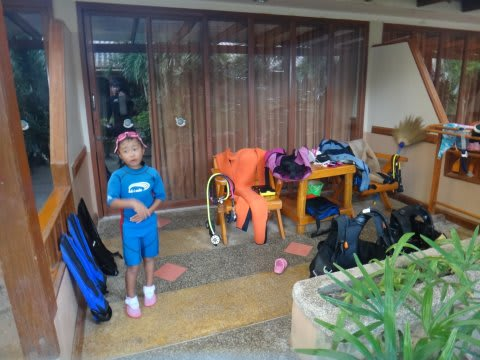

ダイビングショップで清算やらログ付けやらをやっていると，日が暮れてます．

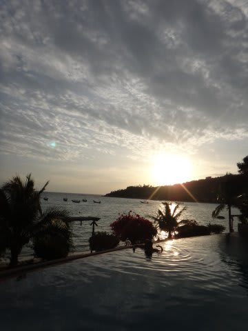

うーむ．

今回，せめてもの救いは．

ダイビングフィーがすごい安かったことだな～．

10本以上潜れば，1本あたり810バーツ．

今回みたいに，1日2本だと1日1620バーツ，

約5000円で済むのは，大変お財布にやさしい…

そして．さらに今回．

子供のボート乗船は，なんと！タダ！

なんて子連れに優しいショップでしょう！

ここは，うれしい限り．

子供がボートスタッフに慣れてくれて，一人で留守番ができるような

子供なら，船の上に子供を預けて潜りにいけるってのも，子連れに

とってうれしいですね～．

ってことで．

ダイビングショップでの清算も終えて，

夕日が沈むころ．

自分たちが泊まった「Ko Tao Resort」の，山の上のほうに

あるパラダイスゾーンへ行ってみました．

＃我々が泊まったのは，海沿いのビーチゾーン

急坂を10分ほど歩いても登って行けますが．

定期的にビーチゾーンとパラダイスゾーンを往復する無料送迎車が

出ているので，それに乗っても行けます．

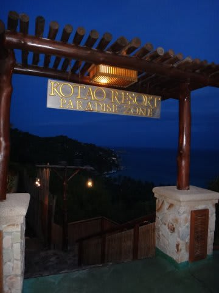

パラダイスゾーンは，ビーチゾーンよりちょっと高級ですね～

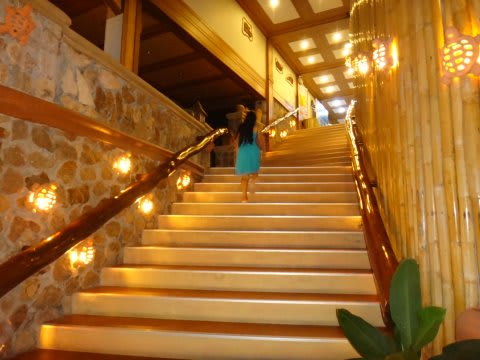

高台のプールからの景色が素晴らしい…

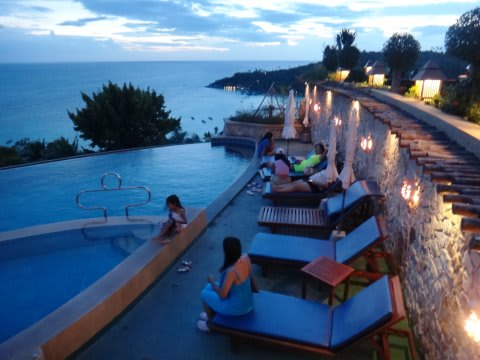

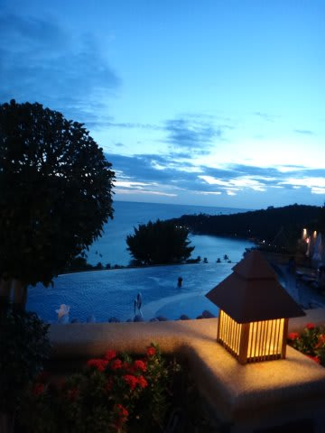

高台から，暮れていく空を眺めるゼイタク…

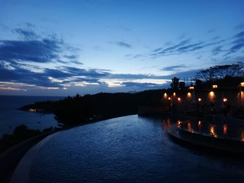

このプールの横に，レストランがあって．

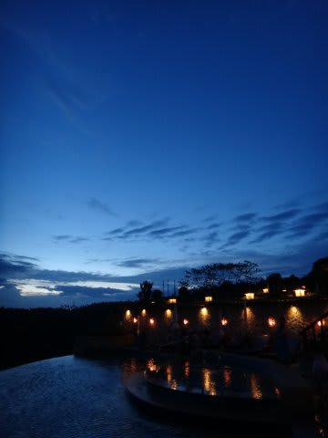

こんな空を眺めながら…

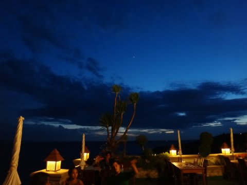

食事ができます．

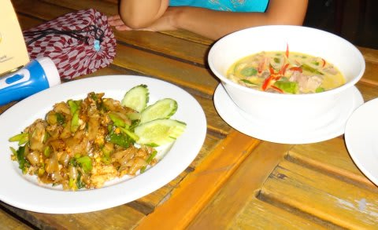

うーん．なんてゼイタクなレストランでしょう…

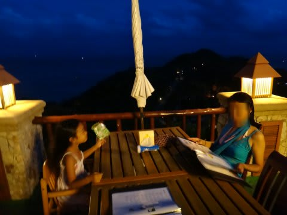

ってことで．

ジンベエが見れなかった残念さを．

きれいな景色を眺めながらの夕食で慰めた，

タイのラストナイトだったのでした…
