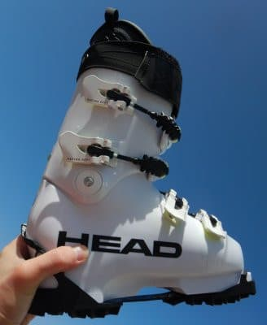

# 物欲選手権が終わって…Skier_S選手が購入したマテリアルたち

📅 投稿日時: 2021-07-01 02:56:53

🏷️ カテゴリ: [スキー雑談](c1f9d2cb7478308da16419928ea3945e9.md)

ってなことで．

今回も皆さんの予想通り，

物欲選手権に大敗

したわけですが．

[今回の物欲選手権の敗退結果](ed9f378aafcc4eb8620e941a8c06dd4a7.md)…というか，

GWに長岡のエキップさんに行った際に

買ってしまったニューマテリアル

たちを紹介します…

まずはニューブーツ，

HEAD RAPTER  WCR 3．

これはアキレス腱部分のビスが1本なら

フレックス140，

ビスを2本にすればフレックス150…

という強烈なフレックスで．

自分の人生上最も過激（？）なブーツ

です．

エキップさんで作ったREXXAM

ブーツを履くようになってから，

滑りがシンプルになり．

板に掛けられる圧も強くなって．

「これだけ踏めるようになってきたら，

もう少しブーツ強いほうがいいかも…」

という危険な発想が進み．

よりフレックスが強いブーツを

履いてみたくなった…というのが，

今回こいつを買った一つの

理由です←危険だ…だんだん危険な方向に行っている

そして，最近私の周りでは

エキップさんおすすめのHEADブーツを

買う人が多く．

その評判の良さもさんざんきいて

いたので．

「どうせ新しいブーツ買うなら，

　評判の良いHEADブーツを

　履いてみたいなぁ…」

というのが，このブーツを買いたく

なってしまったもう一つの理由でした．

ということで．

より強いブーツが欲しい＆

評判のいいHEADブーツを

履いてみたい…

というダブルの欲求で，HEADブーツを

買ってみたのでした…

当然，このブーツもエキップさんの

手により，完璧に調整してもらって

います！

そして，次のアイテムは…

FISCHER RC4 Worldcup GS MASTER 189cm

です．

こいつは長さ189cmと，自分がカービング

スキーを履くようになってから

最も長い板であるのと同時に，

R=27という，最もRが緩い板です…

さらにこの板．

欧州仕様の選手用の板ということで，

日本仕様より板の厚みもある，

かなり強烈なGS板．

一度，人に借りて試乗してみたんですが．

春先の早朝営業の，ガチガチアイスバーン

での強烈グリップ＆安定感ときたら…！！

硬い斜面を切り裂いてものすごい

スピードでかっ飛べる快感がしばらく

忘れられませんでした…

これまで私にとって，そこそこ軟らかめの

フレックスじゃないと大回りの板は

履きこなせなかったんだけど．

板がしっかり踏めるエキップさん謹製の

REXXAMブーツを履くようになって以来，

それまでの大回り板，

SALOMON X-race GS Master182cmが

リアル大回り用としては，柔らかくて

曲がりすぎるように感じていたところ．

試しにこのFISCHERの板を履かせてもらって，

「なんと…！強烈な板ってこんなにすごいのか…!!!

ブーツが良くなると，

189cmのR=27の板でも

こんなに傾けるのか…！！

このくらい強い板がほしい」

…と．

ついつい買ってしまったのでした…

ヤバい．

良いブーツを履くようになって，滑りが

変わってから．

だんだん板もブーツも，さらに過激な

方向に行ってます…

ヤバいです．

そして次のマテリアルは，

FISCHER RC4 Worldcup RC Yellow base Curv booster 180cm

です．

…何度か書いたように．

[エキップさんのブーツを履くようになって
から，小回り板だと回りすぎるように
感じる](ea640d800c00c10d32fc589084e2885eb.md)ようになってきて．

普段履きも大回りベースの板がいいなぁ…

と思うようになっていたわけだけど．

FISCHERのGS Mastersはいい板とはいえ，

あまりにも強烈すぎるので．

こいつはゲレンデがガラガラの時の，

朝イチの整地用スペシャル．

さすが，これを普段履きにするにはつらい．

今履いているSALOMON X-race GS Master は，

さっきも書いたように，リアル大回り用と

してはちょっと物足りないけど．

柔らかくて良く回って，普段履きには

このくらいがちょうどいい感じ．

…ただ，この板ももう2シーズン半ほど

履いてるので．

来シーズンの途中にヘタっちゃう

可能性が高いから，←板劣化加速能力を持っている人限定の悩みだな

来シーズンの途中くらいに，この板の

後継機となる，次期主力戦闘機を

買わなきゃいけないかも？

…と思ったところで．

ちょうどいい大回り板，FISCHERのRC，

それもYellow Baseの在庫があり，

半額

という必殺キーワードが繰り出されて

しまったため，ふらふらと買っちゃい

ました…

2020シーズンモデルのFISCHER RCは，

強めのCURV BOOSTERプレート付きの

Yellow Baseと，

優し目のRacetrackが着いたモデルの

2種類がありますが．

今回買ったのは，強いほうのYellow

 Baseモデル．

ちょうどこのくらいがいいなぁ…

と思っていたモデルでもあります．

さらにビンディングも普通はZ13が着く

ところ，在庫があったZ17が着いて

きたので．

'20モデルとはいえ，新品で

税込み5万円台は，かなりお買い得

だったかと…←自分に対する言い訳

(物欲に敗れ2セットの板を買ってしまった敗戦記念写真）

そして．

最後のマテリアルのヘルメットとゴーグル．

…これまで，お気楽レジャースキーヤー

だったので，ヘルメットをかぶって

いなかったのですが．

（ヘルメットを被るとガチのスキーヤーっぽくて，

お気楽レジャースキーヤーじゃない気がして…）

でも．

エキップさんのブーツ効果で大回り板が

好きになりだして，SXを履いて小回り

している時と比べると，アベレージ

スピードが上がってきたな…

と思っていたところ．

さらに，GSのR=27の選手用の板を

試乗してみて．

ガチガチのアイスバーンを過激な

スピードと傾きで滑れて面白かったと

同時に．

「これ…このスピードでこのガチガチ

　アイスバーンでこけたら死ぬな…」

と思うほどのスピード域だったので．

うーん．

「お気楽レジャースキーヤーなので

　ヘルメットはいらないよね」

思っていた私も．

そろそろヘルメットをかぶらないと

ヤバいかも…？

とうっすらと思い始めていたタイミングで．

ゴーグルとヘルメットのセットで

半額

という必殺キーワードがまた出てしまい．

「これなら，ゴーグル単体より安いじゃないか！！」

と，ついつい買ってしまったのでした…

…そして．自分では，

「これはヘルメットじゃなく

硬めのニットキャップだ！」

と言い張っている

ということで．

ブーツ，板2セット，ヘルメット＆ゴーグルという，

歴史に残る大敗をしてしまったのですが．

なんだか，昨シーズンもFISCHERの

RC4 Worldcup SC PROを買っているので，

来シーズンの私のメイン板．

FISCHERが3セットになって

しまいました(笑)．

それも，'19，'20，’21シーズンモデルの

そろい踏みです…

一時期は我が家にはATOMICのSXが

4セット並んでいたけど．

まさかFISCHERが3セット並ぶように

なるとは…

## 💬 コメント一覧

### 💬 コメント by (Goku)
**タイトル**: Unknown
**投稿日**: 2021-07-01 06:05:08

ある方も買っちゃったので、来シーズンのヤケビはフィシャーだらけですね

ゴンドラ降りる時｢俺のどれだっけ？｣ってなりそうwww.

### 💬 コメント by (西舘)
**タイトル**: Unknown
**投稿日**: 2021-07-01 08:24:25

そして靴はHEADだらけに。

### 💬 コメント by (ほっぽ)
**タイトル**: Unknown
**投稿日**: 2021-07-01 15:44:52

フィッシャーが３本、壮観ですね。

これに生き残ってるアトミックを入れたら何本なんでしょうか❓️😅

そして、まだ増えそうな予感がします。

だって、フィッシャーは皆個性が違うので、同じ板の二郎君、三郎君がいませんから😅

### 💬 コメント by (ほっぽ)
**タイトル**: Unknown
**投稿日**: 2021-07-01 19:19:03

Sさん

普段履きのフィッシャー、2020シーズンモデルのFISCHER RC CURV BOOSTERプレート付きの

Yellow Base 180cmがZ17付きで新品5万円切りで売ってますね。

多分私が交渉したら45000円になるかな😅

二郎君にピッタリかと思います😊

これでサロモンが何時ご臨終になっても安心です❗️👍️

### 💬 コメント by (ikkun)
**タイトル**: Unknown
**投稿日**: 2021-07-01 20:29:41

150ヒャー…ﾚｸﾞｻﾞﾑ120でも硬め？みたいな私しでしたから( *´艸｀)  一緒に試験受けた大将が130同じ奴？かも？  あのホワイトは目立ちますね(笑)

### 💬 コメント by (Northfox)
**タイトル**: Unknown
**投稿日**: 2021-07-01 20:50:00

HEADの白いブーツは黄色く変色しちゃうのが．．．

私のも大分黄色くなってきました。

これ何とかならないものですかね。

### 💬 コメント by (なんちゃってレーサー)
**タイトル**: ここまで買ったなら
**投稿日**: 2021-07-01 22:50:24

たくさん買いましたね．

ヘルメットを買ったのなら，バックプロテクターも買うべきでしたねw

R27ならコブには入れないものの，朝一のハードパック以外でも普通に滑れると思いますが，まあ，そこは板をたくさん買ってみんなに話題を提供していただけた，ということと捉えています．

他の方が書いておられますがHEADブーツ(に限らず，着色剤を入れていないブーツ)は紫外線で変色しちゃうので，紫外線カット剤を塗っておくと良いかもしれません．

あ，HEADの欧州仕様マスターズGS板が日本のカタログモデルとなにが違うのか，と仰っていましたが，僕が持っているモデルは，長さとサイドカット以外は変わりません．(FISモデルともぱっと見は変わりません)

新しいマテリアルを使った感想も楽しみにしています！

### 💬 コメント by (Northfox)
**タイトル**: Unknown
**投稿日**: 2021-07-01 23:46:44

なるほど．．紫外線カット剤ですか！

なんちゃってレーサーさん、ありがとうございました！😊

### 💬 コメント by (Skier_S)
**タイトル**: マテリアルネタは盛り上がる…
**投稿日**: 2021-07-02 05:52:28

＞Gokuさま

いや．確かに．今シーズンもFISCHERが増えたけど．

来シーズンはかなりFISCHER率が上がりますね…

＞西舘さま

そして確かにブーツはHEADだらけに…

エキップさんのヤケビメンバーへの浸透率，恐るべし．

＞ほっぽさま

今，SXは三郎君と四朗君が残っていて，SALOMONのX-Race2セットと太板を合わせると…

8セットですね…

5万円切りは安い！

でも，エキップさんで買えばWax Future付きプレチューン

＆今後のチューンナップ割引があるので，トータルはエキップさんの方もかなりお得かも…

＞ikkunさま

今のところ，ビス1本の140で使ってます．

このくらいでもいいけど，130のREXXAMと使い分けて，

HEADは150に上げてもいいかも…と思っている危険な自分がいます

＞Northfoxさま

新しいHEADは黄色変化しにくくなっているという話です…

実際どのくらい劣化しないのか気になりますが，おそらく私は黄色くなる前に

買い替えることになるかと…（笑）．

＞なんちゃってレーサ―さま

今回はかなり物欲にやられました．

R27だと，私は荒れたゲレンデやら人の多いゲレンデで

普段履きに使う根性は無いです…

紫外線カット剤ですか！ホームセンターで探してみます…

