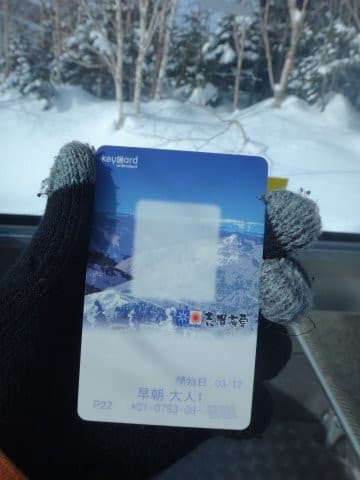
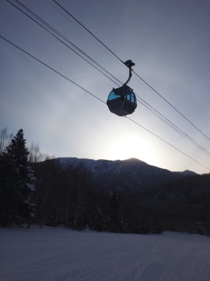
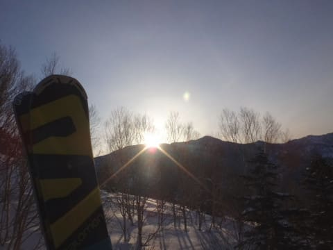
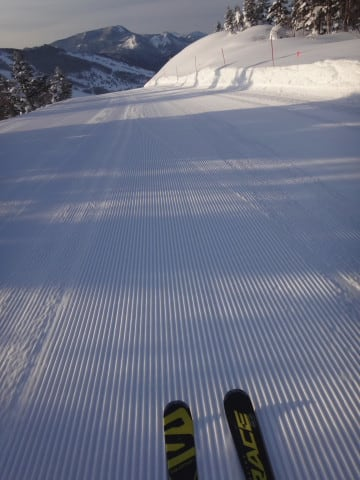
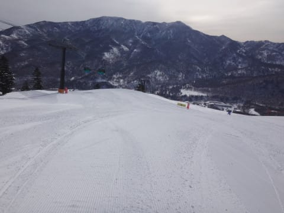
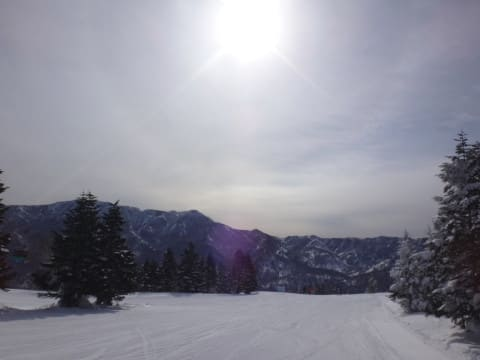
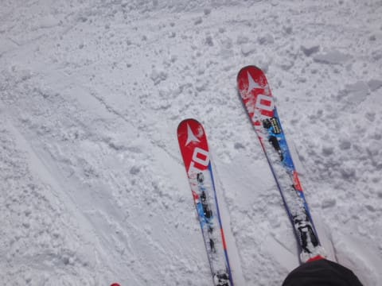
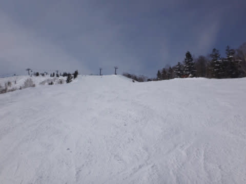
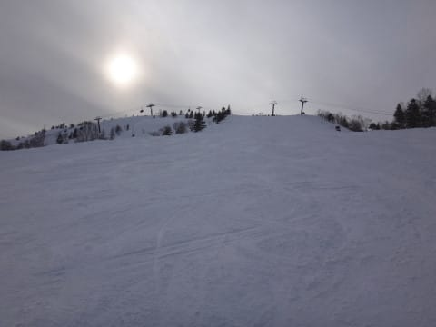

# 3月12日（日）の志賀高原，速報モード…晴天！雪質Good！3月としては恵まれたコンディション

📅 投稿日時: 2017-03-13 00:09:45

えー．

今週は．

土曜にスキーに行くことができなかったので（涙）．

本日，日帰りで志賀高原に行ってきたわけですが…

うむ？

なんだ，このリフト券は？？

そして．

なぜ，日が昇る前からゴンドラに乗っているのだ…？？

…ということで．

日帰りにもかかわらず

深夜1時半出発で，

朝6時半からの早朝スキーに参戦する

という，かなりのチャレンジングな

日程で．←いや，チャレンジングというより無謀といった方が…

そして当然ラストリフトまでしっかり滑ってきたので．

きょうも帰宅はいつも通り，23時…

そろそろ起きてからの活動時間，23時間を

超えてますので（涙）

今日も速報モードにて…

ということで．

朝6時半の日の出とともに第2ゴンドラに乗った，

本日早朝．

ゲレンデは…

うほっ！！！！！

これは…超最高脳内麻薬大量放出快楽バーン！

冷え冷えのシマシマっ！！！

人が少なく，2時間経ってもシマシマが残っている，

冷え冷えプレミアムグレードシマシマバーンを

滑ったあと…

今度は8時半の通常営業開始時に，

第1ゴンドラ側のオープンしたてのシマシマをいただき！

いやーーー．

1日で2度おいしいシマシマバーンをいただけるなんて…

何て最高な一日でしょう…（寝不足で眠いけど）．

天気は終日晴天で．

だのに，昼間もそれほど気温は上がらず，

雪質は最高！

3月でこんなに恵まれてて，いいんだろうか…

午前中はそこそこ人がいたものの，

第1ゴンドラは，ゴンドラ待ちがゲート外に

伸びるほどではなく．

そして，午後になると…

ありゃ？

無人バーン化．

人が少ないので，それほどゲレンデもひどく

荒れませんね～．

…雪よし，天気よしなのに．

なんでこんなに人がいないのか？？

って感じの最高バーンを．

朝6時半から休むことなく，16時半のリフトストップまで

10時間，滑り続けたのでした…

いやーーーー．

満足っ！！（眠かったけど）

また明日，詳細レポートやります～！

## 💬 コメント一覧

### 💬 コメント by (かず)
**タイトル**: 滑ってました？
**投稿日**: 2017-03-13 00:28:47

午後から2時間ほどヤケビ行ったのですが　全く見ませんでしたよ

### 💬 コメント by (マルハバ)
**タイトル**: なぜ・・
**投稿日**: 2017-03-13 09:51:27

第2ゴンドラの乗り場に

ゴールドステッカー付のSXが置いてあったのか？

不思議に思っていましたが、

こういうことだったんですね。

奥志賀への行き帰りで数本だけの焼額なので

今回は愛機との遭遇のみで残念でした・・

また来年を楽しみにしております。

### 💬 コメント by (Goku)
**タイトル**: さすがです
**投稿日**: 2017-03-13 19:33:50

昨日は少ししかご一緒できませんでしたが、お疲れさまでした～

私はあの後接待スキーになってしまいました(笑)

それにしてもまさか早朝からとは・・・恐れ入りました。

６：３０～１６：３０で１０時間ぶっ通し

やはりSkier_Sさんも『スキー星人』だったのですね。

### 💬 コメント by (マルハバ)
**タイトル**: 追伸・・
**投稿日**: 2017-03-13 23:37:11

詳細モードレポートが楽しみです。

あの絶好のコンディションの中

大記録が達成されたのではないかと？

ゴールドの上のプラチナ？ステッカーを

作らなければならないような・・

（クレイジーの更に上って？？笑）

### 💬 コメント by (Skier_S)
**タイトル**: 日曜は疲れた．
**投稿日**: 2017-03-14 01:03:34

＞かずさま

午後1時半から3時ごろまでの1時間半，

奥志賀に旅立ってましたが…

それ以外はひたすら1ゴングルグル

してました～！

うーむ．

丁度奥志賀に遠征していたタイミングと

重なっちゃいましたか？？

＞マルハバさま

お会いできなくて残念でした…

しかし，板は発見されてたんですね（笑）．

1時半から3時までは奥志賀滑ってたのですが…

奥志賀でもお会いしませんでしたね～．

で．

…この日は日帰りであまりにも疲れすぎて

いたので．

午後はペースが上がらず．

早朝を入れても大台に乗りませんでした…

いや，

この日は実は夕方にトラブルに巻き込まれて（？）

午後30分くらいロスしたので…

＃奥志賀ダウンヒルコースで滑れなくなってた人を

＃助けてました（笑）

＞Gokuさま

接待スキー，ご愁傷様です（笑）．

いやーーー．

土曜滑れなかったので，その悔しさを

晴らすべく…

でも．

2時間シマシマを滑り続けられて．

土曜の分も滑った感じでした～！

数日分のシマシマを滑り倒した

感じです．

…やっぱり，GWまで焼額早朝営業を

やってほしいなぁ…

