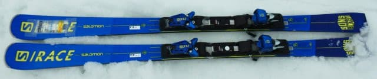
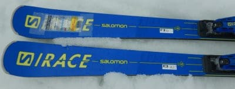
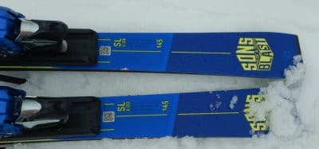
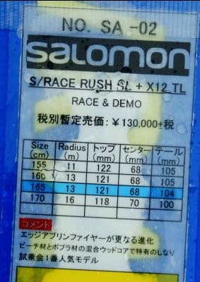
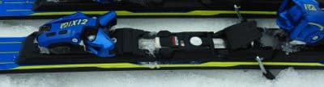

# 2022シーズンモデルのスキー板，試乗レポートその19…SALOMON S/RACE RUSH SL

📅 投稿日時: 2021-07-10 01:17:45

🏷️ カテゴリ: [スキー板試乗](c0bd8048615710cee890e403a36cc9a2b.md)

あぁ…無事金曜日を乗り切れたよ…

久しぶりに宿題の無い週末を過ごせそう…！！

明日こそ，12日ぶりに玄関から外に

出るんだ～！

…と，思ってるけど．

睡眠不足の蓄積で，夕方まで寝てしまい

そうな予感…

いや．

多分．平気で夜まで寝てられそう．

ってなことで．

今日も2022シーズンのスキー板

試乗レポート．

昨日に続き，今回もサロモン編です．

では，どうぞ～！

○SALOMON S/RACE RUSH SL X12 TL 165cm

基礎小回り用

この板は，2021モデルと全く変わらず，

2022年もキャリーオーバーのようです…

2021年モデルから，エッジアンプリファイヤー

(この黄色い部分)の真ん中部分が薄くなり，

操作性が結構良くなってます．

ということで．

基本的に昨年の試乗と変わらないはずですが．

とりあえず乗ってみると…

やはり，SL PROと比べるとグリップが

弱いかな…

荒れた斜面だと，足元がちょっとグラグラ

する感じがあります．

トップが自動で雪面を捉えて勝手に

旋回を始めるというより，

自分で雪面を捉えに行かないと，

と谷回りに入らない感じ．

自分でたわみを作っていき，たわみに

沿って回り始める板ですね．

グリップが緩い分動かしやすいので，

自分から積極的に板を動かして行って，

雪面を捉えに行きやすいです．

雪面を捉えると，グッと回り始めて，

小さなターン弧で回っていき

元気な反動がもらえる感じ．

小回り板だけあって，板の返りは

早く，そこそこの返りがあります．

その反動で次のターンへ板を動かし，

また雪面を捉えていく…という

動きになります．

逆にたわみを出さなければ

縦に落としていくこともでき，

大きめの半径で回ることもできます．

どうしようもなく小回りに入っていく

板ではないので，弧の作り方の

自由度は高いです．

ただ，自分のトップスピードまで

スピードを出していくと，たわみが

出すぎて回りすぎる感じがあります…

硬い斜面で本当にトップスピードを

出すと，ちょっと板が逃げちゃうかも．

そんなガンガントップスピードを

出さなければ，たわみも大きく出せて，

返りも早めでいい感じで小回りが

できるし，どうしようもない小回り

強制板ではなく，ロングターンを

引っ張ることもできるし．

板は動かしやすくて，ズラシが作り

やすいので．

それほど強烈なトップスピードを

求めない人が，小回りベースの

オールラウンド板として履くのに

いい感じの板かな…

と思いました．

## 💬 コメント一覧

### 💬 コメント by (m&t m)
**タイトル**: Unknown
**投稿日**: 2021-07-10 09:41:09

そうなんですよね

昔で言う、基礎オールラウンド板だと思うのですが、最近こういう板が少ない様な気がします

大小２台持ちをさせる業界の戦略ですね

今乗っているのもそうですが、自分はこういう板好きですね

なにしろ１台持ちなので・・・

### 💬 コメント by (Skier_S)
**タイトル**: ＞m&t mさま
**投稿日**: 2021-07-11 05:15:01

そうかもしれませんね…

最近，基礎系オールラウンド板少ないかも…

オールラウンドは，オールマウンテン系が幅を利かせてきてますから．

でも，小回り・大回り・太板と3セット揃えると

世界が変わりますよ！

…と，悪魔のささやきをしてみる

