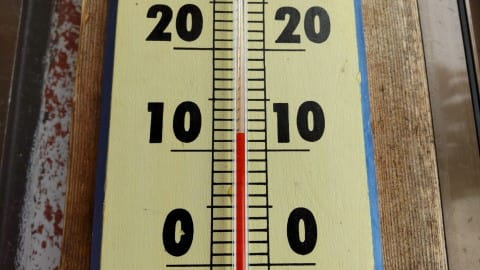
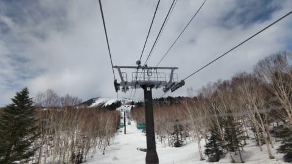
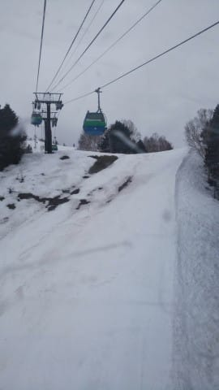
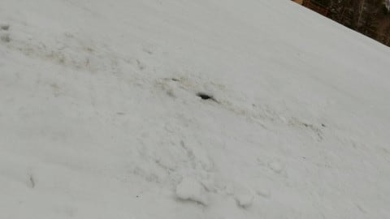

# 今週末もSkier_Sは志賀高原に行くとお思いでしょうが

📅 投稿日時: 2022-04-16 03:14:31

🏷️ カテゴリ: [日記](cc4b5682fb7b8b144980957a978653fb0.md)

なんとか今日は完全徹夜ではなく．

1時間半ほど布団で寝ることができた

Skier_Sです…

ってなことで．

太陽が東から登るのがあたりまえの如く．

明日の土曜日，またSkier_Sは志賀高原に

行くんだよね…

と，このBlogの1億3000万人の読者のすべての

皆さんが思っていることでしょうが．

今日も朝9時から夜9時半まで，昼に20分

Web会議の谷間があっただけであとはずっと

会議が続き．

そしてまた，最後の会議で月曜朝イチの

報告資料の宿題が出されてしまい．

さらには土曜は昼間に会議を突っ込まれ．

その準備もしなくてはならないので…

明日はスキーに行くどころか，

今晩も「これから寝られるんだっけ？？？」

という状況で．

この週末，スキーは諦めました（激涙）

まぁ，週末に仕事が無くても，この睡眠不足の

状況で志賀高原まで運転したら死にますね…（涙）

明日はそこそこ冷えて，朝はうっすら新雪が

バーンに乗っているという，結構良さそうな

コンディションなのに…（泣）

滑りに行けないのが悔しい…

ということで．

今日もおこみん特派員から志賀高原の写真が

送られてきました…

あさイチの気温は+10℃越え（涙）

だもんで，朝から雪はユルユルザブザブ（泣）

朝はかなりのガスで，視界が悪かったようですが．

基本的には終日曇り，時折青空ものぞいた

ようで…ラッキーなことに，雨はほとんど

降らなかったようです！

とはいえ…

雪はかなり減ってしまい．

GSコース，一番最後の落ち込みや…

オリンピックコースの急斜面の端っこの方は，

ちょっと土が出始めてきたようです…（涙）

…いや，この写真なんか見ると．

一気に雪が減りましたね～！！

とりあえず，明日土曜はバーンが冷えて，

朝までにわずかにうっすら積雪，午前中は

雪降りから曇りになります…

そして，やっぱり午後は晴れて，日差しでバーンの

雪が緩んでストップ雪になっちゃいそう…

でも，

まぁ，午前中は雪も意外と良くて．

午後は晴れ続けそうで．

いい一日になるんじゃないですかね？

## 💬 コメント一覧

### 💬 コメント by (大阪のK)
**タイトル**: Unknown
**投稿日**: 2022-04-16 09:11:45

Sさん、今週はスキーお休みなんですね。

それにしても忙しいお仕事なんですね。😅

私には殺人企業にしか見えないわ。

身体と心を大切にしてください🙇

今日の焼額山は、しっかりした圧雪の上にうっすらパウダーが乗ってます。

気温が低過ぎず高すぎずで、比較的滑りやすいです。

が、ずっと小雪が降っており、着雪でゴーグルが覆われ徐々に見え難くなります。

### 💬 コメント by (you160)
**タイトル**: Unknown
**投稿日**: 2022-04-16 15:24:46

Sさま

初期とはいえスキーやらないと死んじゃう病に感染した身としては、スキーに行けない状況、、、心中お察し申し上げます…

一方で、我が家は4/3以来、2週間お休みしておりましたが、娘2人とも「ヤケビに行きたい」と言ってる（言わせている！？）し、4/22に群馬県側からアクセス可能となり、神奈川県民でも県民割で宿泊優遇が手厚い群馬県（万座温泉）を拠点に、来週末から志賀高原に復帰する予定です。

まだまだシーズンは長い！？と思うので、またお会いできるの楽しみにしております。

毎日大変な状況かと思いますが、どうぞご自愛ください。

### 💬 コメント by (Skier_S)
**タイトル**: 仕事が終わらん
**投稿日**: 2022-04-16 22:09:10

＞大阪のKさま

土曜はお休みですが，日曜日帰りで行ければ行きたい！！

＞you106さま

娘さんお二人，素晴らしい教育ですね！！

焼額は5月8日まで行けます！

また焼額でお会いしましょう！！

