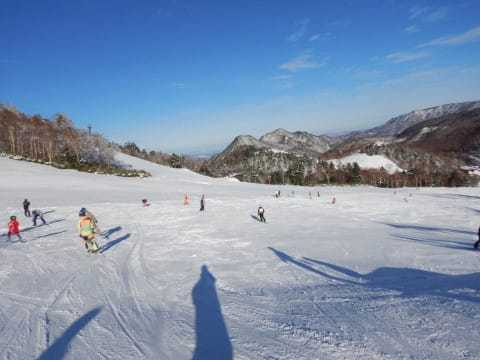
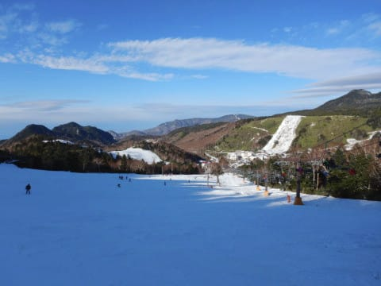

# 2019/12/1(日)の志賀高原，熊の湯スキー場の詳細レポート！…雪質，コースの混雑状況，リフト待ち，道路積雪状況など

📅 投稿日時: 2019-12-03 01:30:18

えー．

来ます．

2日(月)は雨降りの悲惨な一日でしたが．

明日3日(火)の朝には，来ます．

少なくとも，日本海側では，

そこそこの積雪がやってきそうです…

残念ながら西風なので，

3日午前中は志賀高原では

それほどの積雪はなさそうですが．

3日午後から5日にかけて．

…おそらく，積もります．

日本海側に近いところは，

結構積もりそうです…

…とはいえ．志賀高原に雪が

積もりにくい完全な西風の

予想なので（涙）

志賀高原には，あまり過大な

期待は抱けませんが…

でも，志賀高原でも，今から

5日にかけて，20～30cmは

積もってくれるのでは？？

（楽観的期待）

少なくとも，これから

しばらくは気温が上がらず．

8日までは冷え続けるので．

人工降雪機はフル稼働できます！

…この週末に期待っ！！

ってなことで．

昨日速報した，日曜の志賀高原，

熊の湯スキー場の詳細レポートです！

まず．

速報でも書いたように，

志賀高原への登り坂．

もう，完全に真冬の雪道です！

それも，志賀高原の登り口から

すでに雪道ですので．

ノーマルタイヤで志賀高原に

チャレンジしよう

などという無謀は止めておいた方が

身のためです．

何か，物理現象を超えた超能力で

車を操作できる方以外は，

スタッドレスを履いてお越しに

なることをおススメします．

ってなことで．

熊の湯のちょっと残念な所，

駐車場からスキー場までの

長い道のりを歩いていきますが…

うむ．

ここからすでに真っ白．

ゲレンデコンディションは

期待できそう…！！！

で．

熊の湯のゲレンデへやってくると…

…いや，

これはっ！！

雲一つない，すっきり快晴っ！！！

そして，全く予想していなかった，

ゲレンデいっぱいに滑れる

コース幅っ！！

そして…

前日の激冷えで積もった雪が

放射冷却で冷え込み，

今シーズン初めての，最高に

いい感じで冷えた雪質っ！！

そして，朝イチから，並行した

ペアリフトが2本とも運転していて，

リフト待ちも少なく．

…これは．

滑れるコースは緩斜面一つだけしか

無いけれども．

その点を除くと，シーズン中でも

なかなか無い，いいコンディション

なのではっ！？？

（今シーズン，まだYetiしか滑ってないので

　基準が異常なほど甘くなっている可能性大)

うはははは！！

最高の雪質のゲレンデ（今シーズン比）に，

飛び込むのだっ！

…と，さっそくゲレンデに

滑りこみますが…

うほぉっ！！

雪が滑るっ！！

そして，エッジが食い込む！！

スピードが出て，横Gが

かかるよ！！

そうだ，これだっ！！

これがスキーだよっ！！！（感動の涙）

しばらく忘れていたこの感覚…

あぁ．

Yetiも，10月から滑れるだけ

ありがたいんだけど．

アイスクラッシュの雪は，

やっぱりホンモノの雪とは

違って．

あれは，

禁断症状を和らげるための

「スキーのようなもの」

だったんだ…

楽しい．

楽しいよっ！！

緩斜面だから，スピードは

そんなに乗らないけど．

人が少なく，幅が広く．

エッジが食いつくゲレンデって．

こんなに気持ちよかったんだ…（感動の涙）

ってなことで．

アホのように朝から

グルグル滑りまくりますが．

うーん．

さすがに，営業開始からしばらく

経つと，リフトもちょっと待ちが

出てきましたね…

朝9時ごろがピークで，

リフト待ちはこのくらい．

でも．

これでも，ペアが2本とも動いているので，

待ち時間はそれほど長くなく．

最長3分待ち程度でした…

ゲレンデも，朝9時～10時過ぎの

ピークで，このくらいの人口密度

になっちゃって．

さすがにここまで来ると，

好きなライン取りほうだいって

わけにはいかないけど．

コース幅が広いので，それほど

ストレスなく滑れました…

さすがにコース横の，リフト下あたりは

ちょっと土が出てるところも

ありましたが．

でも，コースの端っこ部分，

十分回避できるところ．

人工降雪が載ってるコースの

ど真ん中は，ブッシュが出てきている

ところは無かったです…

天然雪が予想以上に積もったのが

効いてますね！

とはいえ．

まぁ，リフト降り場近辺に，

ちょっと雪が薄い部分は

ありましたが…

でも．

コース真ん中は全然大丈夫なので．

Yetiでは捨て板の二郎君で滑ってましたが．

今回は，昨シーズンのメイン板，

三郎君に出動願いました…！

この写真は，12時過ぎの写真ですが．

気温がプラスに上がり，日が射して

暖かかったこの日ですが．

下地が十分冷えていたからか，

雪がひどく緩むことは無かったです…

そして．

昼前になると，リフト待ちも減っていき…

午後になると，ほぼ飛び乗り状態！

…とはいえ．

午後になると，さすがにちょいと

ゲレンデが荒れ始めてきて，

ところどころウェーブっぽく

凸凹してきました…

そして．

北側斜面の熊の湯．

この時期は，午後2時を過ぎると

ゲレンデが日陰になっていき…

コブというほどではなく，

浅いうねり程度の凸凹ですが，

ちょいと荒れ気味なのに，

凸凹がはっきり見えなくなり，

スピードを出すとちょっと手ごわい

感じになってきたゲレンデは．

寂しいほど，誰もいなく

なってきました…

当然，リフトも飛び乗り！！

飛び乗りリフトで，貸し切り

ゲレンデを思う存分堪能するのだ！！！

ってな感じで．

いつも通り，日が暮れるまで，

楽しすぎて帰ることができず．

いつも通り，リフトストップの

午後4時15分まで，

お腹いっぱい滑ってきたのでした…

いやーーー．

楽しかった．

予想以上に楽しかった．

Yetiで5日滑ったけど．

やっと

「本当にスキーをしたなぁ…」

と感じた，この週末だったのでした…

## 💬 コメント一覧

### 💬 コメント by (Unknown)
**タイトル**: Unknown
**投稿日**: 2019-12-03 12:08:01

さすが志賀高原　さすが熊の湯！

楽しい記事ありがとうございます。

### 💬 コメント by (てつ)
**タイトル**: Unknown
**投稿日**: 2019-12-03 12:33:07

こんにちは！

いつも楽しく拝見しています。

体力半端じゃないですね。

質問させてください。

志賀高原に通っていて、登りはスバル４WDスタッドレスなら大丈夫だと思うのですが、帰り道下りでどうしようもないアイスバーンでチェーン巻いたことはありますか？ 一応積んでいるけど使ったことない感じですかね?

### 💬 コメント by (まーくん)
**タイトル**: Unknown
**投稿日**: 2019-12-03 17:20:57

はじめまして。

スキーは寝不足の耐性と運転の体力が必要なスポーツですね！

12月は26のナイターから29の夕方まで志賀高原で滑る予定なので、どこかで発見できたらいいなと思ってます。（ご利益がありそう）

### 💬 コメント by (Skier_S)
**タイトル**: すみません！こちらのコメント回答遅れました！
**投稿日**: 2019-12-05 01:19:01

コメント回答遅れてすみません…

投稿したつもりで，投稿ボタンがちゃんと押されてなかったようです（涙）

＞Unknownさま

まさに今回は，さすが志賀高原，さすが熊の湯でした！

この記事を楽しんでもらえたなら良かったです～！

＞てつさま

コメントありがとうございます～！！！

体力はそこそこですが，スキーやらないと死ぬかも…という

強迫観念が人より強いだけです(笑)．

ご質問の回答ですが，私はチェーンを持っていません…

実はこれまで，自分の車のチェーンを買ったことが無いんです…

チェーン無しで毎週毎週志賀高原を上り下りしてきました．

下りがブラックアイスになった時は，ゆっくりゆっくり

気を付けて下ります．

それでこれまで事故なく，毎週無事に志賀往復できています…．

＞まーくんさま

はじめまして！

コメントありがとうございます！

首都圏から志賀に通うと，寝不足耐性が必要ですが，

私の場合は往復の車に何人かで乗りあって行って，

運転を代わってもらえるので多少楽です…

（今回はソロ日帰りでしたが）

私は28日に焼額登場予定です．

あさイチに焼額1ゴン前に居れば，99％の確率で私がいると思います．

…でも，ご利益は無いと思います(笑)

