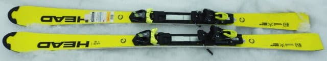
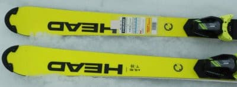
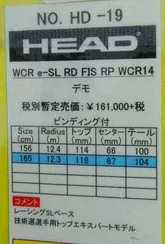
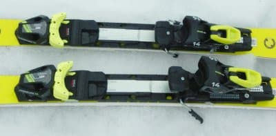
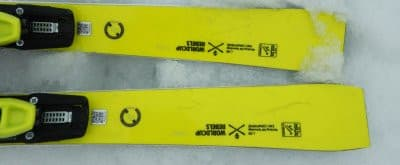

# 2022シーズンモデルのスキー板，試乗レポートその17…HEAD e-SL RD FIS

📅 投稿日時: 2021-07-07 06:06:35

🏷️ カテゴリ: [スキー板試乗](c0bd8048615710cee890e403a36cc9a2b.md)

やばい．

このBlogの更新時間を見て分かるように，

そろそろヤバい状況に…

スキー試乗レポートを書きためておいたから

更新できますが，ちょっといろいろヤバい

かも．

これからしばらく更新が無かったら，

「あぁ…死んでるんだな…」

と思ってやってください．

とりあえず，今日は2022シーズンスキー板

試乗レポート，

今回はHEAD編です．

では，どうぞ～！

○HEAD e-SL RD FIS RP WCR14 165cm

SL競技用

ALPENが板に着けている説明書きでは

「デモ」になっていて，HEADの

全日本技術選選手はこの板で小回り種目を

やっているようですが，

実態はFIS規定のSL板です．

結構張りが強い，しっかりした板です．

フレックスは強めで，たわみよりも

サイドカーブで曲がってくる板．

谷回りで簡単にたわみが出る板では

ないので，ターン始動時にオートマチックに

トップが捉えて旋回力が出てくる感じは

弱いですが，サイドカーブが小さいので

角づけをすると小さい半径で回り

始めます．

たわみを出していくというより，

エッジを入れ替えてスルスルと

レールターンをするようにターン始動

していけば，そこそこの半径で回り

始めます．

スピードが乗っていないうちは

板を踏んでたわませるより，

板を動かして弧を小さくしていく

感じ．

ただ，低速では意外とズラシの

コントロール性が良く，板を

動かして半径を小さくしていくのに

違和感を感じません．

履いた感じも軽く感じられ，

競技用としては驚くほど低速で動かし

やすく，低速での操作性は悪くないです．

スピードが乗ってくると，ガッツリ

エッジグリップと強い遠心力で，

硬い板がたわみ始めて旋回半径が

小さくなっていきます．

スピードが出ていくと，さらに板の

張りがだんだん強くなっていく感じ．

強いグリップと強いフレックスで，

スピードを上げていってもまだまだ

余裕が感じられ，スピード耐性は極めて

高いです．

低速だと割と動かしやすいのに，

スピードを出していくとガッツリグリップが出て，

さらに張りが増していくという，不思議な

感覚の板．

縦目に落として，かなりスピードを乗せて

いくと，気持ちいいカービング小回りが

決められます．

これなら，硬い斜面でもかなり安定して

縦目のカービング小回りでかっ飛ばせ

そうな感じ．

しっかりグリップの安定感だけじゃなく，

板に軽快さもあるので，荒れた斜面に

突っ込んでも雪面をしっかり捉えて行き，

さらに気楽に動かせていくので，

春雪の荒れ雪でも全然問題なく滑れます．

どちらもグリップ＆張りの強い高速向け

小回り板なんですが，

Nordica SLRは，どっしりとした重さで

荒れた斜面をまるでフラット斜面のような

感じで切り裂いて滑っていき，

低速でもどっしりした感じだけど．

HEADのe-SL RD FISは，荒れた斜面の

上を板を動かせる軽快さもあり，

低速でのズラシの操作性も高いという，

両者かなり対極的な性格かな…

でも，かなりの高速域での小回りの

快感度は，NordicaもHEADもかなり

高いです！
