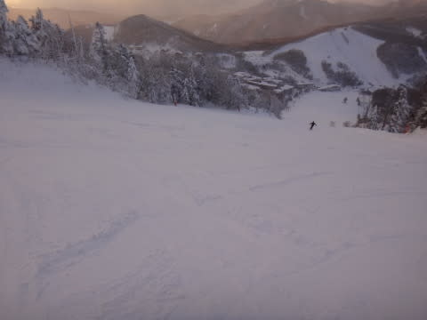

# ついに最終日！1月5日の志賀高原は…激冷え＆雪降り．夕方から晴れ(涙)

📅 投稿日時: 2014-01-07 00:39:38

🏷️ カテゴリ: [2014スキー滑走日記](c992167609b6415052179ee69ea1ea7d8.md)

ということで．

昨日速報でお伝えした，1月5日の志賀高原の状況の

詳細をば…

この日は朝から雪が降っていて．

「を！？まさか，パウダー？」

と，思ったところ．

昨晩からの積雪はこんな感じで…

ほとんど積雪無し(涙)．

車の上の積雪は，1cmほどかな？？

…どーやら，朝方から降り始めたばっかりのようで．

…なぜ，夜に降らず，朝になってから降るかな～(恨）．

で．

朝の気温は，今シーズンの最低気温を更新して．

マイナス13度！

さぶいよっ！！！

朝のゲレンデは，圧雪の上にわずかに軽い雪が乗っていて…

この，上に乗っている雪．

むちゃくちゃ冷えてて軽くて．最高の雪質！

…だけど，あまりにも積雪が薄すぎ．

急斜面では，この雪の下にある，硬めの雪が顔を出してきて，

ちと滑りにくいかも…

あー．

昨日も書いたように．

ゲレンデは，ガラガラでした．

この正月休みで，一番すいてましたよ！

こーゆー，人のいないバーンを飛ばしたい放題！

＃これで天気が良ければ…

で．

天気予想では，

「午前中は雪が残り，昼前後から晴れてくる！」

と，予想しましたが…

午前中は予想通り，こんな感じで雪が降ったり止んだり．

昼ごろにいったん薄日が射して．

「をを，予想通り，昼から回復かっ！」

…と，思ったところ，

また小雪が降り始めたりして…．

結局，太陽が顔を出したのは午後2時ごろ．

2時半ごろには，完全に晴れました！

うーん．

しかし，リフト営業時間は，残り1時間ちょいしかないんですが…

リフト営業直前から降りだし，営業終了間際になって晴れるって…

何かに呪われてるのかなぁ…(涙)

でも．

この日は人がかなり少なかったので．

夕方まで斜面がほとんど荒れなかったのがラッキー！

(午後4時の一の瀬正面バーンがこんなにフラット…信じられない)

夕方まで気持ちよーく，ガンガン大回りができて．

8日間の志賀高原滞在の最終日も．

リフト営業終了まで，たっぷり楽しめたのでした…

ということで．

8日間の志賀高原ステイ(またの名を体力の限界へのチャレンジ)も，

無事終了したのでした…
