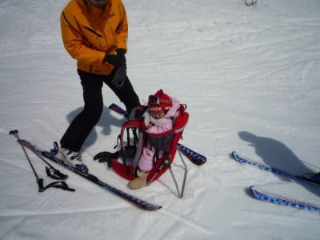

# そういや昔は，子連れスキーで子供をベビーキャリーで背負ってスキーしたもんだ…

📅 投稿日時: 2021-01-24 04:47:45

えー．

本日…というか，もう昨日か．

更新時間が遅れて，昼に更新しちゃったので．

「昨日，更新がなかったなぁ…」

と，昨日の記事を見ていない方は．

[ひとつ前の記事](e700d76ce309114170dea90b26fff37bf.md)も忘れずにお読みください（笑）．

ってなことで．

本日もStay homeのSkier_Sですが．

特派員から，今日も志賀高原情報が

送られてきました…！

やはり，本日の志賀高原は，最高気温が

0℃くらいまで気温が上がったようですが…

焼額山頂では，0℃を超えなかったようです！

時折ガスが出て視界が悪くなる時も

ありながらも，時折雪がぱらつく程度．

意外と気温が低めでいてくれたので，

バーンは締まっていい感じだったようです！

ゴンドラはソーシャルディスタンスで，

ピーク時にちょいと列はあったものの，

それほど待ち時間は無かったようで…

本日も，雨やミサイルに降られること無く，

いい感じのバーンコンディションを

楽しめたようですね…

あぁ…うらやますい…

ってなことで．

本題へ．

昨日，読者の方から，[かなり前の記事](ebde69f9bd0c5456d7aee0d2e06d294e0.md)に対して．

「ベビーキャリーでスキーする時，

　リフトの乗り降りってどうしてたん

　ですか？」

…という質問があったので．

これに対する回答の記事をちょっと

書いてみましょうか…←スキーに行ってない昨今．

ちょいとネタが切れ気味になってきているのが分かるな…

今や，

私が追いつけない直滑降で焼額のGSコースを

まっしぐらに滑り降りていく

ようになってしまったわが娘ですが．

今からかれこれ10年ほど前は，

ベビーキャリーで背負われて滑っていた

モノでした…

一部の人には，「子供の虐待では？」と

思う方もいるようですが．

少なくともわが娘は背負って滑ると，

むちゃくちゃ喜びましたし

背負って滑ってると，振動が気持いいのか，

かなり高い確率…ほぼ100％の確率で，

途中で寝ちゃってましたね…

しかし，わが娘．

背負われて滑る耐性が途中から

強くなってきたのか．

「止まらないで～！」って感じで，

止まることを許さなくなってきて．

慣れて来てからは後ろから

「もっと速く！！」

と，スピードアップを要求してくるという…

…今から見ると．

娘を背負った状態で，かなりガチで滑って

ますね…（笑）

娘の要求に応えるべく，しっかりフルカービングで

滑っていたのを覚えてます…

ってなことで．

当然のごとく，ゴンドラにも乗せてましたし．

リフトにもベビーキャリーのまま

乗っけてました…

で．

リフトに乗るときは，乗る直前にこんな感じで

右肩片側にだけベビーキャリーを担いで…

（写真には写ってませんが，ストックは

左手でもつ）

そして，搬器に座ったら，自分の右側に

こんな感じでベビーキャリーを置いて

乗ってました．

…娘は，リフトの高いところからの

景色が大好きだったのですが．

寝てることが多かったので，

リフトの上からの景色を眺めて

無いことの方が多かったかな…

当然，ゴンドラも大好きだったのですが．

…これも，寝てることが多かったですね…

で．

大体背負われてる間に寝ちゃうので．

寝たままレストラン連れ込んで．

そのまま寝かせておくことも多数…

でも．

背負って滑れば，両親どちらかが

留守番することなく一緒に滑れるし．

天気が良ければ，山の上のいい景色を

子供に見せることもできるし．

娘は今でも．

自分が滑れないうちから，家族で揃って

一緒にスキーに行ったことを，

すごいいい思い出として覚えていて

くれているようです…

…でも．

ほとんど寝てたけどね．

お前は…

ってなことで．

皆さんも，

「子供が生まれたら，スキーは無理か」

と思わず．

ぜひ，子供さんをスキーに連れて行ってみて

ください！

…子供がスキーバカに育っても，

私は責任が持てませんが（笑）

## 💬 コメント一覧

### 💬 コメント by (レインボー73)
**タイトル**: Unknown
**投稿日**: 2021-01-24 06:18:57

おはようございます。と言っても爆睡中かも？

娘さんがずっと寝てる写真ばかりで、最後に笑顔のかわいい写真。編集技術がすごい。

今日は板の選択に悩みます。現地泊の諜報部員からの極秘？連絡待ちです。

### 💬 コメント by (Goku)
**タイトル**: Unknown
**投稿日**: 2021-01-24 07:40:13

我が家も全く同じキャリアを使ってましたよ〜!

うちの娘もスピードを出すと、キャッキャ喜んでいたので、私もガチで滑っていました。

うちはカミさんも背負って滑ってくれましたから、お互いにストレスフリーなスキーを楽しむ事ができ、とても楽しい思い出です。

### 💬 コメント by (アリス)
**タイトル**: 懐かしいです
**投稿日**: 2021-01-24 09:45:49

Skier_S様

同じ思いでがあるスキーヤーさんが居ましたので懐かしく思いながら拝見させていただきました。

僕のところは、確かコンビのキャリアでした。

長女、次女と背負い、数年前は孫も背負い滑っていましたが、さすがひ孫は年齢から考えて無理だと思います・・・

### 💬 コメント by (しんちゃん)
**タイトル**: 素敵な笑顔
**投稿日**: 2021-01-24 11:53:16

背中が重くて滑っていても、あんなかわいい笑顔を見せられると、頑張っちゃうんですよね（笑）

私は、子供が小さいころ、リフト一本分、抱っこして滑った記憶があります（汗）また、板の上に子供を立たせておりてきたことも思い出しました。

### 💬 コメント by (レインボー73)
**タイトル**: Unknown
**投稿日**: 2021-01-24 13:10:06

日曜日の志賀高原情報

山は少ししか降ってないよ、という現地諜報部員の言葉があるにもかかわらず、これから積もるかも、という希望的観測のもとに、太板を用意。でも、しかし、いくら待ってもぱらぱら程度。炒飯じゃないんだ、降れ！

願いむなしく昼になっても、炒飯。

ゲレンデはといえば、重い新雪数センチ。ちなみに湯田中は雨でした。

10時頃に１ゴンで列ができたこともありましたが、まずは順調。昼には寺子屋を滑りましたが、重くてボコボコになっていたので、日頃のぜいたくパウダーに慣れた私はNO３９。

速攻でヤケビに戻って、獅子の一階ラーメンコーナーで、醤油ラーメン1000円を完食。ここも go to eat 対応。

これから帰ります。

### 💬 コメント by (副院長)
**タイトル**: Unknown
**投稿日**: 2021-01-24 17:56:17

皆さん、同じですね、20数年前子供背負ってました。

結局、子供がいることぐらいで、スキーあきらめないってことですよね。

背負っていくから、モンクないやろって、事です。

### 💬 コメント by (Noname)
**タイトル**: Unknown
**投稿日**: 2021-01-24 18:10:51

娘さん、潜水日記には登場するのにSKIには登場しないので、どうしているのかなぁ、と思っていました

まさか「私が追いつけない直滑降で焼額のGSコースをまっしぐらに滑り降りていく」様になっているとは！！

### 💬 コメント by (Goku妻)
**タイトル**: Unknown
**投稿日**: 2021-01-24 19:07:28

お嬢さんの可愛らしい画像にニッコリ、ほっこりさせていただきました。感動モノです‼️

あー、我が家も娘を背負って滑ってたなぁなんて、昔のアルバムを引っ張りだして見ているところです☺️

### 💬 コメント by (AK)
**タイトル**: Unknown
**投稿日**: 2021-01-25 12:32:01

あのSさんを置いていくスピードで❗娘さん凄すぎます❗ダイビングといいスキーといい英才教育の賜物ですね。

私も毎週家族で焼額山に通っていますがいつか置いていかれる日が来るのか来ないのか…今はコース脇の新雪が楽しいそうでパウダーマニアになりつつあります。

### 💬 コメント by (ゆうこ)
**タイトル**: Unknown
**投稿日**: 2021-01-25 14:24:44

お久しぶりです。

うちの子は、5歳になり、当然もうキャリアには乗らず自分で滑るようになりました。トライスキーも取れて、リフトを降りると直滑降でリフト乗り場までまっすぐです。

まだリフトに乗るときには補助してますが、それもあと少しかなと思います。

やる気がなくて自転車には乗れないのに、スキーが滑れる子が育ってしまいました。

### 💬 コメント by (Skier_S)
**タイトル**: コメント遅くなりました…
**投稿日**: 2021-01-26 04:28:57

＞レインボー73さま

いや．ホントに娘は背負われるとほぼ100%の確率で寝てたので，

寝てる写真ばっかりだったんです…

起きてる写真は少なかったです（笑）

＞Gokuさま

すごい！

夫婦で交代で背負っていたんですか！

私の時は，私が背負う専門でした…

そして，夫婦そろってガチで滑ってたんですね（笑）．

そのころに志賀高原を滑っていらしたなら，私はその当時の

Gokuさんを見てる気がします…

＞アリスさま

すごい！

お子さんだけじゃなく，お孫さんまで背負って滑ってらしたんですか！

ぜひ，曾孫さんまで背負って滑ってあげてください…

＞しんちゃんさま

抱っこで滑るのは，かなり体力的に厳しいですよね…すごい…

背負って滑ると，全然楽ですよ．

子供背負ったままコブ斜面とか行ってましたから（笑）．

＞副院長さま

あら！結構皆さん背負って滑ってらっしゃるんですね…

そうなんですよ．

子供をスキーに連れていけないから…って，スキーを諦められなかったので，

「背負って滑ればいいじゃないか」って感じで背負うことにしました…

私の場合は，スキーの先輩で背負って滑っていた方を見ていたのが

参考になりました…

＞Nonameさま

うちの娘，今は部活動であまりスキーができなくなっちゃいましたが，

滑ると暴走キッズになります…

昨年，焼額のニューイヤーファーストトラックで，「よーいドン」で200人がスタートした

時，確か4位くらいで1ゴンにたどり着いたんじゃなかったかな…

私は6位．娘に負けました（涙）

＞Goku妻さま

うちの娘も，こんな時期があったんだなぁ…と懐かしく思いながら

記事を書きました．

昔の写真，見返すと面白いですよね．

しかし，Goku妻さんがお子さんを背負ってガチで滑っていたら，

周りはかなり驚きそうですね（笑）．

＞AKさま

うちの暴走娘，スピードには強いようで，娘が全力で落下していくと

私には追いつけません…

＞ゆうこさま

お久しぶりです～！

お子さん，もう5歳ですか！早いですね～…

直滑降でリフト乗り場までまっすぐって…

いろんな意味で英才教育が進んでますね．育ったら，2000mチャレンジするとか

言い出すんじゃないでしょうか（笑）

自転車に乗れないのに，スキーができるってすごいですね．

しばらくしたら，我が家のようにお子さんに着いて行けなくなる日が

来るんですよ…きっと．

子供の成長はすごいですから！

### 💬 コメント by (mae)
**タイトル**: Unknown
**投稿日**: 2021-01-26 22:27:40

いつも背負って滑ってたなんて凄い立派ですよね。

当時から高天原には託児所もありましたが、妻からは息子を預けるなんて絶対できないと言われ..(^^;

うちはおんぶ紐で背負って、ヤケビでは２ゴンでパノラマインコースを滑ってました。

でも、熊の湯の無料休憩所で妻と交互に面倒を見ながら滑ることが一番多かったかな(^^;

### 💬 コメント by (Skier_S)
**タイトル**: ＞maeさま
**投稿日**: 2021-01-27 03:45:28

いつも背負っていたわけではないのですが…

天気が良くて，娘が遊びに行きたがった時だけ背負ってました．

某オリンピックホテル（全然某になってない）は，子連れアーリーチェックイン＆

レイトチェックアウトサービスがあり，滑ってない間は

部屋に退避できたのでありがたかったです．

私も一回おんぶ紐で滑りましたが，リフト乗り降りの度に外すのが大変で，

ベビーキャリー買いました．

おんぶ紐で滑ってたって，すごいですね…

### 💬 コメント by (migimayu1080)
**タイトル**: Unknown
**投稿日**: 2025-03-10 11:39:12

あまりの懐かしさに　思わずコメントさせていただきます(^-^)

私が子供の頃、実家の父もキャリー使っていました！キャリーに入れられていた妹も寝てたな（笑）

そんな自分は高校生の長女をはじめ三姉妹の母に。

子供達が小さかった時は　あれ、どうしていたっけ？（笑）　キャリーは使わずにおもちゃみたいなキッズスキー板を履かせてボーゲンで間に入れて滑っていました。　ダンナがボーダーなので　ダンナが滑っている間は子供たちはキッズパークで遊び　自分はその付き添いをし、自分が滑るときは　スキー板を履けるようになった娘たちを交代で連れ出して私が一緒に滑ったり教えたりしていました(^^) それもまた　なんだか懐かしいです。

### 💬 コメント by (Skier_S)
**タイトル**: ＞migimayu1080さま
**投稿日**: 2025-03-12 00:48:47

コメントありがとうございます~！！

キャリーを担いだんじゃなく，自分が乗っていた経験者なのですね（笑）．

そして，今はお子さんはもう高校生ですか…！！

このころは小さかった我が家の娘も，今やもう高校生になってます…

いまだに年に数回はスキーに来てくれてますが，昔と違って家族スキーも年に2-3回に

減ってしまいました…（涙）

