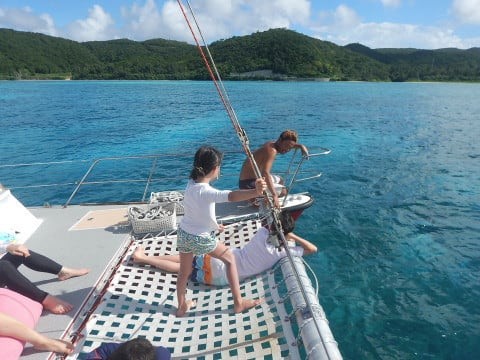

# 2019年8月，座間味で小6の娘と親子ダイビング！その6…ダイビング2日目スタート

📅 投稿日時: 2019-10-21 00:12:08

ってなことで．

今週にはYetiがオープンしますよ～！

待ちに待っていたシーズンインですよ～！！

で

YetiのTwitterを見ると．

雪づくりも順調に進んでいるよう

ですね…

（[Yeti公式Twitter](https://twitter.com/snowtownYeti?ref_src=twsrc%5Etfw%7Ctwcamp%5Eembeddedtimeline%7Ctwterm%5Eprofile%3AsnowtownYeti&ref_url=https%3A%2F%2Fwww.yeti-resort.com%2F)より）

…しかし．

近づいてきている，台風2連発（泣）．

22日にまた台風で土砂降りに

なりそうだし．

さらに25日にかけて，

今度は台風21号か…（涙）

台風で，雪がみんな解けてしまわない

ことを祈るばかり…

ってことで．

そろそろ冬モードに切り替えなくては

ならない時期ですが．

今日はダイビング旅行記です～！

---

明けて2日目…

昨日の朝は，涙のどしゃ降りで

始まったわけだけど．

果たして今朝の天気は…？？

…と，ドキドキしながら外を

見ると．

ををを！

今日は見事な晴れ！

多少雲は多めなものの，

南国の朝日が照らす，

爽やかな朝です！

ってなことで．

いつも通り，朝7時から朝ごはんタイム．

洋食と和食が交互に出る，ペンション

星砂さんの朝ごはん．

今日は洋食の日ですね…

このトーストも分厚くて，

かなりお腹いっぱいになる

朝ごはんを食べたら．

9時にボート集合なので，

ウェットスーツを着込み，

9時前に宿を出ます…

今朝の空は青く．

どしゃ降りの中，びしょ濡れに

なって港に向かった昨日とは，

えらい違いだな！！

…と，港に歩いていくと…

なんだ？

港が水浸し？？

おかげで，晴れている今日も

足が水浸しになってしまいましたが…

どうやら，今日は大潮で，

今は満潮の時間．

桟橋のギリギリ上まで，海面が

せりあがってるようで，海水が

桟橋の上まで広がってます…

いや，しかしこれ．

すごいな…

ってな感じで．

びしょ濡れエリアを通り抜けて，

今日もザマミセーリングさんのボート，

ティンガーラ号に乗船です！

そして，器材をセッティングしたら，

直ちにボートは出航しますが…

いや，どしゃ降りでうすら寒かった

昨日とはホントにうって変わって，

強い日差しがキラキラ眩しい，

南国の海です！

いやーー．

やっぱり，晴れた日の

南国の海はいいなぁ～…

…って感じで，

15分ほど走ったら，1本目の

ポイントに到着したようで．

スタッフがボートから飛び込み，

アンカーを固定しに行きます…

アンカリングが終わったら，

ダイバーに向けてのブリーフィングが

始まりますが．

今日1本目のポイントは，

「アマキンメの根」

…ただし，ポイント名となる

キンメモドキが大量についた根は，

12mを超えるので，娘と私は

根の上で待つことに…

ってなことで．

本日1本目のダイビング．

いざ，エントリー！

